# ATsofterp Current Implemented Architecture Discovery Report

**التاريخ**: 2026-08-03 (تحديث إحصاءات تم التحقق منها من الكود؛ التقرير الأصلي: 2026-07-31)
**نوع التقرير**: تقرير اكتشاف ومراجعة معماري للبنية القائمة (Read-Only Audit)
**الغرض**: توثيق ما هو مُنفَّذ فعلياً في المستودع الحالي دون أي توصيات أو مقارنات مع بنية ERP مثالية.
**مسارات التحقق**: مسار المهمة `C:\Users\attef\PycharmProjects\Trae\ATsofterp` مقابل مسار العمل `C:\Users\attef\PycharmProjects\Project\ATsoft_erp` — مستنسخان متطابقان (نفس SHA `8eba533efec5b02d7986c86e2511a80938bac1a7`، نفس عدد الملفات، نفس git status). تم التدقيق على نسخة العمل.

---

## القسم 1 — Executive Summary

### ما هو ATsofterp حسب الكود الحالي؟

ATsofterp هو **monorepo** لإدارة أعمال المصانع (Smart Factory ERP) مبني على `npm workspaces` يضم تطبيقين فعليين: واجهة API بـ **NestJS 11** (`apps/api`) وواجهة أمامية بـ **Next.js 15** (`apps/web`) مع حزمة مشتركة `packages/shared` و`packages/config` وحزمة `packages/ui` فارغة تقريباً (`.gitkeep` فقط).

وفقاً للكود الفعلي فإن النظام الحالي هو **modular monolith** في الجانب الخلفي (AppModule واحد يسجّل 80 وحدة NestJS) مع واجهة أمامية من صفحة واحدة (SPA) عبر Next.js App Router (266 صفحة في `src/app` + صفحتا تسجيل الدخول والرئيسية).

### النطاقات المنفذة فعلياً

| النطاق | المستوى الفعلي |
|---|---|
| Auth / Users / Roles / Permissions | IMPLEMENTED (7 endpoints، JWT + bcrypt، guard على مستوى كل controller) |
| Companies / Branches / Administrations / Departments | IMPLEMENTED (CRUD كامل + `GET /departments/tree`) |
| Machines / Asset Register | IMPLEMENTED (CRUD + وثائق + مكونات + حالات تشغيلية) |
| Maintenance / CMMS | IMPLEMENTED — النطاق الأكبر (362 endpoint ضمن factory عبر 36 controller صيانة) |
| Maintenance Work Orders | IMPLEMENTED — دورة DRAFT→PLANNED→IN_PROGRESS→COMPLETED/CANCELLED + إصدار قطع موزع |
| Inventory العملياتي | IMPLEMENTED (~160 endpoint: حركات، إيصالات تشغيلية، تسويات، أرصدة افتتاحية، تسويات مخزنية، تحويلات، جرد فعلي) |
| Spare Parts + Conditions + Repair Orders + BOM + Planning | IMPLEMENTED (دفعات Z-AA / AB-AC / AD-AE / AH-AI) |
| Barcodes / QR | IMPLEMENTED (40 endpoint) |
| Reports / Dashboard / Search / Audit / Notifications / Messaging / Settings | IMPLEMENTED |
| موبايل فلتر | IMPLEMENTED (تطبيق Flutter حقيقي في `apps/mobile` — 39 ملف Dart بفيزيائيات مصادقة/مخزون/آلات/صيانة/فاحص/مزامنة) |
| Desktop | STUB — `apps/desktop` سقالة Tauri فقط (`src-tauri/tauri.conf.json` 0 بايت) |
| Production (أوامر إنتاج / BOM إنتاجي / Routing / Shifts / Waste / Rework) | **غير موجود نهائياً** — لا توجد نماذج Prisma ولا كود (ملفات factory/production/* فارغة 0 بايت) |
| Finance / Purchasing / Sales / HR / AI / IoT / BI / Workflows / Forecasting وغيرها | **على القرص كـ 0-byte stubs فقط، غير مسجلة وبدون أي كود** |

### بنية التطبيقات

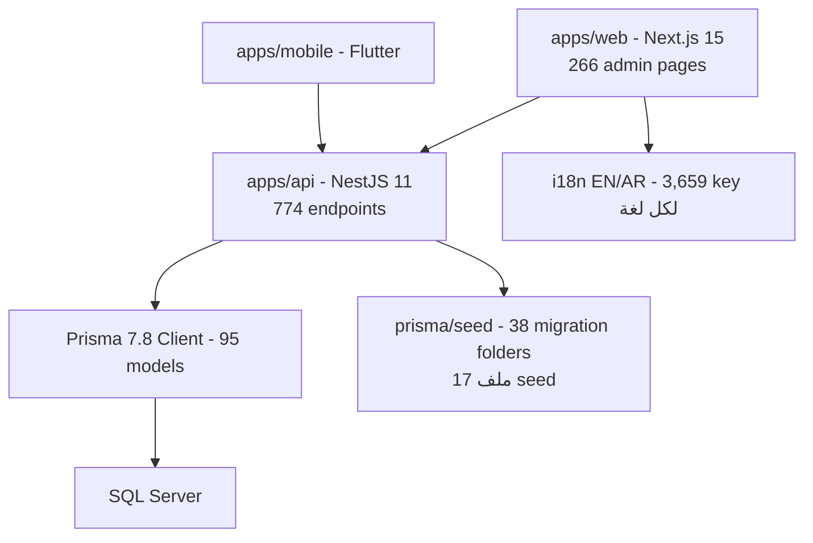

### هل النظام متعدد الشركات فعلياً؟

**جزئياً (PARTIAL)** — التفصيل في القسم 6:

- 20 موديلاً من 95 تحمل `companyId` و20 تحمل `branchId` (غالبيتها في نطاق المخزون؛ والعد يشمل العلاقات غير المسماة).
- `MaintenanceRequest` **لا يحمل** `companyId`/`branchId` إطلاقاً — العزل يتم بشكل غير مباشر عبر `Machine → companyId` (وهو اختياري في Machine نفسه).
- بيانات الأصناف الرئيسية (Product، SparePart، MachineComponent، Barcode، Messaging) **عالمية بدون أعمدة tenant**.
- لا يوجد isolation على مستوى قاعدة البيانات ولا على مستوى middleware عام؛ الحماية تأتي من guard واحد يتحقق فقط من **وجود** المستخدم وصلاحياته، ويوجد `OperationalContext` (UserOperationalScope) يضيف رؤوس سياق (`x-active-company-id`...) للطلبات لكنه نظام تفضيلات/فلترة اختيارية وليس إجبارياً (لا يرفض الطلب إذا لم يُرسَل).
- لا يوجد فحص `branchId` على مستوى السيرفيسات.

### صلاحيات متشددة مع فجوات محققة (تحديث 2026-08-03)

- 416 مفتاح صلاحية فريد تُستخدم في `@Permissions(...)` عبر الـ controllers، منها **163 مفتاحاً غير مزرعة في أي ملف seed** (مثال: `*:read/create/update/delete` بصيغة الجمع مثل `machines:read`، `branches:read`، `companies:create`، بينما الـ seed يزرع الصيغة المفردة أو مفاتيح أخرى).
- الـ `PermissionsGuard` يطابق حرفياًًً (`userPermissionKeys.has(p)`) بلا تطبيع، ويفتح SUPER_ADMIN فقط عبر `role.code === 'SUPER_ADMIN'`. النتيجة: **أي دور غير SUPER_ADMIN يرفض (403) بشكل fail-closed** عند أي endpoint يطلب مفتاحاً غير مزروع.
- تحققت هذه الفجوة بالكشف البرمجي: 416 مفتاحاً مستخدماً في controllers مقابل 343 مفتاحاً مذكوراً في ملفات seed (غالبها داخل `CMMS_EXTRA_PERMISSIONS`، مفاتيح العمل النشطة). التفاصيل الكاملة في القسم 12.

### هل الصيانة والإنتاج مستقلان أم متكاملان؟

الصيانة **منفذة بالكامل**؛ الإنتاج **غير موجود** (لا توجد نماذج ولا API ولا صفحات). التكامل الوحيد "الإنتاجي" هو: `ProductionLine` و`OperationType` و`CostCenter` — وهي **مراجع تنظيمية تُستخدم ضمن نطاق الصيانة** (تُربط بالـ Machine وطلبات الصيانة)، وليس نطاق إنتاج فعلياً. `MaintenanceBom` هو تخطيط قطع غيار للصيانة الوقائية وليس BOM إنتاجي.

### مصادر الحقيقة (Sources of Truth)

1. `apps/api/prisma/schema.prisma` (2,975 سطراً، 95 موديلاً)
2. `apps/api/src/app.module.ts` (80 وحدة مسجلة فعلياً)
3. الكود الفعلي للـ controllers/services (774 endpoint؛ 88 controller غير فارغ)
4. `apps/web/src/app/admin/**/page.tsx` (266 صفحة فعلية)
5. ملفات i18n (3,659 مفتاح EN + 3,659 AR، 16 ملفاً لكل لغة)
6. ملفات seed (38 migration folder + 17 ملف seed)

### نقاط لم يمكن حسمها (Unresolved)

- التصادم الفعلي بين controller-methods مكررة على نفس المسار (`inventory/adjustments` يظهر مرة ثانية في نفس الملف) — أي منها يخدم فعلياً غير محسوم دون تشغيل الخادم.
- هل `GET /inventory/balances` من `inventory.controller.ts` أم من `inventory-balances.controller.ts` عند التشغيل (كلاهما على نفس البادئة).
- سلوك `SecuritySettings` وقت التشغيل (لا يوجد ربط مكتشف بينها وبين flow المصادقة).

---

## القسم 2 — Audit Metadata

| العنصر | القيمة |
|---|---|
| تاريخ التقرير | 2026-08-03 (تحديث إحصاءات) — التقرير الأصلي 2026-07-31 |
| مسار المستودع (أمر المهمة) | `C:\Users\attef\PycharmProjects\Trae\ATsofterp` |
| مسار المستودع (التحقق الفعلي) | `C:\Users\attef\PycharmProjects\Project\ATsoft_erp` |
| الفرع الحالي | `main` |
| SHA الكامل | `8eba533efec5b02d7986c86e2511a80938bac1a7` |
| Git status قبل المراجعة | متسخ (dirty) — تغييرات موجودة مسبقاً في مخزونات وأدلة الإثبات؛ الملفات المذكورة في نهاية القسم |
| Git status بعد المراجعة | التقرير هو التغيير الوحيد للمهمة؛ بقية التغييرات مسبقة (لم يتم لمسها) |
| الـ remote | `origin → https://github.com/attef7474-byte/ATsoftERP` |
| بنية المستودع | Monorepo — npm workspaces 1.11 (`apps/*`, `packages/*`)، packageManager في package.json الجذر |
| الملفات المدروسة | كل `apps/api/src` (1,013 ملف TS)، كل `apps/web/src` (468 ملف ts/tsx)، schema.prisma (2,975 سطراً)، 38 migration folder، 17 ملف seed، apps/mobile (33 Dart)، apps/desktop (سقالة) |
| الدلائل المستثناة | `node_modules`, `.next`, `dist`, `storage`, `.git`, `test-results`, `release/` (ثنائي) |
| الأوامر المستخدمة | قراءة مباشرة فقط: `Get-ChildItem`, `Get-Content`, `Select-String`, `[regex]::Matches`, `git status/log/branch/remote` |
| قيود المنع | لم تُنفَّذ أي أوامر Prisma/DB/seed، لا تثبيت حزم، لا build، لا تشغيل خدمات، لا git write |
| الملفات المعدلة/غير المتعقبة قبل المهمة | `inventory-movements.controller.ts/.service.ts` و`.service.spec.ts`، `docs/proofs/atsofterp-phase0-workorders-runtime-tenant-inventory-proof.md`، دليل `.../inventory-opening-balance-adjustment-control/`، دليل `.../phase0-maintenance-work-orders-browser-proof/` |
| هل ملف التقرير هو التغيير الوحيد المنشأ من المهمة | **نعم** — `docs/proofs/atsofterp-current-architecture-discovery-report.md` (تحديث في مكانه) |

---

## القسم 3 — General Project Map

### شجرة التطبيقات

```text
ATsofterp/
├── apps/
│   ├── api/                      # NestJS 11 — 1,013 ملف TS (520 فارغ = 51%)
│   │   ├── prisma/               # schema.prisma (2,975 سطر، 95 موديل) + 38 migration + 17 seed
│   │   └── src/                  # main.ts, app.module.ts, modules/, common/
│   ├── web/                      # Next.js 15 — 266 page.tsx + login + home
│   │   └── src/app/admin/        # مجموعات تنقل + sidebar
│   ├── mobile/                   # Flutter — 33 ملف Dart (مصادقة/مخزون/آلات/صيانة/فاحص/مزامنة/offline)
│   └── desktop/                  # سقالة Tauri فقط (tauri.conf.json 0 بايت)
├── packages/
│   ├── config/src/index.ts       # حزمة إعدادات (index.ts 0 بايت، tsconfig 0 بايت)
│   ├── shared/src/index.js|.ts   # حزمة مشتركة (فارغة)
│   └── ui/src/.gitkeep           # فارغة تقريباً
├── docs/proofs/                  # أدلة الإثبات — 1,612 ملفاً (~50+ دورة إثبات)
├── infra/                        # docker-compose + prometheus + grafana + mosquitto — كل ملفات compose وmonitoring فارغة 0 b (غير مستخدمة)
├── deploy/windows/               # تثبيت خدمات Windows (PowerShell)
├── tools/                        # backup/deploy/health/installer/runtime
├── scripts/                      # 90+ ملفاً، 6 منها فقط غير فارغة
├── release/                      # حزمة الإصدار الحالي + zip
└── storage/                      # دليل تشغيل محلي
```

### خريطة الحزم (Package Map)

| الحزمة | الغرض الفعلي | التبعيات الرئيسية |
|---|---|---|
| `apps/api` | خادم NestJS: 774 endpoint، Prisma 7.8، JWT | @nestjs/* 11، prisma 7.8، passport-jwt، bcryptjs، exceljs، mssql/msnodesqlv8 |
| `apps/web` | واجهة Next.js 15: 266 صفحة، i18n (16 ns)، RTL | next 15، react 18.3، tailwind 3.4 |
| `apps/mobile` | Flutter 3.2+: خيوط تشغيل ميداني/فاحص/مزامنة | flutter_localizations، sqflite، mobile_scanner، connectivity_plus |
| `packages/shared` | `index.ts` مشترك (فارغ) | — |
| `packages/config` | `index.ts` إعدادات (فارغ) | — |
| `packages/ui` | فارغة (`.gitkeep`) | — |

### الطبقات (System Layers)

1. **طبقة العرض**: Next.js — بيانات عبر `apps/web/src/lib/api.ts` (base `http://localhost:4000/api/v1`).
2. **طبقة API**: NestJS — global prefix `api`، URI versioning `v1`، `ValidationPipe` (whitelist+forbidNonWhitelisted)، `AllExceptionsFilter`، Swagger على `/api/docs`، منفذ 4000.
3. **طبقة الوصول للبيانات**: Prisma Client 7.8 + `@prisma/adapter-mssql` → SQL Server عبر `msnodesqlv8`.
4. **قاعدة البيانات**: SQL Server 2016 Express (127.0.0.1:50079، ATsoftERP_DB).

### التكنولوجيا الفعلية (مع الأدلة)

| المجال | التقنية | الدليل |
|---|---|---|
| Backend | NestJS 11.1 | `apps/api/package.json` |
| Frontend | Next.js 15.5 + React 18.3 | `apps/web/package.json` |
| ORM | Prisma 7.8 (adapter mssql) | `apps/api/package.json`, `schema.prisma` datasource `sqlserver` |
| قاعدة البيانات | SQL Server | `schema.prisma` + `.env` (الأسماء فقط) |
| المصادقة | JWT (passport-jwt) + bcryptjs | `modules/auth/strategies/jwt.strategy.ts`, `auth.service.ts:26` |
| التفويض | `@Permissions()` + `PermissionsGuard` (per-controller، لا APP_GUARD) | `modules/auth/guards/permissions.guard.ts` |
| i18n | React Context (`I18nProvider`)، 53 namespace، 16 ملف/لغة (3,659 key) | `apps/web/src/lib/i18n/` |
| RTL/LTR | خاصية `dir` على مستوى الجذر + تخطيطات CSS | `i18n-provider.tsx` |
| State management | React hooks فقط (useState/useEffect) + `useCrudList` (4 صفحات فقط) | `hooks/useCrudList.ts` |
| التصدير | CSV (تقرير)، Excel (exceljs) | `reports.controller.ts` (`/reports/export/csv/*`, `/excel/*`) |
| الطباعة | QR/Barcode templates + صفحات طباعة متصفح | `barcodes/*` صفحات، `requests/[id]/print` |
| المرفقات | Multer على القرص (`storage/uploads`) | `documents/attachments` |
| الاختبارات | 45 spec مكتوبة (45 في api) — **27 منها غير فارغة** وتحتوي منطق اختبار حقيقي (services/guards/validation) | fحص بالحجم |
| Docker | ممنوع (AGENTS.md) — ملفات `infra/` كلها فارغة وغير مستخدمة | — |
| Installer/Runtime | سكربتات PowerShell (tools/runtime, tools/deploy) + حزمة release | `tools/runtime/atsofterp-install.ps1` وغيرها |
| Backup/Restore | سكربتات PowerShell + مجلد storage/backups | `tools/backup/*.ps1` |
| الإشعارات | In-app فقط (Notification)، قناة `IN_APP` في NotificationRule | `modules/notifications/` |
| Caching | لا يوجد Redis ولا cache طبقة | — |
| الجدولة | لا توجد cron/worker مسجلة | — |

---

## القسم 4 — Current Organizational Structure

### ما هو موجود فعلياً

| المستوى | النموذج | الحقول التنظيمية | حالة |
|---|---|---|---|
| Company (جذر tenant) | `Company` | code@u, name, legalName, taxNumber... | IMPLEMENTED |
| Branch | `Branch` | `companyId` + `@@unique(companyId, code)` | IMPLEMENTED |
| Administration | `Administration` | `branchId` + `@@unique(branchId, code)` | IMPLEMENTED |
| Department | `Department` | `companyId` + `branchId?` + `administrationId?` + `parentId?` (تسلسلي) + `@@unique(companyId, code)` | IMPLEMENTED |
| User | `User` | `companyId?` + `branchId?` + `departmentId?` | IMPLEMENTED |
| Employee | — | **غير موجود** — لا يوجد موديل Employee في schema | NOT_FOUND |
| Manager/مدير وحدة | — | لا يوجد تعيين managers؛ يوجد `MaintenancePersonnel` كطاقم صيانة فقط | NOT_FOUND |

### خصائص التسلسل الهرمي (من الكود):

- **Company → Branch → Administration → Department** — خط مستقيم صارم: Administration يتبع Branch فقط، Department يتبع Company مع Branch/Administration اختياريين.
- `Department.parentId` يدعم **التسلسل (recursive)** عبر `parent/children` — توجد واجهة `GET /departments/tree` وصفحة `core/departments`.
- لا يوجد `Administration` أبوي لـ Administration آخر (لا يوجد `parentId` في Administration).
- لا يوجد Employees؛ ولهذا لا يوجد تعيين موظف لوحدات متعددة ولا تواريخ بداية/نهاية للانتداب على مستوى الموظف (يوجد `startDate/endDate` فقط في `MachineResponsibilityAssignment` لطاقم الصيانة).
- لا توجد صفحة "شجرة تنظيمية" كاملة — يوجد `departments/tree` API وصفحة إدارة أقسام تسمح بـ parentId، ولا صفحة شجرة إدارات.
- لا يوجد validation يمنع علاقات هرمية خاطئة (مثل ربط إدارة بقسم غير تابع لنفس الفرع) — لا يوجد فحص مكتشف في services.
- **الفصل**: البنية الإدارية (Administration/Department) منفصلة عن الخطوط الإنتاجية والآلات؛ لكن `ProductionLine` و`Machine` يربطان بشكل اختياري بـ department/administration للـ cost attribution.
- **التضمين**: الوحدات التنظيمية **غير مضمّنة** في نماذج التشغيل — `MaintenanceRequest` لا يحمل departmentId (يصل عبر Machine → departmentId اختياري)، ونماذج المخزون تحمل companyId/branchId فقط.

### مخطط Mermaid (المدعوم فقط من الكود)

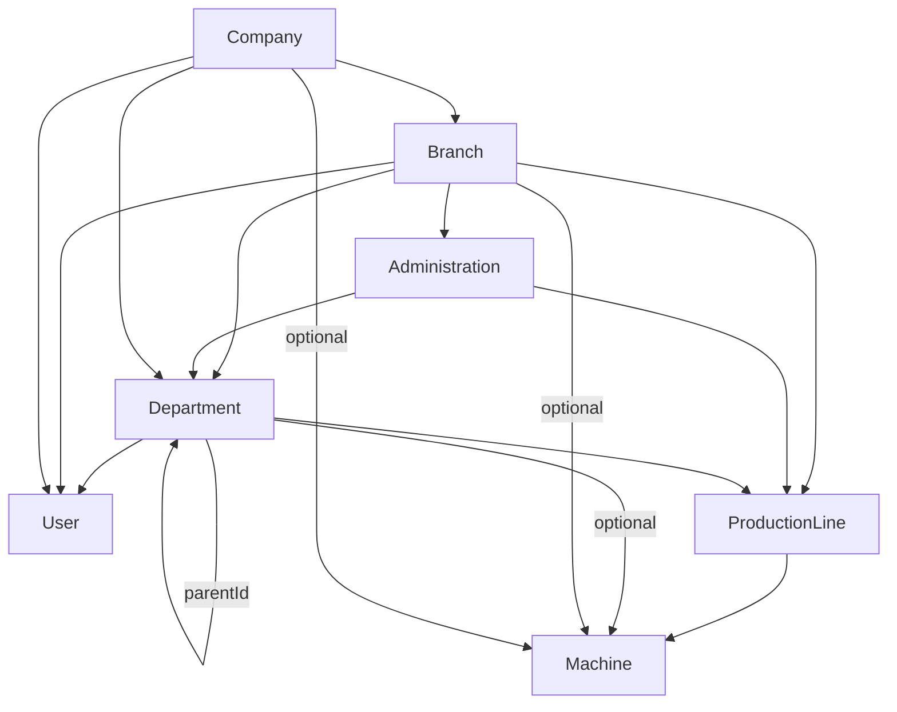

---

## القسم 5 — Current Factory and Operational Structure

### ما هو موجود فعلياً

| المفهوم | النموذج/التنفيذ | الحالة |
|---|---|---|
| Facility / Area / Section | **غير موجود** — لا توجد نماذج facilities/areas/sections | NOT_FOUND |
| Production Line | `ProductionLine` — مرجع تنظيمي (companyId, branchId, administrationId?, departmentId, operationTypeId, costCenterId?) | IMPLEMENTED (كتنظيم صيانة) |
| Operation Type | `OperationType` (MANUFACTURING, MIXING, FILLING, PACKAGING... 9 قيم seed) | IMPLEMENTED (مرجع) |
| Machine (أصل) | `Machine` — code@u, categoryId?, companyId?, branchId?, departmentId?, productionLineId?, operationTypeId?, defaultCostCenterId?, technicalAdministrationId?, technicalDepartmentId?, serial, warranty, qrCode, image | IMPLEMENTED |
| Machine Category | `MachineCategory` — تسلسلي (parentId?) | IMPLEMENTED |
| Machine Component | `MachineComponent` — تسلسلي تحت Machine (`@@unique(machineId, code)`) + criticality (MEDIUM افتراضي) | IMPLEMENTED |
| Machine Part (قديم) | `MachinePart` — رابط قديم بين Machine وProduct (machineId?/productId?) | LEGACY/شبه مهجور |
| Machine Document | `MachineDocument` — ملفات لكل آلة | IMPLEMENTED |
| Warehouse / Location | `Warehouse` (warehouseType: SPARE_PART/PRODUCT/RAW_MATERIAL) + `WarehouseLocation` | IMPLEMENTED |
| Employees/Operators/Supervisors | لا يوجد Employee model؛ يوجد `OperationalPerson` (category MAINTENANCE) + `MaintenancePersonnel` (role, specialty, dailyCapacityMinutes) | PARTIAL (طاقم صيانة فقط) |
| Shifts | **غير موجود** | NOT_FOUND |
| Cost Center | `CostCenter` (type + companyId?/branchId?/administrationId?/departmentId?) | IMPLEMENTED (مرجع) |

### العلاقات الفعلية (Mermaid)

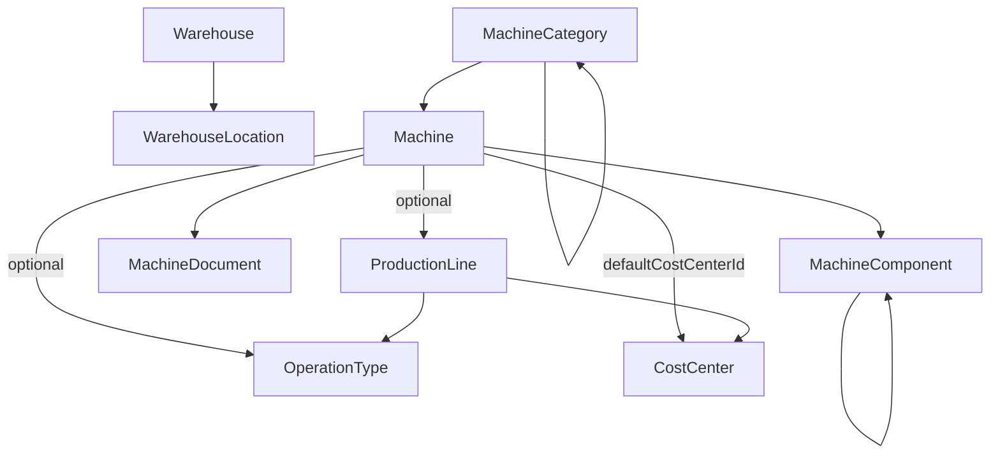

---

## القسم 6 — Database Architecture

### الإحصاءات الأساسية

| المقياس | القيمة |
|---|---|
| عدد النماذج (Models) | **95** |
| عدد الـ Enums | **0** (جميع الحالات نصوص String حرة — القيم فقط في كود TypeScript) |
| عدد الـ Views | 0 |
| `@unique` (أحادية) | 38 |
| `@@unique` (مركّبة) | 18 |
| `@@id` (مفاتيح مركّبة) | 2 (UserRole, RolePermission) |
| `@id` مفاتيح أولية | 95 (كل نموذج) |
| `@@index` | 507 |
| نماذج بها `deletedAt` (حذف ناعم) | 41 |
| نماذج بها `updatedAt` | 83 |
| نماذج بها حقل `status` | 55 (كلها String) |
| نماذج بها `companyId` | 20 |
| نماذج بها `branchId` | 20 |
| حجم schema.prisma | 2,975 سطراً |
| مجلدات migrations | 38 (تبدأ `20260714042111_init_core_foundation` وتنتهي `20260803000000_add_maintenance_work_order`) |

### النماذج مجمعة حسب النطاق

| النطاق | النماذج |
|---|---|
| Business Partners (6) | BusinessPartnerGroup, PaymentTerm, BusinessPartner, BusinessPartnerContact, BusinessPartnerAddress, BusinessPartnerBankAccount |
| تنظيم/tenant (10) | Company, Branch, Administration, Department, ProductionLine, User, UserOperationalScope, Role, Permission, UserRole, RolePermission (11 فعلياً) |
| نظام/عام (7) | AuditLog, Notification, NotificationRule, Attachment, SystemSetting, NumberSequence, InventoryLock |
| مخزون رئيسي (4) | Warehouse, WarehouseLocation, ProductCategory, Product |
| مستندات مخزون (20) | InventoryCount(+Line), InventoryPhysicalCount(+Line), InventoryMovement(+Line), InventoryAdjustment(+Line), InventoryOpeningBalance(+Line), InventoryStockAdjustment(+Line), InventoryStockTransfer(+Line), InventoryOperationalReceipt(+Line), InventoryBalance |
| صيانة رئيسية/مراجع (9) | MachineCategory, Machine, MachinePart, MachineDocument, MachineComponent, SparePart, ComponentSparePart, MachineSparePart, OperationType, CostCenter (10 فعلياً) |
| عمليات صيانة (16) | MaintenanceRequest, MaintenanceRequestRequiredPart, MaintenanceSlaRule, MaintenanceSlaState, OperationalPerson, MaintenancePersonnel, MachineResponsibilityAssignment, MaintenanceRequestAssignment, MaintenancePartAccountability, MaintenanceTask, MaintenanceSchedule, MaintenanceChecklistItem, DowntimeLog, MaintenanceRequestPartUsage, MaintenanceRequestCostEntry, MaintenanceChecklistExecution(+Item) (17 فعلياً) |
| Barcode/QR (4) | BarcodeLabel, BarcodeScanEvent, BarcodeLabelTemplate, BarcodePrintJob |
| Messaging (3) | InternalConversation, InternalConversationParticipant, InternalMessage |
| حالات/إصلاح/BOM (10) | SparePartConditionBalance, SparePartConditionMovement, SparePartRepairOrder, SparePartRepairAction, MachineInstalledPart, SparePartReplacementHistory, MaintenanceBom, MaintenanceBomVersion, MaintenanceBomItem, PreventiveSparePartPlan(+Item) (11 فعلياً) |

### المفاتيح المركّبة الفريدة (18 @@unique)

`Branch(companyId,code)`، `Administration(branchId,code)`، `Department(companyId,code)`، `Warehouse(companyId,code)`، `WarehouseLocation(warehouseId,code)`، `InventoryBalance(warehouseId,productId,batchNumber,serialNumber)`، `InventoryCountLine(countId,productId,warehouseLocationId)`، `InventoryPhysicalCountLine(...)`، `MachineComponent(machineId,code)`، `ComponentSparePart(componentId,sparePartId)`، `MachineSparePart(machineId,sparePartId)`، `MaintenanceRequestRequiredPart(maintenanceRequestId,sparePartId)`، `MaintenanceSlaState(maintenanceRequestId)`، `InternalConversationParticipant(conversationId,userId)`، `SparePartConditionBalance(sparePartId,warehouseId,condition)`، `MaintenanceBomVersion(bomId,versionNumber)`.

### فحص العزل متعدد الشركات (Tenant Isolation)

- **نماذج تحمل companyId (20 بالعد الجسمي)**: Branch, Department, ProductionLine, User, UserOperationalScope, Warehouse, Machine, CostCenter, InventoryCount, InventoryPhysicalCount, InventoryMovement, InventoryAdjustment, InventoryOpeningBalance, InventoryStockAdjustment, InventoryStockTransfer, InventoryOperationalReceipt وغيرها — عدد حقول `companyId` في schema = 20.
- **عزل غير مباشر (بلا companyId)**: InventoryBalance (عبر warehouseId)؛ كل جداول الخطوط (عبر المستند الأب)؛ كل نماذج الصيانة (عبر Machine → companyId اختياري!)؛ SparePartConditionBalance/Movement وSparePartRepairOrder (عبر warehouseId)؛ MachineInstalledPart/ReplacementHistory/Bom/Plans (عبر machineId).
- **بيانات عالمية (بلا tenant إطلاقاً)**: Product، SparePart، MachineComponent، MachineCategory، Barcode*، Messaging، Role، Permission، AuditLog، Notification، Attachment، SystemSetting، OperationType.
- **حيث يتم العزل**: لا يوجد isolation على مستوى قاعدة البيانات (SQL views/RLS) ولا على مستوى middleware؛ العزل النظري هو: فلاتر `companyId` في استعلامات مخزون معينة + `OperationalContext` (رؤوس `x-active-company-id`...) التي تُقرأ عبر interceptor وترسلها الواجهة الأمامية كتفضيل سياق. **لا يوجد فحص يمنع جلب سجل شركة أخرى عند معرفة ID مباشر** (لا توجد where clauses عامة تفرض tenant على كل الخدمات).
- **كيف تُفتح الشركة النشطة**: من `UserOperationalScope` (تسلسلات لكل مستخدم عبر `/auth/contexts` + `/auth/context/validate`)، وليس من JWT. الرأس `x-active-company-id` يختاره المستخدم من `context-switcher` في الشريط العلوي.
- **هل يُفعَّل فرع الوصول؟** لا — branchId في السياق اختياري وغير مفروض.
- **فريدية مقيّدة بالشركة**: نعم لبعضها (`@@unique(companyId, code)` في Branch/Warehouse/Department/Administration)؛ لكن `code@u` عالمي في Product/SparePart/Machine/BusinessPartner/NumberSequence — أي أكواد لا تتكرر عبر الشركات.

---

## القسم 7 — Backend Architecture

### إحصاءات الوحدات

| المقياس | القيمة |
|---|---|
| وحدات مسجلة في `AppModule` | **80** (تم التحقق برمجياً من مصفوفة imports) |
| ملفات `.module.ts` على القرص | 202 (89 غير فارغة) |
| وحدات على القرص غير مسجلة | ~113 (باستثناء app.module.ts نفسه) |
| ملفات controller | 170 (88 تحتوي مسارات حقيقية، **82 فارغة 0 بايت**) |
| إجمالي الـ endpoints | **774** (GET=380، POST=161، PATCH=168، DELETE=65، PUT=0) |
| ملفات service | 143 (96 غير فارغة) |
| ملفات DTO | 389 |
| ملفات TS في api/src إجمالاً | 1,013 — منها **520 ملفاً فارغاً (51%)** |
| Guard files | 7 (زوجان مكرران Jwt/Permissions + inventory-lock + approval-duplication.guard فارغ + roles.guard فارغ) |

### الوحدات المسجلة (80) — ملخص مصنف

- **Core**: PrismaModule, HealthModule, AuthModule, UsersModule, RolesModule, PermissionsModule, BranchesModule, AdministrationsModule, DepartmentsModule, CompaniesModule, AuditModule
- **Factory/Inventory**: ProductsModule, ProductCategoriesModule, InventoryModule, InventoryCountsModule, InventoryCountLinesModule, InventoryMovementsModule, InventoryAdjustmentsModule, InventoryBalancesModule, InventoryLedgerReconciliationModule, InventoryOpeningBalancesModule, InventoryStockAdjustmentsModule, InventoryStockTransfersModule, InventoryOperationalReceiptsModule, InventoryPhysicalCountsModule, InventoryLocksModule
- **Maintenance (40 وحدة)**: MaintenanceModule، MachineCategories، MachineParts، MachineDocuments، MaintenanceRequests، MaintenanceTasks، MaintenanceSchedules، MaintenanceChecklistItems، DowntimeLogs، MaintenanceRequestParts، MaintenanceRequestCosts، MaintenanceChecklistExecutions، MaintenanceDashboard، PreventiveMaintenance، OperationTypes، CostCenters، ProductionLines، MachineComponents، SpareParts، ComponentSpareParts، MachineSpareParts، MaintenancePersonnel، MachineResponsibilityAssignments، MaintenanceRequestAssignments، MaintenancePartAccountability، MaintenanceReliability، MaintenanceSparePartRequestLines، MaintenanceNotification، MaintenanceSla، MaintenanceCalendarWorkload، MaintenanceStockIssue، SparePartCondition، InstalledPartsReplacement، RepairOrders، MaintenanceBom، PreventiveSparePartPlan
- **أخرى**: BusinessPartners، Barcodes، SystemSettings، CompanyProfile، Language، Appearance، Security، NotificationRules، Numbering، Notifications، Reports، Search، Dashboard، Alerts، Attachments، Messaging

### وحدات على القرص غير مسجلة (أمثلة مع المسارات)

`modules/ai/*` (6)، `finance/*` (12)، `purchasing/*` (10)، `sales/*` (9)، `hr/*` (8)، `iot/*` (8)، `bi/*` (5)، `forecasting/*` (5)، `dynamic/*` (5)، `workflows`، `approvals`، `backups`، `import-export/*` (5)، `print-templates`، `predictive-maintenance/*` (5)، `system-health`، `system-update`، `monitoring`، `universal-requests`، `hr-requests`، `inventory-issue-requests`، `financial-disbursement-requests`، `business-rules`، `factory/bom`، `factory/materials`، `factory/quality`، `factory/units`، `factory/production`، `admin/access-control` (نسخة قديمة فارغة)، `documents` (الأب)، `settings` (الأب)، `admin` (الأب). **كلها 0 بايت ولا تسرّب إلى runtime.**

### الترويسات العامة

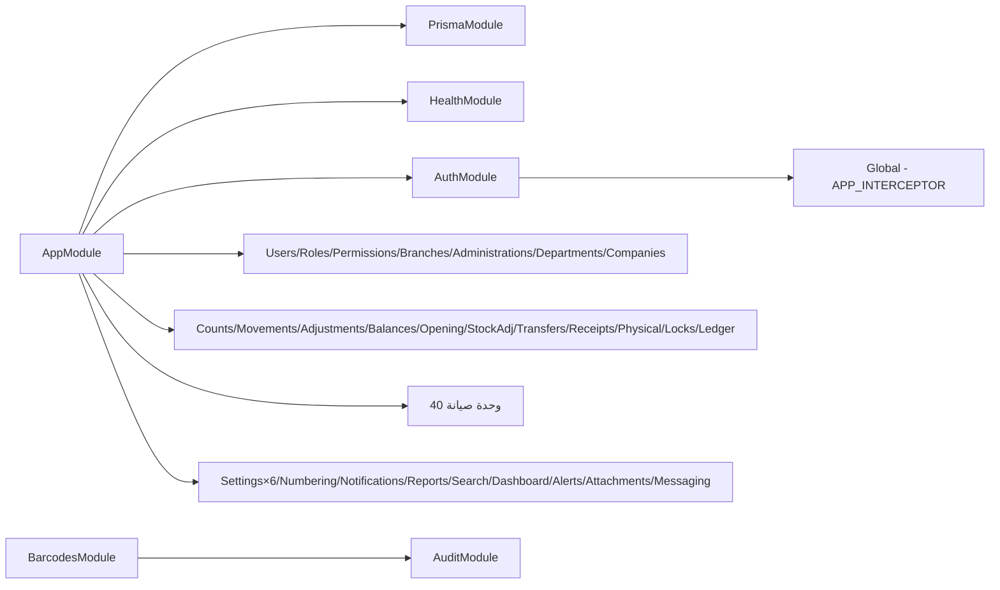

### توزيع الـ endpoints حسب الوحدة (774 — عد برمجي شامل لكل decorator @Get/@Post/@Patch/@Delete)

| الوحدة | العدد | ملاحظة |
|---|---|---|
| factory※ (كل النطاق التشغيلي) | 538 | تشمل Maintenance + Inventories + Products |
| 　└─ Maintenance (36 controller) | 362 | requests/tasks/schedules/work-orders/downtime/… |
| 　└─ Inventory documents + أرصدة + أقفال | 142 | adjustments 11, balances 9, count-lines 6, counts 10, ledger-reconciliation 13, locks 12, movements 10, opening-balances 14, operational-receipts 14, physical-counts 14, stock-adjustments 14, stock-transfers 15 |
| 　└─ Products + Categories | 18 | products 10، categories 8 |
| Admin (users/roles/permissions/branches/departments/administrations/organizational-units) | 42 | 8 controllers |
| Reports | 42 | |
| Barcodes | 40 | 4 controllers |
| Business Partners | 30 | 6 controllers |
| Settings (6 وحدات) | 22 | |
| Auth | 7 | |
| Documents/Attachments | 7 | |
| Numbering | 7 | |
| Notifications | 6 | |
| Search | 6 | |
| Audit | 6 | |
| Companies | 5 | |
| Messaging | 9 | |
| Dashboard | 3 | |
| Alerts | 3 | |

### Guards والتفويض

- لا يوجد `APP_GUARD` — الحماية **per-controller** عبر `@UseGuards(JwtAuthGuard, PermissionsGuard)` (~90 controller).
- `JwtAuthGuard` — نسختان: `modules/auth/guards/jwt-auth.guard.ts` (775 b) و`common/guards/jwt-auth.guard.ts` (796 b) بمنطق متطابق.
- `PermissionsGuard` — نسختان متطابقتان أيضًا (`auth/guards/permissions.guard.ts` 1,684 b و`common/guards/permissions.guard.ts` 1,642 b): تقرأ metadata `'permissions'`، تطابق حرفياًًً (`userPermissionKeys.has(p)`)، تفتح SUPER_ADMIN فقط عبر `role.code === 'SUPER_ADMIN'`، وتقوم lookup في Prisma لكل طلب. **لا توجد أي عملية تطبيع بين مفتاح الـ controller والمفتاح المزروع.**
- `InventoryLockGuard` — على 6 controllers للطفرات المخزنية (adjustments, movements, stock-transfers, stock-adjustments, physical-counts, operational-receipts) — يرفض الطفرات أثناء الأقفال (WAREHOUSE/LOCATION/ITEM/PERIOD/GLOBAL).
- `roles.guard.ts` و`approval-duplication.guard.ts` — **0 بايت** (غير مستخدَمين).
- Decorator الصلاحيات: `@Permissions(...)` فقط (مفتاح `'permissions'` مشترك).
- `@Public()` على 3 endpoints فقط: `GET /health`, `POST /auth/login`, `POST /auth/logout`.
- `@OperationalContextOptional()` على endpoints المصادقة.

### ملاحظات معمارية خلفية (Conflict/Observation)

- `inventory-adjustments.controller.ts` يحتوي **controller ذا بادئة مكررة داخل نفس الملف** (`:17` و`:87` كلاهما `inventory/adjustments`) + controller لـ `inventory/counts` في نفس الملف (`:102`) يتصادم مع `inventory-counts.controller.ts:15`.
- `inventory-count-lines.controller.ts` **بلا بادئة** (المسارات كاملة يدوياً) — غير متسق مع بقية inventory/counts.
- `changePassword` يرمي أخطاء إنجليزية خام (`auth.service.ts:185,191,194`) — مخالفة لقاعدة i18n API.
- `getProfile` يعيد `{...user, user, ...}` (تكرار مفتاح user) (`auth.service.ts`).
- الـ 2FA: حقول `twoFactorEnabled/twoFactorSecret` موجودة في User، وDTOs (confirm-two-factor, disable-two-factor, regenerate-recovery-codes, verify-two-factor-login) **0 بايت** — غير منفذة.
- **فجوة صلاحيات محققة (تحديث 2026-08-03)**: 416 مفتاح صلاحية مستخدم في `@Permissions(...)` بالـ controllers، منها **163 غير مزرعة** في أي ملف seed. الـ `PermissionsGuard` لا يطبّع المفاتيح فيفشل أي دور غير SUPER_ADMIN (403) عند endpoint يطلب مفتاحاً مفقوداً. أمثلة على المفاتيح غير المزروعة: `machines:read/create/update/delete`، `branches:read`، `companies:read`، `administrations:*`، `attachments.*`، `alerts.view`، `downtime-log:start/end`.

---

## القسم 8 — Frontend Architecture

### الإحصاءات

| المقياس | القيمة |
|---|---|
| صفحات `page.tsx` تحت `src/app` | **266** |
| صفحات الجذر | 2 (`/login`, `/`) |
| layouts | 2 (root + admin) |
| ملفات i18n EN | 16 (index + 15 namespace) — **3,659 مفتاحاً** |
| ملفات i18n AR | 16 — **3,659 مفتاحاً** (تطابق 100% مع EN) |
| مجلدات locales متطابقة ar/en | نعم (16 ملفاً لكل لغة، أسماء متطابقة) |
| مجموعات sidebar | 10 مجاميع / 97 رابطاً |
| روابط sidebar ميتة | **0** (كل الـ 97 موجودة) |
| صفحات placeholder | **0** |
| بيانات mock في الصفحات | **0** |
| مكونات entity قابلة لإعادة الاستخدام | 9 ملفات (`components/entity/`) |
| ملفات i18n في `lib/i18n/` | 42 (8 أساسية + 16 AR + 16 EN + misc) |
| صفحات تستخدم `useCrudList` | 4 فقط (companies/branches/administrations/departments) |

### شجرة الـ Sidebar الفعلية (10 مجموعات)

```text
dashboard            → /admin/dashboard
organization         → companies, branches, administrations, departments
                       + production-lines, operation-types, cost-centers
access               → users, roles, permissions
assets               → machines, machine-categories, machine-documents
                       + machine-components, machine-parts
maintenance          → requests, tasks, schedules, checklist-items, downtime-logs
                       + calendar, workload, sla, reliability/mttr
                       + personnel, machine-responsibilities, accountability
                       + spare-parts, spare-part-conditions, installed-parts,
                         repair-orders, bom, spare-part-plans
inventory            → warehouses, locations, product-categories, products
                       + opening-balances, movements, counts, adjustments,
                         stock-adjustments, locks
                       + balances, ledger, reconciliation, governance-audit
barcode              → barcodes, generate, print, scan, preview
                       + records, templates, product-labels, machine-cards,
                         scans, print-jobs
reports              → reports + 25 تقريراً (maintenance/inventory/barcodes/system)
documents            → attachments
system               → settings, company, language, appearance, security,
                       numbering, notification-rules
                       + audit, user-activity, login-history
                       + notifications, messaging
```

- صفحات بلا إدخال sidebar (تُفتح من أماكن أخرى): `/admin/alerts` (من لوحة التحكم)، `/admin/profile` (من قائمة المستخدم)، `/admin/search` (من F9/Ctrl+K).
- `routeGroupMap` يحتوي إدخالات orphan لـ `search`/`alerts` بلا مجموعات مطابقة (غير ضار).
- i18n: 127 labelKey مستخدمة في sidebar، كلها معرّفة في `en/navigation.ts` (169 مفتاحاً).

### نظام i18n

- `I18nProvider` — locale محفوظ في `localStorage('locale')`، الافتراضي `'ar'`، `t(key, ns?)` يستخرج ns من أول نقطة ويرجع **المفتاح الخام** إذا لم يوجد.
- 53 namespace معرفة في `types.ts`؛ 5 منها غير منفذة كملفات مستقلة لكن مفاتيحها موجودة داخل ملفات أخرى (inventoryCounting, maintenanceDashboard, preventiveMaintenance, downtimeAnalysis, sparePartRequest — كما توثق AGENTS.md).
- **لا يوجد إرسال `x-locale` من الـ frontend** — grep صفري؛ اللغة من جهة API تعتمد على `Accept-Language` ثم fallback `ar`.

### Data Fetching

- `lib/api.ts`: base `NEXT_PUBLIC_API_URL || http://localhost:4000/api/v1`؛ token من `localStorage.accessToken`؛ يحقن رؤوس السياق التشغيلي (`x-active-company-id`...) من `lib/operational-context.ts` (مخزنة بـ localStorage تحت مفتاح المستخدم).
- أخطاء API تمر عبر `useApiErrorHandler()` → `normalizeApiError()` → `ErrorModal` (نافذة أخطاء عامة)؛ النجاح عبر `showToast`.
- F9: `components/f9/F9Lookup.tsx` + `UnifiedSearchModal` + `adapter-registry` (adapters لكل كيان) + اختصار عام F9/Ctrl+K عبر `f9-shortcut.tsx` — مستخدم في 30+ صفحة.
- مكونات واجهة رئيسية: `AdminDataGrid` (غني) + `DataTable` (بسيط)، `AdminActionBar` (`useRegisterAdminActions`)، `ToastProvider`، `ErrorModalProvider`، مكونات سياق تشغيلي (`context-switcher`, `operational-context-gate`)، مكونات entity (v11).

---

## القسم 9 — Current Maintenance Implementation

### النطاق (362 endpoint عبر 36 controller — الأكبر في النظام)

| المحور | الحالة |
|---|---|
| Machines register + categories + documents + components + parts | IMPLEMENTED |
| Maintenance Requests (طلب صيانة كامل) | IMPLEMENTED — 28 endpoint |
| Work Orders (أوامر عمل + إصدار قطع) | IMPLEMENTED — دورة DRAFT→PLANNED→IN_PROGRESS→COMPLETED/CANCELLED + `issueParts` كامل بالحركة/الرصيد/التركيب |
| Tasks | IMPLEMENTED — 13 endpoint |
| Schedules (جدولة وقائية) | IMPLEMENTED — 10 endpoint |
| Checklist items + executions | IMPLEMENTED |
| Downtime Logs + RCA | IMPLEMENTED — 17 endpoint |
| Dashboard/Planning/Workload/SLA | IMPLEMENTED — 13/16/5 endpoint |
| Preventive (upcoming/overdue/calendar/execution) | IMPLEMENTED — 5 endpoint |
| Required Parts workflow (طلب/اعتماد/حجز/استخدام) | IMPLEMENTED — 9 endpoint |
| Stock Issue (صرف قطع من مستودع SPARE_PART) | IMPLEMENTED — 3 endpoint |
| Conditions (SparePartConditionBalance/Movement) | IMPLEMENTED — 8 endpoint |
| Installed Parts + Replacement History | IMPLEMENTED — 9 endpoint |
| Repair Orders | IMPLEMENTED — 17 endpoint |
| BOM + Preventive Spare Part Plans | IMPLEMENTED — 18 + 14 endpoint |
| Reliability/MTTR/MTBF | IMPLEMENTED — 13 endpoint |
| Personnel/Responsibilities/Assignments/Accountability | IMPLEMENTED |

### الحالات (Statuses) الفعلية من الكود

| الكيان | الحالة الابتدائية | القيم الكاملة |
|---|---|---|
| MaintenanceRequest | OPEN | OPEN, IN_PROGRESS, COMPLETED, CANCELLED, CLOSED (reopen → OPEN) |
| MaintenanceRequestRequiredPart | REQUESTED | DRAFT, REQUESTED, APPROVED, REJECTED, RESERVED, USED, CANCELLED + stockIssueStatus: NOT_ISSUED, PARTIALLY_ISSUED, FULLY_ISSUED |
| MaintenanceTask | PENDING | PENDING, IN_PROGRESS, DONE, CANCELLED |
| MaintenanceSchedule | ACTIVE | ACTIVE, INACTIVE, COMPLETED |
| MaintenanceChecklistExecution | IN_PROGRESS | IN_PROGRESS, COMPLETED (items: PENDING, COMPLETED) |
| DowntimeLog | (محسوبة) | ACTIVE, CLOSED, CANCELLED + rcaStatus: PENDING... |
| MaintenanceSlaState | ON_TRACK | ON_TRACK, AT_RISK, OVERDUE, BREACHED + escalationLevel NONE... |
| MachineResponsibilityAssignment | ACTIVE | ACTIVE, INACTIVE |
| MaintenanceRequestAssignment | ASSIGNED | ASSIGNED, COMPLETED, CANCELLED (+ acceptedAt/startedAt/completedAt) |
| MaintenancePartAccountability | ASSIGNED | ASSIGNED, REPORTED, RETURNED, CANCELLED |
| SparePartRepairOrder | DRAFT | DRAFT, OPEN, IN_INSPECTION, INSPECTION_FAILED, APPROVED_FOR_REPAIR, UNDER_REPAIR, WAITING_PARTS, UNDER_TEST, COMPLETED_SERVICEABLE, COMPLETED_PARTIAL, COMPLETED_NOT_REPAIRABLE, SCRAPPED, CANCELLED |
| MaintenanceWorkOrder | DRAFT | DRAFT → (plan) PLANNED → (start) IN_PROGRESS → (complete) COMPLETED، أو (cancel) CANCELLED من DRAFT/PLANNED؛ وشرط أساسي قبل الإكمال: وجوب إصدار كل أسطر القطع (لا يُسمح ببقاء أي سطر PARTIALLY_ISSUED). توجد فحوص حالة صريحة قبل كل انتقال داخل `transition()` |
| MaintenanceWorkOrderPart | PENDING | stockIssueStatus: PENDING → PARTIALLY_ISSUED → FULLY_ISSUED (عبر `issueParts` داخل transaction) |
| SparePartRepairAction | PLANNED | PLANNED, IN_PROGRESS, DONE, FAILED, CANCELLED |
| MachineInstalledPart | ACTIVE | ACTIVE, REMOVED |
| MaintenanceBom | ACTIVE | ACTIVE, INACTIVE فقط في الخدمة (AGENTS.md توثق DRAFT→APPROVED→ACTIVE→ARCHIVED — **تعارض موثق** مع الكود) |
| PreventiveSparePartPlan | DRAFT | DRAFT→[ACTIVE, CANCELLED]→[COMPLETED, CANCELLED] |

### دورة طلب الصيانة (من الكود)

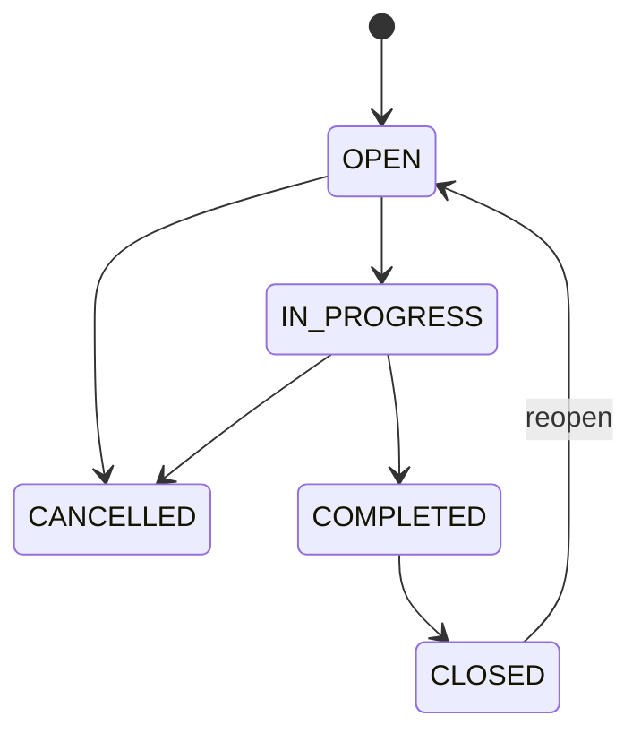

### دورة سطر قطع الغيار (RequiredPart)

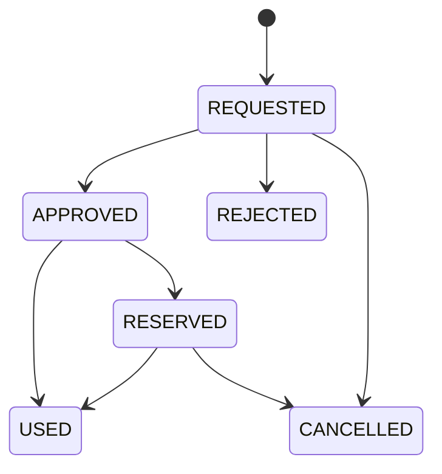

### دورة أمر الإصلاح (RepairOrder)

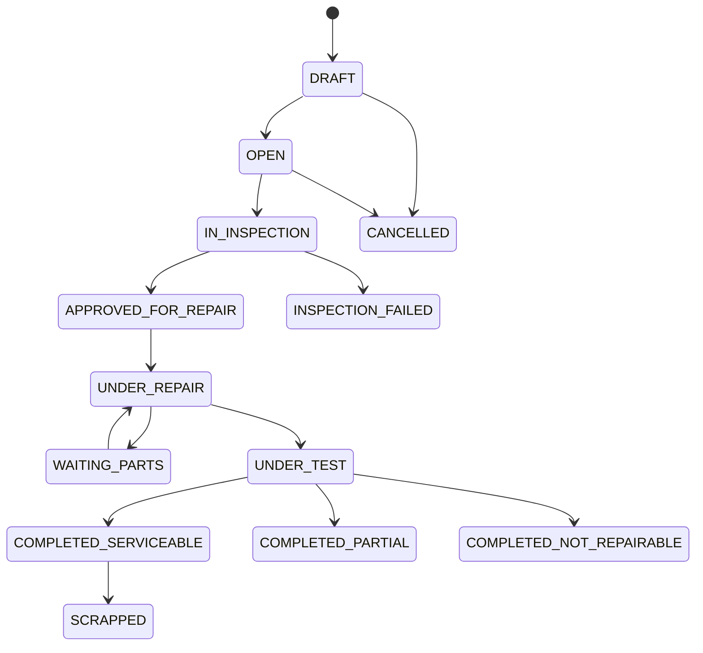

### دورة أمر العمل (Work Order) — تم التحقق من `maintenance-work-orders.service.ts:301`

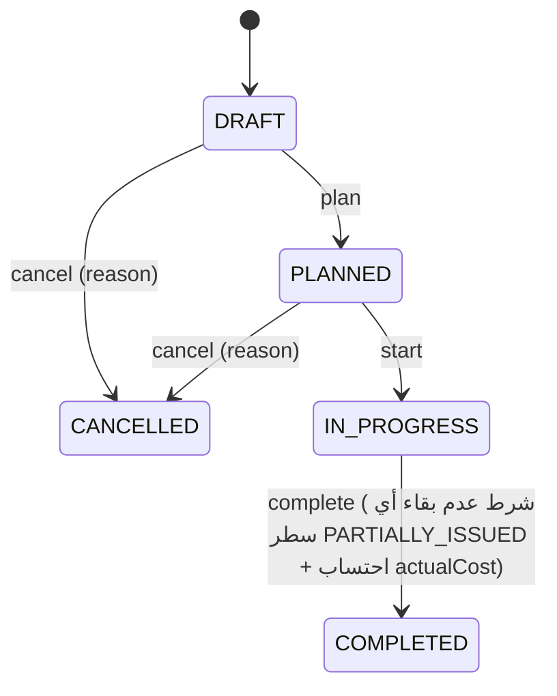

### دورة إصدار قطع أمر العمل (MaintenanceWorkOrderPart)

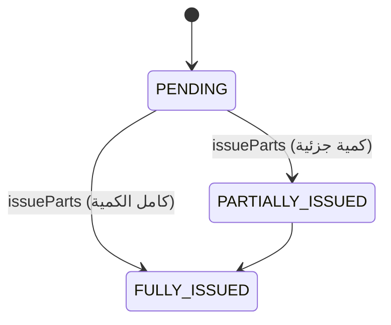

### قواعد الأعمال المؤكدة (من الكود)

- **Stock Issue**: `MaintenanceStockIssueService.issue()` يستخدم مستودع **SPARE_PART فقط** (كتل PRODUCT/RAW_MATERIAL)، يخصم من `InventoryBalance` (upsert)، ينشئ `InventoryMovement`، يسجل `MachineInstalledPart` + `SparePartReplacementHistory`، يحدّث `stockIssueStatus` ويحدّث رصيد الشرط (condition) عند الإرجاع.
- **Work Order Issue**: `MaintenanceWorkOrdersService.issueParts()` (L473-624) — يتحقق من توافق المخزون/الكمية المتاحة، يكيف حركة مخزون وسطر أمر عمل، يوقف الرصيد، ويحدّث `stockIssueStatus` إلى PARTIALLY/FULLY_ISSUED — كلها داخل `transaction`.
- **التحويل الشرطي**: تحويل حالة في `SparePartConditionBalance` (OUT من مصدر → IN لهدف) دون لمس `InventoryBalance` — يتم داخل `$transaction`.
- **التخطيط لا يخصم**: PreventiveSparePartPlan/BOM reservation **لا يخصم** رصيداً (يحدّث availableQuantity فقط).
- **لا توجد قيود مالية**: الـ Repair workflow لا ينشئ إدخالات Finance/Purchasing (كما في الكود؛ النماذج المالية غير موجودة أصلاً).
- **NumberingService**: 47 موقع استدعاء عبر ~14 خدمة؛ صفر تجاوز (`numberSequence` يُلمس فقط داخل `numbering.service.ts`).
- **الحماية**: كل خدمات الطفرات المخزنية تستخدم `prisma.$transaction`.

### فجوات الصلاحيات المكتشفة (تحديث 2026-08-03 — تم توسيعها بالفحص البرمجي الشامل)

- **النتيجة الموسعة**: 416 مفتاح صلاحية فريد مستخدم في `@Permissions(...)` عبر الـ controllers، منها **163 مفتاحاً غير مزرع في أي ملف seed** — ومع التطابق الحرفي في الـ guard، تكون النتيجة رفضاً (403) لأدوار غير SUPER_ADMIN عند مسارات معروضة فعلياً في الواجهة.
- النقاط الأربع المؤكدة سابقاً تبقى صحيحة كأمثلة على هذه الفجوة:
  1. `installed-parts:read` غير مزرع — 9 endpoints تطلبه → 403.
  2. `maintenance-request:activity.view` مقابل المزروع `maintenance-request:activity` → 403.
  3. `maintenance-request:attachments.view` مقابل `maintenance-request:attachments` → 403.
  4. `maintenance-request:print` مقابل المزروع `maintenance-request:printData` → 403.
  5. صيغ أساسية مثل `machines:*`, `branches:*`, `companies:*`, `administrations:*`, `attachments.*` غير مذكورة في أي seed.

---

## القسم 10 — Current Production Implementation

**النتيجة: النطاق غير موجود.**

| العنصر | الحالة | الدليل |
|---|---|---|
| ProductionOrder / WorkOrder | NOT_FOUND | لا يوجد موديل في schema (فحص شامل) |
| BillOfMaterials إنتاجي | NOT_FOUND | `MaintenanceBom` لنطاق الصيانة فقط |
| Routing | NOT_FOUND | — |
| ProductionLine | PARTIAL | مرجع تنظيمي للصيانة فقط (`schema.prisma:337`) |
| Shifts | NOT_FOUND | — |
| Waste / Rework | NOT_FOUND | — |
| Quality | NOT_FOUND | `factory/quality/*` على القرص 0 بايت |
| Material consumption / Finished-goods receipt | NOT_FOUND | `factory/production` DTOs (create-production-order, issue-material, receive-finished-goods, record-production-waste) **كلها 0 بايت** |
| OEE | NOT_FOUND | — |
| واجهة إنتاج | NOT_FOUND | صفر صفحات؛ صفر استدعاءات frontend لنطاقات الإنتاج |

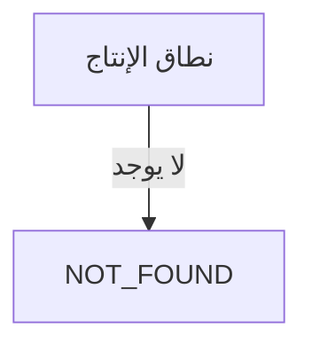

---

## القسم 11 — Inventory, Spare Parts, and Costing

### المخزون (IMPLEMENTED)

- **العناصر**: `Product` + `ProductCategory` (شجرة) + `Warehouse` (warehouseType: SPARE_PART/PRODUCT/RAW_MATERIAL) + `WarehouseLocation`.
- **الأرصدة**: `InventoryBalance` (unique: warehouseId+productId+batchNumber+serialNumber) — upsert داخل `$transaction` (16 موقع upsert في inventory-balances.service).
- **المستندات** (كلها بمسار DRAFT → SUBMITTED → APPROVED → REJECTED → POSTED → CANCELLED، عدا Counts وMovements):
  - `InventoryCount` (+Lines) — DRAFT/IN_PROGRESS/COMPLETED/CANCELLED — مع start/complete/cancel/results/history.
  - `InventoryMovement` (+Lines) — DRAFT/POSTED/CANCELLED — movementType + sourceType/sourceId (مصدر عام).
  - `InventoryAdjustment` (+Lines) — من فرق العد (systemQty/countedQty/differenceQty) + `from-count/:countId` و`generate-adjustment`.
  - `InventoryOpeningBalance` (+Lines)، `InventoryStockAdjustment` (+Lines) — دورة اعتماد كاملة.
  - `InventoryStockTransfer` (+Lines) — مصدر/وجهة (أرصدة OUT/IN + حركتان).
  - `InventoryOperationalReceipt` (+Lines) — supplierName/supplierDoc (استلام تشغيلي فقط).
  - `InventoryPhysicalCount` (+Lines) — variance control كامل (enter/submit/approve/reject/post/cancel).
- **منع الرصيد السالب**: فحص `availableQuantity`/`quantity >= requested` في خدمات الصرف/التحويل قبل الخصم (داخل transactions).
- **الأقفال**: `InventoryLock` + `InventoryLockGuard` على 6 controllers للطفرات.
- **التسوية**: `InventoryLedgerReconciliationModule` — ledger + reconciliation + orphans + negative-balances.
- **الأرقام**: كل المستندات ترقم عبر `NumberingService.generateNumberAtomic()`.

### قطع الغيار (IMPLEMENTED)

- قطعة الغيار كيان مستقل `SparePart` (كتالوج بخصائص: technicalClassification, usageType, nature, importance, isCritical) مع **رابط اختياري إلى Product** (`productId`) وربط بـ Machine (`MachineSparePart`) وComponent (`ComponentSparePart`).
- التركيب/الإزالة/الاستبدال مسجلة (`MachineInstalledPart`, `SparePartReplacementHistory`).
- **العمر المتوقع**: غير مسجل (لا توجد حقول expected life في SparePart/InstalledPart).
- **التنبيهات**: لا توجد تنبيهات عمر/استبدال مكتشفة (لا يوجد scheduler).
- **التوافق**: عبر links فقط (machine/component quantity+unit+isPrimary) — لا يوجد جدول توافق عام.

### التكلفة (Costing) — الوضع الحالي

| العنصر | الحالة | الدليل |
|---|---|---|
| تكلفة سطر قطعة الغيار | DIRECTLY_STORED (محسوبة) | `MaintenanceRequestRequiredPart.unitCost × quantity = totalCost` (maintenance-request-parts.service.ts:22-23,63-68) |
| توزيع التكلفة (owner) | PARTIAL | حقول costOwnerType/costOwnerAdministrationId/costDepartmentId/costProductionLineId/costMachineId/costMachineComponentId |
| MaintenanceRequestCostEntry | DIRECTLY_STORED | type + description + amount + incurredAt (إدخال يدوي تشغيلي) |
| MaintenanceRequestPartUsage (قديم) | DUPLICATED/LEGACY | unitCost/totalCost Float — نموذج قديم يتعايش مع RequiredPart |
| MaintenanceRequest.cost | DIRECTLY_STORED (مجموع) | maintenance-requests.service.ts:692-701 يجمع `_sum.amount` |
| SparePartRepairOrder | DIRECTLY_STORED | estimatedRepairCost/actualRepairCost Decimal(18,2) |
| Downtime cost | **NOT_IMPLEMENTED** | لا hourlyRate/laborCost/downtimeCost في أي مكان (grep صفري) |
| BOM cost | NOT_IMPLEMENTED | لا حقل تكلفة في MaintenanceBom |
| أجور (Labor) | NOT_IMPLEMENTED | — |
| Finance/Currencies | NOT_FOUND | لا نماذج مالية؛ business-partners يوجد لكنه معزول (30 endpoint مسجلة لكنها غير مستخدمة من صفحات — راجع القسم 15) |

---

## القسم 12 — Authentication, Users, Roles, and Permissions

### تدفق المصادقة

1. `POST /auth/login` (Public) — email + password → bcryptjs مقارنة → `lastLoginAt` تحديث → JWT payload `{sub, email}` (expiresIn من `JWT_EXPIRES_IN || '1d'`).
2. الوصول: `Authorization: Bearer` → `JwtStrategy` يعيد تحميل المستخدم من DB (يجب أن يكون موجوداً، `deletedAt: null`، `status: 'ACTIVE'`) ويعيد `{id, sub, email, name, companyId, branchId, departmentId}`.
3. `GET /auth/me` — يجلب المستخدم + الأدوار + الصلاحيات النشطة + `isSuperAdmin` + `allowedContexts`/`defaultContext` + `currentContextStatus` (NO_CONTEXT/AUTO_SELECT/SELECTION_REQUIRED).
4. `GET /auth/permissions` — مفتاحا الصلاحيات المجمعة.
5. `GET /auth/contexts` + `POST /auth/context/validate` — سياق التشغيل (UserOperationalScope).
6. `POST /auth/change-password` — يتحقق من الحالي ويُحدّث hash (bcrypt 10 rounds) — **رسائل خطأ إنجليزية خام**.
7. `POST /auth/logout` — Public، no-op (JWT عديم الحالة).

### User / Employee

- `User`: email@u، passwordHash، name، twoFactorEnabled، twoFactorSecret، lastLoginAt — لا يوجد Employee model إطلاقاً؛ لا يوجد ربط User→موظف (العلاقة الوحيدة: `OperationalPerson.userId` لطاقم الصيانة، `@@unique`).
- تعطيل المستخدم: تغيير status إلى INACTIVE (يُرفض تسجيل الدخول بـ `auth.userInactive`).
- إعادة تعيين كلمة المرور: **غير موجودة** (لا يوجد forgot/reset endpoint).

### السلوك العام

| البند | السلوك |
|---|---|
| SUPER_ADMIN | bypass كامل في `PermissionsGuard` (فحص `role.code === 'SUPER_ADMIN'`) |
| فحص صلاحيات | lookup في Prisma **لكل طلب** (roles→permissions النشطة) |
| بيانات النطاق | من `OperationalContext` (رؤوس) — لا يوجد filter عام إجباري |
| حماية عبر الشركات | لا يوجد فحص صريح على مستوى الخدمات؛ فقط فلاتر حيث كتبها المطور |
| حماية عبر الفروع | غير موجودة |
| 2FA | غير منفذة (DTOs 0 بايت؛ حقول فقط) |
| سياسات الأمان (Security settings) | مخزنة (قفل/انتهاء جلسة/كلمة مرور) لكن **غير مربوطة** بالتدفق (لا دليل على تطبيقها في auth) |
| تسجيل الدخول التاريخ | عبر `user-activity.controller` + صفحات login-history |

### مخزون الصلاحيات (من قراءات seed + فحص controllers)

- **فحص تكميلي جديد (2026-08-03)**: عبر فحص برمجي لكل `@Permissions('...')` في الـ controllers (416 مفتاحاً فريداً) مقابل كل مفاتيح `key: "..."` في 15 ملف seed غير فارغ (343 مفتاحاً فريداً)، تبين أن **163 مفتاحاً مستخدماً في الـ controllers غير موجود في أي seed** — وهو أكبر من التصادمات المفردة السابقة.
- الرقم الكلي السابق **~509 صلاحية** زراعية عبر 12 ملف seed (الآن 15 ملف seed غير فارغ): seed.ts + CMMS + counting + governance + reports + physical-count + accountability + search + barcode + partners + others.
- كل seed يعيد ربط كل الصلاحيات بـ SUPER_ADMIN.
- حالة الـ `syncPermissionKeys` (permission-sync.ts): يعمل على ترحيل مفاتيح mismatch (old→new للمفاتيح الثلاثة activity/attachments/print) ويزرع extras بدون تكرارات؛ يوجد اختبار `permission-synchronization.spec.ts` غير فارغ (27 ملف اختبار غير فارغ إجمالاً الآن).
- صلاحيات معرّفة لكن غير مستخدمة: مفاتيح seed لـ business-partner* (الوحدات مسجلة لكن لا صفحات أمامية تستهلكها) — PARTIAL.
- لا توجد صلاحيات Frontend مستقلة؛ الـ frontend يعتمد على `permissions` القادمة من `/auth/me` في `PermissionActionButton` وفلاتر العرض.

---

## القسم 13 — Shared Services

| الخدمة | الحالة | التفاصيل |
|---|---|---|
| Audit | IMPLEMENTED (معزول) | `AuditLog` + 6 endpoints (list/summary/export csv/user-activity/login-history)؛ الاستدعاءات من الخدمات محدودة (grep يشير لاستخدام في barcodes وبعض خدمات الصيانة/المخزون)؛ ليس نظاماً إلزامياً موحداً |
| Numbering | IMPLEMENTED (مركزي) | `NumberingService.generateNumberAtomic()` — 47 موقعاً، صفر تجاوز؛ 49 تسلسلاً مزروعاً (41 ACTIVE + 8 USER_REJECTED_FOR_CURRENT_RELEASE)؛ 5 تسلسلات orphan بلا موديل (MACHINE_ASSET, PREVENTIVE_MAINTENANCE, QR_LABEL, BARCODE_RECORD, REPORT_EXPORT_JOB) |
| Attachments | IMPLEMENTED | `Attachment` + 7 endpoints (upload/download/CRUD)؛ تخزين محلي `storage/uploads` |
| Comments | NOT_FOUND | لا يوجد موديل comments عام (التعليقات داخل `InternalMessage` للنقاش فقط) |
| Notifications | IMPLEMENTED (in-app فقط) | `Notification` + 6 endpoints (dispatch/inbox/unread/read/mark-all)؛ `NotificationRule` (قناة IN_APP، أحداث)؛ `MaintenanceNotificationModule` يطلق إشعارات أحداث الصيانة |
| Alerts | IMPLEMENTED | `GET /alerts` + summary + id (للتشغيل لا للصلاحيات) |
| Settings | IMPLEMENTED | 6 وحدات: system-settings (7)، company-profile (2)، language (2)، appearance (2)، security (2)، notification-rules (7) |
| Printing | PARTIAL | طباعة QR/باركود (templates/print) + صفحات طباعة متصفح (requests/[id]/print، machine cards) — لا يوجد Print Template Designer (0 بايت) |
| Export | IMPLEMENTED | CSV (`/reports/export/csv/*`) + Excel عبر exceljs (`/reports/export/excel/*`) + زر تصدير في واجهة التقارير |
| Search | IMPLEMENTED | Unified search عبر 6 endpoints + فلترة سياق (734 سطراً context-aware) + F9 |
| F9 | IMPLEMENTED | Frontend: F9Lookup + adapters + اختصار عام |
| Backup/Restore | PARTIAL (أدوات) | سكربتات PowerShell (`tools/backup/*.ps1`) + مجلدات storage فارغة؛ لا يوجد endpoint API backup |
| Installer | PARTIAL (سكربتات) | `tools/installer/*.ps1` + `tools/runtime/atsofterp-install.ps1` + حزمة `release/` + سكربتات deploy/windows |
| Dashboard | IMPLEMENTED | `GET /dashboard/summary|operations|kpis` + لوحة أمامية بـ 12 استدعاء |
| Reports | IMPLEMENTED | 42 endpoint + 25 صفحة تقارير حقيقية |
| Workflow Engine / Request Policy / Request Notifications (common) | NOT_WIRED | وحدات common موجودة على القرص (بها كود حقيقي غير فارغ في بعض الملفات) لكن **غير مستوردة** من أي وحدة مسجلة |
| Barcodes | IMPLEMENTED | 40 endpoint (labels/generate/qr/scan/print-jobs/templates) |
| Business Partners | REGISTERED لكن UNUSED من الواجهة | 30 endpoint + 6 وحدات فرعية على القرص (sub-modules غير مسجلة) — لا صفحات أمامية تستهلكها (النطاق مرفوض في الإصدار الحالي) |

---

## القسم 14 — Integration Map

| المصدر | الهدف | نوع التكامل | الملفات | علاقة DB | الاستخدام الفعلي | الحالة |
|---|---|---|---|---|---|---|
| MaintenanceRequest | Machine | مرجع + عمليات | maintenance-requests.service | machineId | كامل | FULLY_INTEGRATED |
| MaintenanceRequest | ProductionLine/CostCenter/OperationType/MachineComponent | مرجع تشغيلي | schema + requests | FK اختيارية | كامل (فلترة/تقارير) | FULLY_INTEGRATED |
| MaintenanceRequestRequiredPart | SparePart + MachineComponent + Warehouse | صرف/تكلفة | stock-issue/parts services | FKs | كامل | FULLY_INTEGRATED |
| Stock Issue | InventoryBalance + InventoryMovement | خصم فعلي | maintenance-stock-issue | movementId/balance upsert | كامل (transaction) | FULLY_INTEGRATED |
| Stock Issue | MachineInstalledPart + SparePartReplacementHistory | سجل تركيب/استبدال | stock-issue + installed-parts | movementId | كامل (تلقائي) | FULLY_INTEGRATED |
| Replacement History | Repair Orders | طابور إصلاح | repair-orders (from-replacement-history) | replacementHistoryId | كامل | FULLY_INTEGRATED |
| Repair Orders | SparePartConditionBalance/Movement | تحويل حالة | repair-orders service | conditionOut/InMovementId | كامل | FULLY_INTEGRATED |
| MaintenanceSchedule | PreventiveSparePartPlan + BOM | تخطيط وقائي (حجز بلا خصم) | preventive-spare-part-plan | scheduleId | كامل | FULLY_INTEGRATED |
| MaintenanceRequest | Audit/Notifications | سجل + تنبيه | maintenance-notification | — | جزئي (أحداث محددة) | PARTIAL |
| InventoryDocs (كل المستندات) | NumberSequence | ترقيم | numbering.service (47 site) | sequenceId | كامل | FULLY_INTEGRATED |
| InventoryMovement | InventoryBalance | تحديث رصيد | جميع خدمات المخزون | upsert | كامل | FULLY_INTEGRATED |
| InventoryCount | InventoryAdjustment | إنشاء تسوية من فرق | inventory-adjustments (from-count) | inventoryCountId | كامل | FULLY_INTEGRATED |
| Machine | UserOperationalScope/Context | سياق تشغيلي | operational-context | — | جزئي (فلترة frontend) | PARTIAL |
| Company/Branch | Inventory/Machines/ProductionLine | عزل بيانات | schema FKs | companyId/branchId | جزئي (بلا guard إجباري) | PARTIAL |
| Business Partners | أي نطاق مالي | — | — | — | بلا مستهلك أمامي | NOT_INTEGRATED |
| Production | كل النطاقات | — | — | — | غير موجود | NOT_INTEGRATED |
| Finance/Purchasing/Sales/HR | كل النطاقات | — | 0 بايت | لا نماذج | — | NOT_INTEGRATED |

### مخطط التكامل

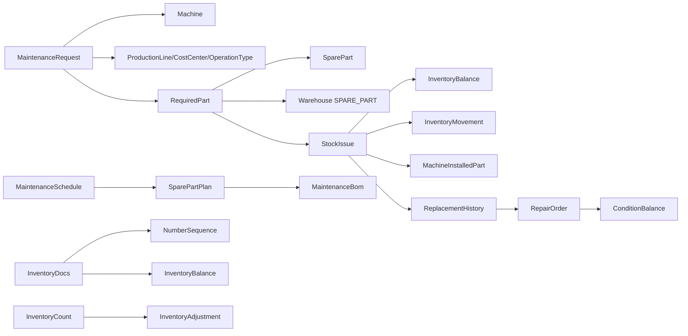

---

## القسم 15 — Duplication, Conflicts, and Unused Parts

| # | التصنيف | النتيجة | الدليل |
|---|---|---|---|
| 1 | CRITICAL_STRUCTURAL_OBSERVATION | **520 من 1,013 ملف TS في api/src فارغة (51%)** — كامل نطاقات Finance/Purchasing/Sales/HR/AI/IoT/BI/Production وغيرها عبارة عن scaffolding 0 بايت على القرص | فحص حجم الملفات |
| 2 | HIGH | **تصادم مسارات controllers**: `inventory-adjustments.controller.ts:17` و`:87` (نفس البادئة في نفس الملف) + `:102` يتصادم مع `inventory-counts.controller.ts:15` | قراءة الملفات |
| 3 | HIGH | **فجوة صلاحيات محققة موسعة**: 416 مفتاحاً فريداً في `@Permissions(...)`، **163 غير مزروعة** في أي seed → 403 لغير SUPER_ADMIN | فحص برمجي شامل controllers vs seeds |
| 4 | HIGH | 3 مفاتيح صلاحيات mismatch (activity.view/attachments.view/print مقابل activity/attachments/printData) | controllers vs seeds |
| 5 | MEDIUM | نسختان من JwtAuthGuard/PermissionsGuard (auth vs common) — 9 controllers تستورد common | guards paths |
| 6 | MEDIUM | `MaintenanceBom` lifecycle في AGENTS.md (DRAFT→APPROVED→ACTIVE→ARCHIVED) يخالف كود الخدمة (ACTIVE/INACTIVE فقط) — **تعارض توثيقي** | bom service |
| 7 | MEDIUM | 5 تسلسلات orphan بلا موديل: MACHINE_ASSET, PREVENTIVE_MAINTENANCE, QR_LABEL, BARCODE_RECORD, REPORT_EXPORT_JOB | seed vs schema |
| 8 | MEDIUM | `inventory-count-lines.controller` بلا بادئة (مسارات كاملة يدوياً) | controller file |
| 9 | MEDIUM | `getProfile` يعيد `{...user, user, ...}` (مفتاح مكرر) | auth.service |
| 10 | MEDIUM | `changePassword` برسائل إنجليزية خام + DTOs 2FA فارغة | auth.service/DTOs |
| 11 | LOW | `admin/access-control/` (5 ملفات 0 بايت) نسخة ميتة من `modules/auth` | — |
| 12 | LOW | وحدات أب ميتة: `admin.module`, `settings.module`, `documents.module`, `factory.module` (0 بايت أو بلا استخدام) | — |
| 13 | LOW | `routeGroupMap` يحتوي search/alerts بلا مجموعات sidebar | navigation-data.ts |
| 14 | LOW | `MachinePart` و`MaintenanceRequestPartUsage` نماذج قديمة تتعايش مع RequiredPart/SparePart | schema |
| 15 | LOW | `.github/workflows/ci.yml` و`docs-check.yml` فارغان (0 بايت) — لا CI فعلي | — |
| 16 | LOW | `.env.example` الجذر 0 بايت؛ لا .env.example في apps/web | — |
| 17 | LOW | `scripts/`: 25 من 31 ملفاً 0 بايت | — |
| 18 | LOW | `roles.guard.ts` فارغ (غير مستخدم) | — |
| 19 | LOW | **45 ملف spec، 27 غير فارغة** — اختبارات خدمات/guards/validation حقيقية موجودة | فحص بالحجم |
| 20 | LOW | `spare-part-conditions` و`installed-parts` خارج بادئة `maintenance/` (مسارات مستقلة) — اختلاف تسمية فقط | controllers |
| 21 | INFORMATIONAL | `routeGroupMap` و`navItems: []` بقايا types قديمة في navigation-data | — |
| 22 | INFORMATIONAL | لا `x-locale` يُرسل من الـ frontend (اللغة من Accept-Language ثم fallback ar) | grep |
| 23 | INFORMATIONAL | `/admin/alerts` و`/admin/search` و`/admin/profile` بلا إدخال sidebar (تصل عبر لوحة/F9/قائمة المستخدم) | navigation-data |
| 24 | INFORMATIONAL | `BusinessPartners` (30 endpoint) مسجلة لكن بلا مستهلك أمامي ولا نماذج مالية — معزولة | frontend grep |
| 25 | UNCERTAIN | `common/request-policy` و`common/workflow-engine` و`common/request-notifications` تحتوي كوداً حقيقياً لكن غير مستوردة — أيها كان مقصوداً للتفعيل غير محسوم | common/ |

---

## القسم 16 — Module Completion Matrix

| الوحدة | DB | Backend | Permissions | Frontend | Tests | Runtime Wiring | الحالة العامة |
|---|---|---|---|---|---|---|---|---|
| Auth | COMPLETE | COMPLETE | COMPLETE | COMPLETE | PARTIAL | COMPLETE | **COMPLETE** (مع ملاحظات changePassword/2FA) |
| Users/Roles/Permissions | COMPLETE | COMPLETE | COMPLETE | COMPLETE | PARTIAL | COMPLETE | **COMPLETE** |
| Companies/Branches/Administrations/Departments | COMPLETE | COMPLETE | COMPLETE | COMPLETE | PARTIAL | COMPLETE | **COMPLETE** |
| Machines + Categories + Components + Documents | COMPLETE | COMPLETE | COMPLETE | COMPLETE | PARTIAL | COMPLETE | **COMPLETE** |
| Maintenance Requests/Tasks/Schedules/Checklist/Downtime | COMPLETE | COMPLETE | PARTIAL (163 مفتاح ناقص شاملاً 3 mismatches) | COMPLETE | PARTIAL | COMPLETE | **COMPLETE** (فجوة صلاحيات واسعة) |
| Spare Parts + Links | COMPLETE | COMPLETE | COMPLETE | COMPLETE | PARTIAL | COMPLETE | **COMPLETE** |
| Stock Issue + Conditions + Installed Parts + Replacement | COMPLETE | COMPLETE | PARTIAL (installed-parts:read مفقودة + 163 مفتاح ناقص) | COMPLETE | PARTIAL | COMPLETE | **PARTIAL** (صلاحيات) |
| Repair Orders | COMPLETE | COMPLETE | COMPLETE | COMPLETE | PARTIAL | COMPLETE | **COMPLETE** |
| BOM + Preventive Plans | COMPLETE | COMPLETE | COMPLETE | COMPLETE | PARTIAL | COMPLETE | **COMPLETE** (تعارض توثيقي lifecycle) |
| Maintenance SLA/Reliability/Calendar/Notification | COMPLETE | COMPLETE | PARTIAL | COMPLETE | PARTIAL | COMPLETE | **COMPLETE** (SLA عبر النسخة الإنجليزية من guards) |
| Inventory Documents (8 أنواع) | COMPLETE | COMPLETE | COMPLETE | COMPLETE | PARTIAL | COMPLETE | **COMPLETE** (مع تصادم adjustments controller) |
| Inventory Balances/Ledger/Reconciliation/Locks | COMPLETE | COMPLETE | COMPLETE | COMPLETE | PARTIAL | COMPLETE | **COMPLETE** |
| Barcodes/QR | COMPLETE | COMPLETE | COMPLETE | COMPLETE | PARTIAL | COMPLETE | **COMPLETE** |
| Reports | COMPLETE | COMPLETE | COMPLETE | COMPLETE | PARTIAL | COMPLETE | **COMPLETE** |
| Search/Dashboard/Alerts/Notifications/Messaging | COMPLETE | COMPLETE | COMPLETE | COMPLETE | PARTIAL | COMPLETE | **COMPLETE** |
| Settings (6 وحدات) | COMPLETE | COMPLETE | COMPLETE | COMPLETE | PARTIAL | COMPLETE | **COMPLETE** (security غير مربوطة بالتدفق) |
| Audit | COMPLETE | COMPLETE | COMPLETE | COMPLETE | PARTIAL | PARTIAL (استخدام محدود) | **PARTIAL** |
| Attachments | COMPLETE | COMPLETE | COMPLETE | COMPLETE | PARTIAL | COMPLETE | **COMPLETE** |
| Numbering | COMPLETE | COMPLETE | COMPLETE | COMPLETE | PARTIAL | COMPLETE | **COMPLETE** |
| Business Partners | COMPLETE | COMPLETE | COMPLETE | NOT_FOUND | PARTIAL | NOT_WIRED (بلا مستهلك) | **NOT_WIRED** |
| Operational Context (UX-0) | COMPLETE | COMPLETE | COMPLETE | COMPLETE | PARTIAL | COMPLETE | **COMPLETE** |
| Production (factory/*) | NOT_FOUND | NOT_FOUND | NOT_FOUND | NOT_FOUND | STUB | NOT_WIRED | **NOT_FOUND** |
| Finance/Purchasing/Sales/HR/AI/IoT/BI/Workflows/Import-Export/Forecasting/Predictive/PrintTemplates/Backups/Approvals/Dynamic/UniversalRequests/SystemHealth/SystemUpdate/Monitoring/InventoryIssueRequests/HRRequests/FinancialDisbursementRequests/BusinessRules | NOT_FOUND | STUB (0 بايت) | NOT_FOUND | NOT_FOUND | STUB | NOT_WIRED | **STUB / NOT_WIRED** |
| Workflow Engine / Request Policy / Request Notifications (common) | NOT_FOUND | PARTIAL (كود موجود غير مسجل) | NOT_FOUND | NOT_FOUND | STUB | NOT_WIRED | **NOT_WIRED** |

---

## القسم 17 — Unresolved Facts

| # | ما الذي تم البحث عنه | أين | لماذا بقي غير محسوم | الدليل الإضافي المطلوب لاحقاً |
|---|---|---|---|---|
| 1 | أي controller يخدم فعلياً على `inventory/adjustments` عند وجود تعريفين بنفس البادئة في نفس الملف | inventory-adjustments.controller.ts:17/:87 | يتطلب تشغيل الخادم (ممنوع في هذه المهمة) لمعرفة ترتيب تسجيل NestJS | تشغيل GET ومراقبة الرد أو فحص Swagger |
| 2 | هل `GET /inventory/balances` يخدم من inventory.controller أم inventory-balances.controller | controllers | نفس البادئة inventory بلا فحص runtime | تشغيل + trace |
| 3 | هل تُطبق سياسات Security settings (قفل/انتهاء جلسة/كلمة مرور) وقت التشغيل | modules/settings/security + auth | لا يوجد كود ربط مكتشف | grep أعمق لاستخدام SystemSetting في auth/interceptors |
| 4 | نطاق عمل `common/workflow-engine` و`common/request-policy` و`common/request-notifications` — هل كانت مخصصة لنطاقات مرفوضة | common/ | كود موجود غير فارغ لكن بلا مستورد | مراجعة git history للـ common/ |
| 5 | هل يوجد استخدام فعلي لنظام Audit من جميع الخدمات أم اقتصر على عدد قليل | modules/audit + grep | لا يوجد عداد شامل لاستدعاءات auditService عبر الكود | grep موسع + فحص runtime |
| 6 | عدد الصلاحيات الفريد الصافي بعد إزالة التكرار بين الـ 15 seed غير الفارغة | prisma/seed/*.ts | 343 مفتاح فريد المذكور، 416 مستخدم في controllers، 163 ناقصة | CONFIRMED (فحص برمجي) |
| 7 | هل توجد فلاتر companyId داخل كل خدمة مخزون فعلاً أم في البعض فقط | خدمات المخزون | الفحص ركّز على balance upserts وnumbering؛ الفلترة لم تُحصى كاملة | مسح where-clauses لكل خدمة |
| 8 | سلوك `MaintenanceBom` lifecycle عند تفعيل/أرشفة | maintenance-bom service | الوثائق تقول DRAFT→APPROVED→ACTIVE→ARCHIVED والكود ACTIVE/INACTIVE | قراءة كاملة لخدمة BOM (تم رصدها كتعارض) |
| 9 | هل تسجيل AuditLog يتم داخل نفس transaction مع العمليات | خدمات الصيانة/المخزون | لم يُتحقق لكل خدمة على حدة | فحص per-service |
| 10 | نطاق فجوة الصلاحيات (416 مستخدم، 343 مزروع، 163 ناقص) وتأثير fail-closed | controllers vs seeds | — | CONFIRMED |

---

## القسم 18 — Evidence Index

| النتيجة | الملفات الداعمة | الفئات/الدوال | مستوى الثقة |
|---|---|---|---|
| 80 وحدة مسجلة | `apps/api/src/app.module.ts` (L83-120) | AppModule imports | CONFIRMED |
| 774 endpoint / 170 controller (88 غير فارغ) | فحص جميع `*.controller.ts` | — | CONFIRMED |
| 202 module / ~113 غير مسجل / 82 controller فارغ | glob + فحص حجم | — | CONFIRMED |
| 95 نموذج / 0 enum / 507 @@index / 18 @@unique / 38 @unique / 2 @@id | `apps/api/prisma/schema.prisma` | — | CONFIRMED |
| 41 deletedAt / 83 updatedAt / 55 status / 20 companyId / 20 branchId | schema.prisma | — | CONFIRMED |
| MaintenanceRequest بلا companyId/branchId | schema.prisma (MaintenanceRequest) | — | CONFIRMED |
| 362 maintenance endpoints (36 controller) | فحص 36 controller صيانة | — | CONFIRMED |
| ~160 inventory endpoints + products/categories | فحص controllers المخزون | — | CONFIRMED |
| الحالات والقيم لكل كيان صيانة + Work Orders | خدمات maintenance + DTOs | transition maps | CONFIRMED |
| 47 موقع generateNumberAtomic / صفر تجاوز | grep numberSequence | numbering.service.ts:84 | CONFIRMED |
| $transaction في كل خدمات الطفرات المخزنية | خدمات المخزون (12 خدمة) | — | CONFIRMED |
| Stock Issue يمنع PRODUCT/RAW_MATERIAL ويخصم الرصيد ويسجل التركيب/الاستبدال | maintenance-stock-issue.service | issue() | CONFIRMED |
| RepairOrder دورة 13 حالة | repair-orders.service | transition methods | CONFIRMED |
| التخطيط لا يخصم الرصيد | preventive-spare-part-plan.service | availability | CONFIRMED |
| 343 مفتاح فريد مذكور في 15 seed / 163 ناقصة من 416 مستخدمة | 15 seed + controllers | — | CONFIRMED |
| installed-parts:read مفقودة (9 endpoints) | installed-parts controller vs seeds | — | CONFIRMED |
| 3 مفاتيح mismatch | controllers vs seed-cmms | — | CONFIRMED |
| 520 ملف TS فارغ من 1,013 في api/src (51%) | فحص حجم 1,013 ملف | — | CONFIRMED |
| تصادم inventory/adjustments + inventory/counts | inventory-adjustments.controller.ts:17/:87/:102 | — | CONFIRMED (التأثير runtime غير محسوم) |
| 266 صفحة page.tsx / 0 placeholder / 0 mock | فحص apps/web/src/app | — | CONFIRMED |
| 97 رابط sidebar سليم / 0 ميت | navigation-data.ts vs pages | — | CONFIRMED |
| 3,659 مفتاح EN = AR بنسبة 100% | 16 ملف لكل لغة | — | CONFIRMED |
| لا إنتاج إطلاقاً | schema + factory/* + frontend grep | — | CONFIRMED |
| لا تكلفة تعطل (hourlyRate) | grep صفري في api/src | — | CONFIRMED |
| 45 spec ملف، 27 غير فارغة | فحص حجم | — | CONFIRMED |
| CI و.env.example فارغان | .github/workflows، .env.example | — | CONFIRMED |
| 2FA غير منفذة | DTOs 0 بايت + auth.service | — | CONFIRMED |
| changePassword إنجليزي خام | auth.service.ts:185-194 | — | CONFIRMED |
| duplicate guards (9 controllers يستخدمون common) | common/guards vs auth/guards | — | CONFIRMED |
| routeGroupMap orphan search/alerts | navigation-data.ts | — | CONFIRMED |
| BusinessPartners بلا مستهلك أمامي | grep frontend | — | CONFIRMED |
| BOM lifecycle تعارض توثيقي | bom service vs AGENTS.md | — | CONFIRMED (تعارض) |
| 38 migration folder / 43 sql files | prisma/migrations | — | CONFIRMED |
| 15 seed غير فارغ (seed.ts + CMMS + counting + governance + reports + physical-count + accountability + search + barcode + partners + others) | prisma/seed | — | CONFIRMED |

---

## القسم 19 — Final Git Integrity Statement

```
Final Git Status

- Modified application files: 0 (هذه المهمة)
- Modified database files: 0
- Modified configuration files: 0
- Modified translation files: 0
- Modified test files: 0
- Modified package or lock files: 0
- Pre-existing changes BEFORE this task (dirty working tree):
  * apps/api/src/modules/factory/inventory-movements/inventory-movements.controller.ts
  * apps/api/src/modules/factory/inventory-movements/inventory-movements.service.ts
  * docs/proofs/atsofterp-phase0-workorders-runtime-tenant-inventory-proof.md
  * docs/proofs/inventory-opening-balance-adjustment-control/final-acceptance-report.md
  * docs/proofs/inventory-opening-balance-adjustment-control/validation-report.md
- Untracked files before this task:
  * apps/api/src/modules/factory/inventory-movements/inventory-movements.service.spec.ts
  * docs/proofs/phase0-maintenance-work-orders-browser-proof/
- Created or modified approved report file (THIS task):
  docs/proofs/atsofterp-current-architecture-discovery-report.md
- Any other created, modified, deleted, or renamed files by this task:
  None
```

---

### ملخص الأرقام الرئيسية (تحديث 2026-08-03)

| المقياس | القيمة |
|---|---|
| Prisma models | 95 |
| Prisma enums | 0 |
| الوحدات المسجلة في AppModule | 80 |
| ملفات .module.ts على القرص | 202 (89 غير فارغة) |
| وحدات غير مسجلة على القرص | ~113 (stubs 0 بايت أو common غير مستورد) |
| API endpoints (إجمالي @Get/@Post/@Patch/@Delete) | 774 (GET=380, POST=161, PATCH=168, DELETE=65) |
| صفحات frontend (page.tsx) | 266 |
| ملفات i18n EN/AR | 16 لكل لغة، 3,659 مفتاح |
| migration folders / SQL files | 38 / 43 |
| Seed files غير فارغة | 15 |
| Controller files (إجمالي/غير فارغ) | 170 / 88 |
| Service files (إجمالي/غير فارغ) | 143 / 96 |
| DTO files | 389 |
| Spec files (إجمالي/غير فارغ) | 45 / 27 |
| Guard files غير فارغة | 5 (jwt-auth×2، permissions×2، inventory-lock) |
| Empty files in api/src | 520 من 1,013 (51%) |
| وحدات COMPLETE | 19 |
| وحدات PARTIAL | 4 (Inventory adjustments collision، Stock Issue permissions، SLA guards/English، Maintenance perm gap) |
| وحدات STUB / NOT_WIRED | 30+ (كل النطاقات المرفوضة + Production) |
| Structural observations | 25 (في القسم 15) |

---

## خاتمة التحديث — 2026-08-03 (Closing Update - Architecture Discovery Refresh)

اعتباراً من 2026-08-03 تم تحديث هذا التقرير ليعكس الإحصاءات الفعلية المُتحقق منها من الكود في وقت المراجعة (SHA `8eba533efec5b02d7986c86e2511a80938bac1a7`، branch `main`). التغييرات الجوهرية عن التقرير الأصلي (2026-07-31):

1. **تصحيح الأرقام الأساسية**: نماذج 90→95، endpoints 758→774، صفحات 259→266، مفاتيح i18n 3,458→3,659، الوحدات المسجلة 78→80، migration folders 36→38.
2. **فجوة صلاحيات محققة موسعة**: 416 مفتاحاً مستخدماً في الـ controllers مقابل 343 مفتاحاً مذكوراً في 15 seed file غير فارغ = **163 مفتاحاً ناقصاً** (ليس فقط 4). الـ `PermissionsGuard` يطابق حرفياً فيؤدي إلى fail-closed (403) لكل دور غير SUPER_ADMIN عند مسارات بأسماء مفاتيح غير مزروعة (مثل `machines:*`، `branches:*`، `companies:*`، `administrations:*`، `attachments:*`).
3. **اختبارات حقيقية**: 27 ملف spec غير فارغ (كان "19 spec 0 بايت").
4. **تطبيق Flutter حقيقي**: `apps/mobile` يحوي 33 ملف Dart (مصادقة، مخزون، آلات، صيانة، فاحص، مزامنة offline) — ليس مجرد سقالة.
5. **Desktop**: `apps/desktop` Tauri scaffold فقط (tauri.conf.json 0 بايت).
6. **Production**: لا يزال غير موجود إطلاقاً (factory/production/* كلها 0 بايت، لا نماذج Prisma، لا صفحات).
7. **مساران للمستودع**: مسار المهمة `C:\Users\attef\PycharmProjects\Trae\ATsofterp` ومسار العمل الفعلي `C:\Users\attef\PycharmProjects\Project\ATsoft_erp` — مستنسخان متطابقان (نفس SHA، نفس الملفات، نفس git status متسخ قبل المهمة).
8. **Git status متسخ قبل المهمة**: 5 ملفات معدلة و2 غير متعقبة مسبقاً (تفصيل في قسم 19) — لم تكن نظيفة كما ورد في التقرير الأصلي.

> **ملاحظة**: هذا التقرير أداة اكتشاف (Discovery Aid)، وليس سلطة تصميم. السلطة الملزمة هي `docs/architecture/atsoft-erp-engineering-constitution-v1.0.md` وملفات `docs/agent-rules/` و`AGENTS.md`. الكود الحالي هو مصدر الحقيقة النهائي.
