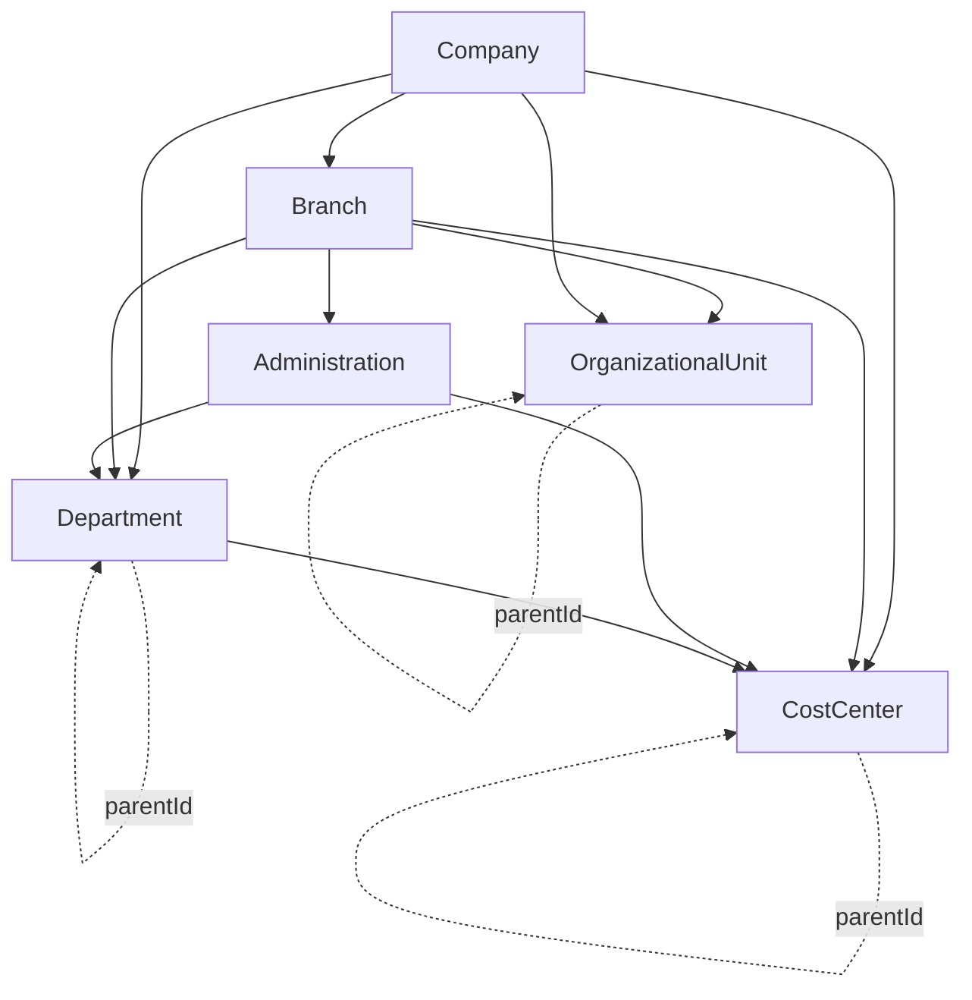
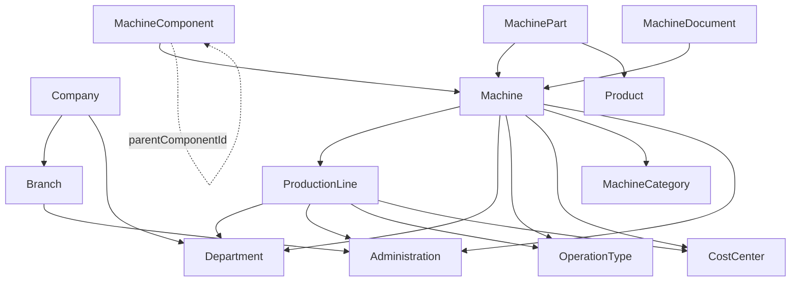
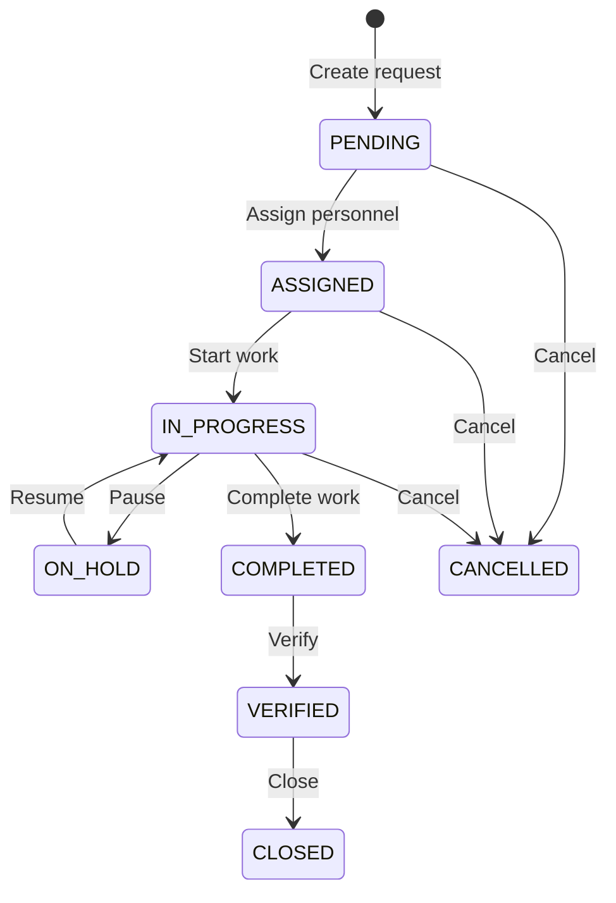
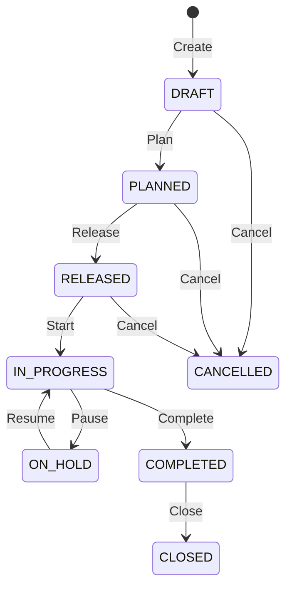
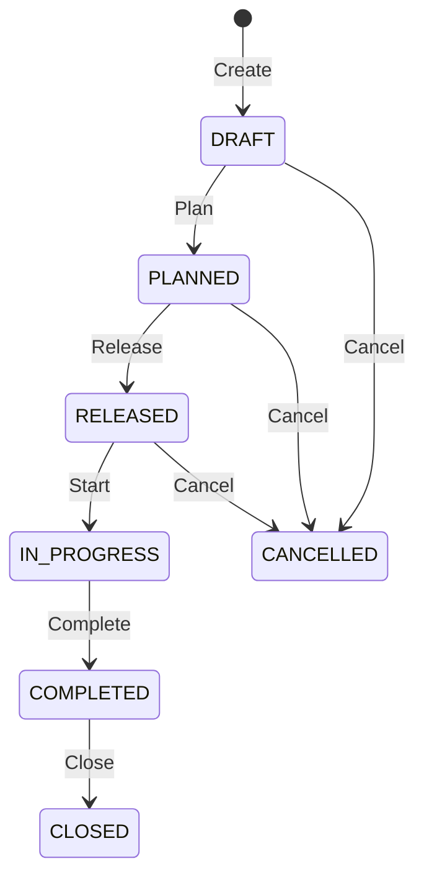
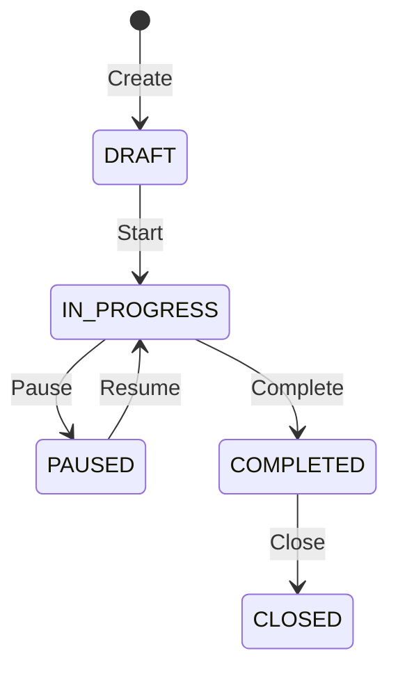
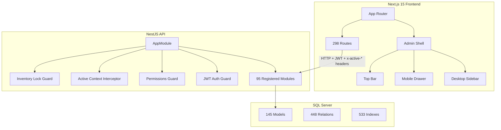
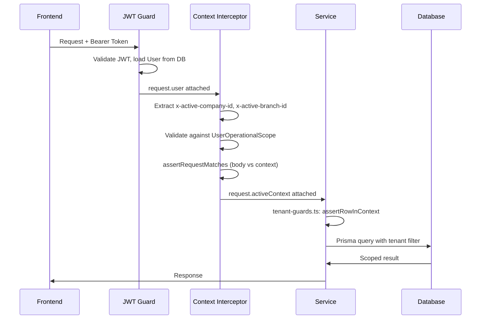

# تقرير اكتشاف الهيكلة الحالية الفعلية لمشروع ATsofterp

# ATsofterp Current Architecture Discovery Report

> **Discovery / Audit only. No future architecture was designed. No code was modified.**

---

## 1. Audit Baseline

| Field | Value |
|-------|-------|
| Branch | `checkpoint/backend-lan-responsive-shell` |
| Full SHA | `0e9c925c887777f830a5a0611660770b9a2abdd7` |
| Git status | CLEAN |
| Audit date | 2026-08-18 |
| Schema file | `apps/api/prisma/schema.prisma` (5,292 lines) |
| Backend source | `apps/api/src/` (1,216 .ts files) |
| Frontend source | `apps/web/src/` (520 .ts/.tsx files) |
| Test files | 106 `.spec.ts` files |
| Migrations | 60 applied migration directories |

---

## 2. Executive Summary

ATsofterp is a multi-company industrial ERP system designed for factory maintenance, production, inventory, spare parts management, and operational costing. It runs on Windows with SQL Server, uses Prisma ORM, a NestJS API backend, and a Next.js 15 App Router frontend with Tailwind CSS. The system supports Arabic (RTL) and English (LTR) with JWT-based authentication and per-request tenant isolation via HTTP headers.

**What is actually built and working:**
- Complete multi-company/branch tenant isolation with header-based context validation
- Full organizational hierarchy (Company → Branch → Administration → Department → Organizational Unit, with recursive Department support)
- Complete CMMS (Maintenance): requests, work orders, tasks, schedules, checklists, downtime logs, spare parts, installed parts, replacement history, BOM, SLA, reliability, personnel, accountability, repair orders
- Complete inventory management: warehouses, locations, products, movements, counts, physical counts, adjustments, stock adjustments, transfers, opening balances, operational receipts, locks, ledger, reconciliation
- Production master data, shifts, assignments, capacity standards, orders, runs, output events, measurement points, loss reasons, downtime segments, loss quantity events, material documents, material requirements, finished goods receipts, quality (plans, inspections, dispositions, NCRs), cost (rates, snapshots, transactions, calculations), performance targets, analytics, reliability
- Organization management, access control, barcodes, notifications, messaging, audit, attachments, numbering, search, reports, dashboard, settings
- Business partners (customers/suppliers with contacts, addresses, bank accounts)

**What exists as empty stubs (not implemented):**
- Finance, Sales, Purchasing, HR, AI, BI, IoT, Forecasting, Predictive Maintenance, Monitoring, Workflows, Dynamic Forms, Import-Export, Print Templates, Approvals, Backups, Business Rules, System Health/Update, Universal Requests, Financial Disbursement Requests, HR Requests, Inventory Issue Requests

---

## 3. Technology Architecture

| Layer | Technology | Version |
|-------|-----------|---------|
| Database | SQL Server | localhost:50079 |
| ORM | Prisma | prisma-client-js (library engine) |
| API Framework | NestJS | URI versioning (`/api/v1/`) |
| Frontend Framework | Next.js | 15 (App Router) |
| UI | React 18 + Tailwind CSS 3.4 | Custom components (no UI library) |
| Auth | JWT (Passport) | Bearer token, bcrypt passwords |
| i18n | Custom system | 59 namespaces, ar/en, cookie-based |
| API Docs | Swagger | `/api/docs` |

**Evidence:** `apps/api/src/main.ts`, `apps/web/next.config.ts`, `apps/web/package.json`, `apps/web/src/lib/i18n/types.ts`

---

## 4. Repository Structure

```
ATsofterp/
├── apps/
│   ├── api/                          # NestJS backend
│   │   ├── src/
│   │   │   ├── main.ts              # Bootstrap (port 4000, /api prefix, v1)
│   │   │   ├── app.module.ts         # 95 registered modules
│   │   │   ├── common/               # Guards, decorators, interceptors, helpers
│   │   │   │   ├── guards/           # JWT, Permissions, InventoryLock
│   │   │   │   ├── decorators/       # CurrentUser, Permissions, Public
│   │   │   │   ├── operational-context/  # Tenant isolation engine
│   │   │   │   ├── audit/            # Audit service
│   │   │   │   ├── i18n/             # API messages
│   │   │   │   ├── workflow-engine/  # Generic workflow engine
│   │   │   │   ├── request-policy/   # Approval/duplication guards
│   │   │   │   └── request-notifications/  # Notification dispatching
│   │   │   ├── modules/
│   │   │   │   ├── auth/             # Authentication
│   │   │   │   ├── admin/            # Users, roles, permissions, branches, administrations, departments, org units
│   │   │   │   ├── companies/        # Multi-company management
│   │   │   │   ├── factory/          # All operational modules
│   │   │   │   │   ├── maintenance/  # 36+ sub-modules
│   │   │   │   │   ├── inventory*/   # 12+ sub-modules
│   │   │   │   │   ├── production*/  # 14+ sub-modules
│   │   │   │   │   ├── products/     # Product definitions
│   │   │   │   │   └── product-categories/
│   │   │   │   ├── audit/            # Audit trail
│   │   │   │   ├── barcodes/         # Barcode management
│   │   │   │   ├── business-partners/  # Customers/suppliers
│   │   │   │   ├── settings/         # System settings, company profile, language, appearance, security
│   │   │   │   ├── documents/        # Attachments
│   │   │   │   ├── notifications/    # Notification system
│   │   │   │   ├── messaging/        # Internal messaging
│   │   │   │   ├── numbering/        # Document numbering
│   │   │   │   ├── search/           # Global search
│   │   │   │   ├── reports/          # Report engine
│   │   │   │   ├── dashboard/        # Dashboard
│   │   │   │   └── alerts/           # Alert system
│   │   │   └── modules/ (STUBS)      # ~36 unregistered empty modules
│   │   └── prisma/
│   │       ├── schema.prisma         # 145 models, 5292 lines
│   │       └── migrations/           # 60 applied migrations
│   └── web/                          # Next.js frontend
│       ├── src/
│       │   ├── app/                  # 298 page.tsx routes
│       │   ├── components/           # 7 top-level component directories
│       │   ├── hooks/                # 1 custom hook (useCrudList)
│       │   └── lib/                  # API client, auth, i18n, types, themes
│       └── next.config.ts
└── docs/
    └── proofs/                       # Audit reports
```

---

## 5. Database Statistics

| Metric | Count |
|--------|------:|
| TOTAL_MODELS | **145** |
| TOTAL_ENUMS | **0** (all statuses/types are plain strings) |
| TOTAL_RELATIONS (@relation) | **448** |
| TOTAL_UNIQUE_CONSTRAINTS (@@unique) | **76** |
| TOTAL_INDEXES (@@index) | **533** |
| TOTAL_COMPOSITE_PRIMARY_KEYS (@@id) | **2** (UserRole, RolePermission) |
| TOTAL_SELF_RELATIONS | **15** |
| Models with companyId | **~55** |
| Models with branchId | **~50** |
| Models with deletedAt (soft-delete) | **~40** |
| JSON fields | **0** |
| Decimal fields (money/quantity) | **~80+** |

---

## 6. Complete Database Model Inventory

### 6.1 Organizational / Tenant Models

| Model | Domain | Purpose | companyId | branchId | Status | Actual Usage |
|-------|--------|---------|-----------|----------|--------|-------------|
| Company | Organization | Top-level tenant | NO (this IS the company) | NO | ACTIVE | ACTIVE |
| Branch | Organization | Company subdivision | YES (required) | NO | ACTIVE | ACTIVE |
| Administration | Organization | Branch-level admin division | NO (via branch) | YES (required) | ACTIVE | ACTIVE |
| Department | Organization | Company-wide with optional branch/admin/parent | YES (required) | optional | ACTIVE | ACTIVE |
| OrganizationalUnit | Organization | Branch-scoped hierarchical unit | YES (required) | YES (required) | ACTIVE | ACTIVE |
| CostCenter | Organization | Cost accounting unit with hierarchy | YES (required) | optional | ACTIVE | ACTIVE |
| OperationalCostCenterAssignment | Organization | Assigns cost center to machine/line/unit | YES (required) | optional | ACTIVE | ACTIVE |
| OperationType | Organization | Type of operation (e.g. machining) | NO | NO | ACTIVE | ACTIVE |
| ProductionLine | Organization | Production line with dept/operationType/costCenter | YES (required) | YES (required) | ACTIVE | ACTIVE |

**Evidence:** `apps/api/prisma/schema.prisma` lines 95-430, `apps/api/src/modules/admin/`

### 6.2 User / Auth / Permission Models

| Model | Domain | Purpose | companyId | branchId | Status | Actual Usage |
|-------|--------|---------|-----------|----------|--------|-------------|
| User | Auth | System user with optional company/branch/dept | optional | optional | ACTIVE | ACTIVE |
| Role | Auth | Role definition (isSystem flag) | NO | NO | ACTIVE | ACTIVE |
| Permission | Auth | Permission key (module + action) | NO | NO | ACTIVE | ACTIVE |
| UserRole | Auth | User-Role join (composite PK) | NO | NO | ACTIVE | ACTIVE |
| RolePermission | Auth | Role-Permission join (composite PK) | NO | NO | ACTIVE | ACTIVE |
| UserOperationalScope | Auth | User's authorized company+branch+admin+dept scope | YES (required) | YES (required) | ACTIVE | ACTIVE |

**Evidence:** `apps/api/src/modules/auth/`, `apps/api/src/common/operational-context/`

### 6.3 Employee / Personnel Models

| Model | Domain | Purpose | Status | Actual Usage |
|-------|--------|---------|--------|-------------|
| OperationalPerson | Personnel | Generic operational person linked to User | ACTIVE | ACTIVE |
| MaintenancePersonnel | Personnel | Maintenance staff with role/specialty/capacity | ACTIVE | ACTIVE |
| MachineResponsibilityAssignment | Personnel | Assigns personnel to machines | ACTIVE | ACTIVE |
| MaintenanceRequestAssignment | Personnel | Assigns personnel to requests | ACTIVE | ACTIVE |
| MaintenancePartAccountability | Personnel | Tracks part accountability per person | ACTIVE | ACTIVE |

**NOTE:** There is NO `Employee` model. The system uses `OperationalPerson` linked to `User`. There is NO HR module active (stub only).

**Evidence:** `apps/api/prisma/schema.prisma` lines ~2700-2900, `apps/api/src/modules/factory/maintenance/maintenance-personnel/`

### 6.4 Asset / Machine Models

| Model | Domain | Purpose | Status | Actual Usage |
|-------|--------|---------|--------|-------------|
| MachineCategory | Asset | Hierarchical machine categorization | ACTIVE | ACTIVE |
| Machine | Asset | Machine with category, company, branch, dept, line, operationType, costCenter, technical admin/dept | ACTIVE | ACTIVE |
| MachineComponent | Asset | Machine component with hierarchy | ACTIVE | ACTIVE |
| MachinePart | Asset | Spare parts catalog linked to machines | ACTIVE | ACTIVE |
| MachineDocument | Asset | Documents attached to machines | ACTIVE | ACTIVE |
| MachineInstalledPart | Asset | Currently installed spare part on machine | ACTIVE | ACTIVE |
| MachineInstalledPartReading | Asset | Runtime readings for installed parts | ACTIVE | ACTIVE |

**Evidence:** `apps/api/src/modules/factory/maintenance/machine-categories/`, `machine-components/`, `machine-parts/`

### 6.5 Spare Parts / Inventory Models

| Model | Domain | Purpose | Status | Actual Usage |
|-------|--------|---------|--------|-------------|
| SparePart | SpareParts | Spare part catalog with classification | ACTIVE | ACTIVE |
| ComponentSparePart | SpareParts | Links components to spare parts | ACTIVE | ACTIVE |
| MachineSparePart | SpareParts | Links machines to spare parts | ACTIVE | ACTIVE |
| SparePartConditionBalance | SpareParts | Balance per condition per warehouse | ACTIVE | ACTIVE |
| SparePartConditionMovement | SpareParts | Condition-based inventory movements | ACTIVE | ACTIVE |
| SparePartRepairOrder | SpareParts | Repair order for defective parts | ACTIVE | ACTIVE |
| SparePartRepairAction | SpareParts | Actions taken during repair | ACTIVE | ACTIVE |
| SparePartReplacementHistory | SpareParts | Tracks old/new part replacements | ACTIVE | ACTIVE |
| MaintenanceBom | SpareParts | Bill of materials for machine maintenance | ACTIVE | ACTIVE |
| MaintenanceBomVersion | SpareParts | Versioned BOM | ACTIVE | ACTIVE |
| MaintenanceBomItem | SpareParts | BOM line items | ACTIVE | ACTIVE |
| PreventiveSparePartPlan | SpareParts | Spare part planning for preventive schedules | ACTIVE | ACTIVE |
| PreventiveSparePartPlanItem | SpareParts | Plan line items | ACTIVE | ACTIVE |

**Evidence:** `apps/api/src/modules/factory/maintenance/spare-parts/`, `installed-parts-replacement/`, `maintenance-bom/`

### 6.6 Inventory Models

| Model | Domain | Purpose | companyId | branchId | Status | Actual Usage |
|-------|--------|---------|-----------|----------|--------|-------------|
| Warehouse | Inventory | Storage location | YES (required) | optional | ACTIVE | ACTIVE |
| WarehouseLocation | Inventory | Location within warehouse | NO (via warehouse) | NO | ACTIVE | ACTIVE |
| ProductCategory | Inventory | Product hierarchy | NO | NO | ACTIVE | ACTIVE |
| Product | Inventory | Product master | NO | NO | ACTIVE | ACTIVE |
| InventoryBalance | Inventory | Current stock per warehouse/location/product | NO | NO | ACTIVE | ACTIVE |
| InventoryMovement | Inventory | Stock movements | YES (required) | optional | ACTIVE | ACTIVE |
| InventoryMovementLine | Inventory | Movement line items | NO (via movement) | NO | ACTIVE | ACTIVE |
| InventoryCount | Inventory | Cycle count header | YES (required) | optional | ACTIVE | ACTIVE |
| InventoryCountLine | Inventory | Count line items | NO (via count) | NO | ACTIVE | ACTIVE |
| InventoryPhysicalCount | Inventory | Physical count header | YES (required) | optional | ACTIVE | ACTIVE |
| InventoryPhysicalCountLine | Inventory | Physical count lines | NO (via count) | NO | ACTIVE | ACTIVE |
| InventoryAdjustment | Inventory | Adjustment header | YES (required) | optional | ACTIVE | ACTIVE |
| InventoryAdjustmentLine | Inventory | Adjustment lines | NO (via adj) | NO | ACTIVE | ACTIVE |
| InventoryOpeningBalance | Inventory | Opening balance header | YES (required) | optional | ACTIVE | ACTIVE |
| InventoryOpeningBalanceLine | Inventory | Opening balance lines | NO (via OB) | NO | ACTIVE | ACTIVE |
| InventoryStockAdjustment | Inventory | Stock adjustment header | YES (required) | optional | ACTIVE | ACTIVE |
| InventoryStockAdjustmentLine | Inventory | Stock adjustment lines | NO (via adj) | NO | ACTIVE | ACTIVE |
| InventoryStockTransfer | Inventory | Transfer header | YES (required) | optional | ACTIVE | ACTIVE |
| InventoryStockTransferLine | Inventory | Transfer lines | NO (via transfer) | NO | ACTIVE | ACTIVE |
| InventoryOperationalReceipt | Inventory | Operational receipt header | YES (required) | optional | ACTIVE | ACTIVE |
| InventoryOperationalReceiptLine | Inventory | Operational receipt lines | NO (via receipt) | NO | ACTIVE | ACTIVE |
| InventoryLock | Inventory | Period/warehouse/item lock | optional | optional | ACTIVE | ACTIVE |

**Evidence:** `apps/api/src/modules/factory/inventory*/` (12+ modules), `apps/api/src/modules/factory/inventory-counts/`, etc.

### 6.7 Maintenance Models

| Model | Domain | Purpose | Status | Actual Usage |
|-------|--------|---------|--------|-------------|
| MaintenanceRequest | Maintenance | Maintenance request header | ACTIVE | ACTIVE |
| MaintenanceRequestRequiredPart | Maintenance | Required parts for request | ACTIVE | ACTIVE |
| MaintenanceRequestPartUsage | Maintenance | Parts actually used | ACTIVE | ACTIVE |
| MaintenanceRequestCostEntry | Maintenance | Cost entries for request | ACTIVE | ACTIVE |
| MaintenanceRequestAssignment | Maintenance | Personnel assignment | ACTIVE | ACTIVE |
| MaintenanceTask | Maintenance | Task within request | ACTIVE | ACTIVE |
| MaintenanceWorkOrder | Maintenance | Work order header | ACTIVE | ACTIVE |
| MaintenanceWorkOrderPart | Maintenance | Parts for work order | ACTIVE | ACTIVE |
| MaintenanceWorkOrderCostEntry | Maintenance | Cost entries for work order | ACTIVE | ACTIVE |
| MaintenanceSchedule | Maintenance | Preventive schedule | ACTIVE | ACTIVE |
| MaintenanceChecklistItem | Maintenance | Checklist template | ACTIVE | ACTIVE |
| MaintenanceChecklistExecution | Maintenance | Checklist execution record | ACTIVE | ACTIVE |
| MaintenanceChecklistExecutionItem | Maintenance | Individual checklist item result | ACTIVE | ACTIVE |
| DowntimeLog | Maintenance | Downtime tracking | ACTIVE | ACTIVE |
| MaintenanceSlaRule | Maintenance | SLA rule definition | ACTIVE | ACTIVE |
| MaintenanceSlaState | Maintenance | SLA state per request | ACTIVE | ACTIVE |
| MaintenancePartAccountability | Maintenance | Part accountability tracking | ACTIVE | ACTIVE |

**Evidence:** `apps/api/src/modules/factory/maintenance/maintenance-requests/`, `maintenance-work-orders/`, etc.

### 6.8 Production Models

| Model | Domain | Purpose | companyId | branchId | Status | Actual Usage |
|-------|--------|---------|-----------|----------|--------|-------------|
| ProductionUnit | Production | Unit of measure | YES | YES | ACTIVE | ACTIVE |
| ProductionProductDefinition | Production | Product production definition | YES | YES | ACTIVE | ACTIVE |
| ProductionSpecification | Production | Product specifications | NO | NO | ACTIVE | ACTIVE |
| ProductionVersion | Production | Product version | NO | NO | ACTIVE | ACTIVE |
| ProductionPackaging | Production | Packaging definition | NO | NO | ACTIVE | ACTIVE |
| ProductionEligibility | Production | Product-machine-line eligibility | NO | NO | ACTIVE | ACTIVE |
| ProductionCapacityStandard | Production | Capacity standard (rate, cycle time, efficiency) | YES | YES | ACTIVE | ACTIVE |
| ProductionOrder | Production | Production order | YES | YES | ACTIVE | ACTIVE |
| ProductionOrderTransition | Production | Order status transitions | YES | YES | ACTIVE | ACTIVE |
| ProductionOrderAttachment | Production | Order attachments | YES | YES | ACTIVE | ACTIVE |
| ProductionShift | Production | Shift definition | YES | YES | ACTIVE | ACTIVE |
| ProductionShiftTemplate | Production | Shift template | YES | YES | ACTIVE | ACTIVE |
| ProductionShiftTemplateDay | Production | Template day mapping | NO | NO | ACTIVE | ACTIVE |
| ProductionShiftCalendar | Production | Calendar | YES | YES | ACTIVE | ACTIVE |
| ProductionShiftCalendarEntry | Production | Calendar entries | NO | NO | ACTIVE | ACTIVE |
| ProductionShiftAssignment | Production | Personnel shift assignment | YES | YES | ACTIVE | ACTIVE |
| ProductionOperationalAssignment | Production | Resource assignment (machine/line/unit/shift) | YES | YES | ACTIVE | ACTIVE |
| ProductionRun | Production | Production run execution | YES | YES | ACTIVE | ACTIVE |
| ProductionRunSession | Production | Run sessions (start/stop) | YES | YES | ACTIVE | ACTIVE |
| ProductionRunTransition | Production | Run status transitions | YES | YES | ACTIVE | ACTIVE |
| ProductionMeasurementPoint | Production | Measurement point definition | YES | YES | ACTIVE | ACTIVE |
| ProductionOutputEvent | Production | Output recording | YES | YES | ACTIVE | ACTIVE |
| OperationalLossReason | Production | Loss reason hierarchy | YES | YES | ACTIVE | ACTIVE |
| DowntimeSegment | Production | Production downtime tracking | YES | YES | ACTIVE | ACTIVE |
| ProductionLossQuantityEvent | Production | Loss quantity recording | YES | YES | ACTIVE | ACTIVE |
| ProductionMaterialDocument | Production | Material issue document | YES | YES | ACTIVE | ACTIVE |
| ProductionMaterialDocumentLine | Production | Material document lines | YES | YES | ACTIVE | ACTIVE |
| ProductionMaterialRequirement | Production | Material requirement | YES | YES | ACTIVE | ACTIVE |
| ProductionMaterialRequirementLine | Production | Material requirement lines | YES | YES | ACTIVE | ACTIVE |
| ProductionMaterialConsumption | Production | Material consumption | YES | YES | ACTIVE | ACTIVE |
| ProductionMaterialConsumptionCorrection | Production | Consumption corrections | YES | YES | ACTIVE | ACTIVE |
| ProductionFinishedGoodsReceipt | Production | FG receipt header | YES | YES | ACTIVE | ACTIVE |
| ProductionFinishedGoodsReceiptLine | Production | FG receipt lines | YES | YES | ACTIVE | ACTIVE |
| ProductionQualityPlan | Production | Quality plan | YES | YES | ACTIVE | ACTIVE |
| QualityCharacteristic | Production | Quality characteristic | YES | YES | ACTIVE | ACTIVE |
| QualitySamplingPoint | Production | Sampling point | YES | YES | ACTIVE | ACTIVE |
| ProductionInspection | Production | Quality inspection | YES | YES | ACTIVE | ACTIVE |
| ProductionInspectionResult | Production | Inspection results | YES | YES | ACTIVE | ACTIVE |
| ProductionQualityDisposition | Production | Quality disposition | YES | YES | ACTIVE | ACTIVE |
| ProductionNonconformance | Production | NCR | YES | YES | ACTIVE | ACTIVE |
| ProductionNonconformanceTransition | Production | NCR transitions | YES | YES | ACTIVE | ACTIVE |
| ProductionNonconformanceAttachment | Production | NCR attachments | YES | YES | ACTIVE | ACTIVE |
| OperationalCostRate | Production | Cost rate definition | YES | YES | ACTIVE | ACTIVE |
| OperationalStandardCostSnapshot | Production | Standard cost snapshot | YES | YES | ACTIVE | ACTIVE |
| OperationalCostTransaction | Production | Cost transaction ledger (append-only) | YES | YES | ACTIVE | ACTIVE |
| OperationalCostCalculation | Production | Cost calculation run | YES | YES | ACTIVE | ACTIVE |
| OperationalSourceChange | Production | Source change watermark (append-only) | YES | YES | ACTIVE | ACTIVE |
| ProductionPerformanceTarget | Production | OEE/performance targets | YES | YES | ACTIVE | ACTIVE |
| ProductionPerformanceTargetTransition | Production | Target transitions | YES | YES | ACTIVE | ACTIVE |

**Evidence:** `apps/api/src/modules/factory/production-master-data/`, `production-shifts/`, `production-orders/`, `production-runs/`, `production-cost/`, `production-quality/`, `production-analytics/`

### 6.9 Shared / Cross-Cutting Models

| Model | Domain | Purpose | Status | Actual Usage |
|-------|--------|---------|--------|-------------|
| AuditLog | Audit | Audit trail | ACTIVE | ACTIVE |
| Notification | Notifications | User notifications | ACTIVE | ACTIVE |
| NotificationRule | Notifications | Notification dispatch rules | ACTIVE | ACTIVE |
| Attachment | Documents | File attachments (polymorphic via entityName+entityId) | ACTIVE | ACTIVE |
| SystemSetting | Settings | Key-value system settings | ACTIVE | ACTIVE |
| NumberSequence | Numbering | Document number sequences | ACTIVE | ACTIVE |
| BarcodeLabel | Barcodes | Barcode label records | ACTIVE | ACTIVE |
| BarcodeScanEvent | Barcodes | Scan history | ACTIVE | ACTIVE |
| BarcodeLabelTemplate | Barcodes | Label templates | ACTIVE | ACTIVE |
| BarcodePrintJob | Barcodes | Print job records | ACTIVE | ACTIVE |
| BusinessPartner | Partners | Customer/supplier | ACTIVE | ACTIVE |
| BusinessPartnerGroup | Partners | Partner grouping | ACTIVE | ACTIVE |
| BusinessPartnerContact | Partners | Partner contacts | ACTIVE | ACTIVE |
| BusinessPartnerAddress | Partners | Partner addresses | ACTIVE | ACTIVE |
| BusinessPartnerBankAccount | Partners | Partner bank accounts | ACTIVE | ACTIVE |
| PaymentTerm | Partners | Payment terms | ACTIVE | ACTIVE |
| InternalConversation | Messaging | Chat conversations | ACTIVE | ACTIVE |
| InternalConversationParticipant | Messaging | Conversation participants | ACTIVE | ACTIVE |
| InternalMessage | Messaging | Chat messages | ACTIVE | ACTIVE |

---

## 7. Current Administrative Organization Structure

### How the System Represents Organization

1. **Company** — Top-level tenant entity. No `companyId` on itself. Has `code` (unique), `name`, status.

2. **Branch** — Belongs to one Company (`companyId` required). Has `code` unique per company.

3. **Administration** — Belongs to one Branch (`branchId` required). Has `code` unique per branch. Represents a major administrative division within a branch.

4. **Department** — Belongs to one Company (`companyId` required), optionally to a Branch and Administration. Has recursive `parentId` (self-relation `DepartmentHierarchy`). Has `code` unique per company.

5. **OrganizationalUnit** — Belongs to one Company + Branch (both required). Has recursive `parentId` (self-relation `OrganizationalUnitHierarchy`). Has `type` field (default `"DEPARTMENT"`). Has `code` unique per branch.

6. **CostCenter** — Belongs to Company (required), optionally Branch, Administration, Department. Has recursive `parentId` (self-relation `CostCenterHierarchy`). Has `type` field.

### Actual Organizational Hierarchy (Mermaid)



### Key Facts

- Department has `parentId` (recursive) — **CONFIRMED**
- OrganizationalUnit has `parentId` (recursive) — **CONFIRMED**
- CostCenter has `parentId` (recursive) — **CONFIRMED**
- No fixed number of levels — recursive hierarchies allow unlimited depth
- Employee is represented via `OperationalPerson` → `User`, not via a dedicated Employee model
- No Supervisor/Manager hierarchy in the Employee domain
- No Assignment/Transfer history for employees

**Evidence:** `apps/api/prisma/schema.prisma` lines 95-250, `apps/api/src/modules/admin/departments/`, `organizational-units/`

---

## 8. Current Factory / Operational Structure

### Actual Factory Hierarchy (Mermaid)



### Key Facts

- **Factory = Company** (no separate Facility/Plant entity). Branches represent physical locations.
- **No "Production Area" or "Production Section" entity.** The chain is: Branch → Administration → Department → ProductionLine → Machine.
- **ProductionLine** links to: Company, Branch, Administration, Department, OperationType, CostCenter.
- **Machine** links to: Company, Branch, Department, ProductionLine, OperationType, CostCenter, MachineCategory, TechnicalAdministration, TechnicalDepartment.
- **MachineComponent** is hierarchical via `parentComponentId`.
- **Machine is separate from Asset** — there is no generic "Asset" model; Machine IS the asset entity.
- **No "Location" entity separate from hierarchy** — machine location is a string field.

**Evidence:** `apps/api/prisma/schema.prisma` lines 300-430, `apps/api/src/modules/factory/maintenance/production-lines/`, `machine-categories/`

---

## 9. Employees and User Structure

### Actual Model Chain

```
User (email, passwordHash, companyId?, branchId?, departmentId?)
  └── OperationalPerson (code, category, userId?)
        └── MaintenancePersonnel (role, specialty, dailyCapacityMinutes?)
              └── MachineResponsibilityAssignment → Machine
              └── MaintenanceRequestAssignment → MaintenanceRequest
              └── MaintenancePartAccountability → Parts
```

### Key Facts

- **1 User = 1 OperationalPerson** (via `userId` unique link, optional)
- **Not all Users are OperationalPersons** — admin users may not have one
- **No Employee model** — the system uses `OperationalPerson` + `User`
- **No JobTitle/Position model** — MaintenancePersonnel has `role` and `specialty` string fields
- **No Supervisor/Manager hierarchy** — MaintenancePersonnel has `responsibilityRole` on assignment
- **No Assignment dates/transfer history** for employees
- **No dedicated Employee-Branch or Employee-Company assignment** — the User has direct `companyId`/`branchId` fields, plus `UserOperationalScope` for multi-context access
- **Shift assignment** is via `ProductionShiftAssignment` → `OperationalPerson`

**Evidence:** `apps/api/prisma/schema.prisma` lines ~2700-2900, `apps/api/src/modules/factory/maintenance/maintenance-personnel/`

---

## 10. Shift Structure

### Models

| Model | Purpose |
|-------|---------|
| ProductionShift | Shift definition (code, name, startTime, endTime, durationMinutes, breakMinutes) |
| ProductionShiftTemplate | Template grouping shifts by day |
| ProductionShiftTemplateDay | Day-of-week → shift mapping |
| ProductionShiftCalendar | Calendar applying a template over a date range |
| ProductionShiftCalendarEntry | Individual calendar entries (date, shift, isWorkDay) |
| ProductionShiftAssignment | Assigns OperationalPerson to shift (with effective dates) |
| ProductionOperationalAssignment | Assigns machine/line/unit to shift (with capacity) |

### Key Facts

- Shifts are **production-specific** — no separate MaintenanceShift
- Shift assignment links to `OperationalPerson` (not User directly)
- Calendar system supports effective date ranges
- Template system maps days of week to shifts
- Shifts are **Master Data** — they define working periods, not real-time tracking
- **No Shift Handover** model exists

**Evidence:** `apps/api/src/modules/factory/production-shifts/`, `apps/api/prisma/schema.prisma` lines ~1400-1700

---

## 11. Asset Structure

### Chain

```
MachineCategory (hierarchical)
  └── Machine (code, name, model, serialNumber, manufacturer, purchaseDate, warrantyEnd, location, qrCode, image)
        ├── MachineComponent (hierarchical via parentComponentId)
        │     └── ComponentSparePart → SparePart
        ├── MachinePart → Product
        ├── MachineDocument
        ├── MachineSparePart → SparePart
        ├── MachineInstalledPart → SparePart
        │     └── MachineInstalledPartReading
        ├── MachineResponsibilityAssignment → MaintenancePersonnel
        └── ProductionLine (machine belongs to a line)
```

### Key Facts

- Machine IS the asset (no separate Asset model)
- Machine is linked to: MachineCategory, Company, Branch, Department, ProductionLine, OperationType, CostCenter, TechnicalAdministration, TechnicalDepartment
- MachineComponent is hierarchical (unlimited depth)
- Installed parts track lifecycle: installedAt, removedAt, lifeStatus, expectedLifeHours, runtimeHours
- Runtime readings are recorded via MachineInstalledPartReading
- SparePartReplacementHistory tracks old→new part swaps

**Evidence:** `apps/api/src/modules/factory/maintenance/machine-categories/`, `machine-components/`, `installed-parts-replacement/`

---

## 12. Maintenance Architecture

### Complete Module Inventory (36+ sub-modules registered)

| Sub-Module | Controller | Service | Purpose |
|-----------|-----------|---------|---------|
| maintenance (parent) | Yes | Yes | Overview, aggregated queries |
| machine-categories | Yes | Yes | Machine category CRUD |
| maintenance-dashboard | Yes | Yes | Dashboard KPIs |
| machine-parts | Yes | Yes | Machine parts catalog |
| machine-documents | Yes | Yes | Machine documents |
| maintenance-requests | Yes | Yes | Request CRUD + workflow |
| maintenance-work-orders | Yes | Yes | Work order CRUD + workflow |
| maintenance-tasks | Yes | Yes | Task management |
| maintenance-schedules | Yes | Yes | Preventive schedules |
| maintenance-checklist-items | Yes | Yes | Checklist templates |
| downtime-logs | Yes | Yes | Downtime tracking |
| maintenance-request-parts | Yes | Yes | Required/used parts |
| maintenance-request-costs | Yes | Yes | Cost tracking |
| maintenance-checklist-executions | Yes | Yes | Execution records |
| preventive-maintenance | Yes | Yes | PM generation |
| operation-types | Yes | Yes | Operation type CRUD |
| cost-centers | Yes | Yes | Cost center CRUD + resolver |
| production-lines | Yes | Yes | Production line CRUD |
| machine-components | Yes | Yes | Component CRUD |
| spare-parts | Yes | Yes | Spare part catalog |
| component-spare-parts | Yes | Yes | Component-Part links |
| machine-spare-parts | Yes | Yes | Machine-Part links |
| maintenance-personnel | Yes | Yes | Personnel management |
| machine-responsibility-assignments | Yes | Yes | Responsibility assignment |
| maintenance-request-assignments | Yes | Yes | Request assignment |
| maintenance-part-accountability | Yes | Yes | Part accountability |
| maintenance-reliability | Yes | Yes | MTTR/reliability metrics |
| maintenance-spare-part-request-lines | Yes | Yes | Spare part requests |
| maintenance-notification | No (service only) | Yes | Notification dispatch |
| maintenance-sla | Yes | Yes | SLA management |
| maintenance-calendar-workload | Yes | Yes | Calendar/workload |
| maintenance-stock-issue | Yes | Yes | Stock issue from warehouse |
| spare-part-conditions | Yes | Yes | Condition tracking |
| installed-parts-replacement | Yes | Yes | Install/remove parts |
| repair-orders | Yes | Yes | Repair order management |
| maintenance-bom | Yes | Yes | BOM management |
| preventive-spare-part-plan | Yes | Yes | Preventive spare planning |

**Evidence:** `apps/api/src/modules/factory/maintenance/` (36 sub-module directories)

---

## 13. Maintenance Workflows

### MaintenanceRequest Status Flow (from code analysis)

The MaintenanceRequest uses a string-based status field. Based on the service code and controller actions:



**CONFIDENCE:** HIGH_CONFIDENCE — derived from controller action endpoints and service status transitions.

### MaintenanceWorkOrder Status Flow



**Evidence:** `apps/api/src/modules/factory/maintenance/maintenance-requests/`, `maintenance-work-orders/`

---

## 14. Planned Maintenance

### Models

| Model | Purpose |
|-------|---------|
| MaintenanceSchedule | Preventive schedule per machine (type, frequency, nextDueDate) |
| MaintenanceChecklistItem | Checklist template per schedule |
| MaintenanceChecklistExecution | Execution record |
| MaintenanceChecklistExecutionItem | Individual item result |
| PreventiveSparePartPlan | Spare part planning per schedule |
| PreventiveSparePartPlanItem | Plan line items |

### Flow

```
MaintenanceSchedule → generates → MaintenanceRequest (via PreventiveMaintenance service)
MaintenanceSchedule → MaintenanceChecklistItem (templates)
MaintenanceSchedule → PreventiveSparePartPlan → PreventiveSparePartPlanItem → SparePart
```

### Key Facts

- Preventive maintenance is schedule-based (not predictive or condition-based)
- Checklist items are linked to schedules and copied to executions
- Spare part plans are generated per schedule
- Schedule has `nextDueDate` for scheduling
- **No Predictive Maintenance** exists (stub only)
- **No Calendar visualization** in the backend (calendar page exists in frontend but data comes from schedule list)

**Evidence:** `apps/api/src/modules/factory/maintenance/preventive-maintenance/`, `maintenance-schedules/`, `preventive-spare-part-plan/`

---

## 15. Failures and Downtime

### Models

| Model | Purpose |
|-------|---------|
| DowntimeLog | Records downtime per machine (startTime, endTime, failureCategory, rcaStatus) |
| DowntimeSegment | Production downtime (links to production run, order, line, shift, reason) |
| OperationalLossReason | Hierarchical loss reason catalog |

### DowntimeLog Fields

- `startTime`, `endTime` — time range
- `failureCategory` — string categorization
- `failureSubCategory`, `failureMode` — additional classification
- `rcaStatus`, `rcaCompletedById`, `rcaCompletedAt` — root cause analysis tracking
- `correctsLogId` — self-reference for corrections
- Links to: Machine, MaintenanceRequest, ProductionRun, ProductionOrder, ProductionLine, Shift

### Downtime Calculation

The system calculates duration from `endTime - startTime` (when both are present). The `DowntimeSegment` in the production domain provides a parallel tracking system linked to production runs.

**Evidence:** `apps/api/src/modules/factory/maintenance/downtime-logs/`, `apps/api/src/modules/factory/production-downtime/`

---

## 16. Spare Parts Integration

### Complete Chain

```
SparePart (catalog)
  ├── ComponentSparePart → MachineComponent
  ├── MachineSparePart → Machine
  ├── SparePartConditionBalance → Warehouse (per condition)
  ├── SparePartConditionMovement → Warehouse (condition changes)
  ├── SparePartRepairOrder → Repair workflow
  │     └── SparePartRepairAction
  ├── MachineInstalledPart → Machine (currently installed)
  │     └── MachineInstalledPartReading (runtime data)
  ├── SparePartReplacementHistory (old→new tracking)
  ├── MaintenanceBom → Machine/Component (BOM)
  │     └── MaintenanceBomVersion → MaintenanceBomItem → SparePart
  ├── PreventiveSparePartPlan → MaintenanceSchedule
  │     └── PreventiveSparePartPlanItem → SparePart
  ├── MaintenanceRequestRequiredPart → MaintenanceRequest
  ├── MaintenancePartAccountability → Personnel
  └── Product (optional link to inventory product)
```

### Key Facts

- SparePart is an **independent catalog entity** (not the same as Product)
- SparePart has optional `productId` link to the Product inventory model
- Spare parts have condition tracking (NEW, SERVICEABLE, REPAIRABLE, DEFECTIVE)
- Installed parts track: installedAt, expectedLifeHours, runtimeHours, lifeStatus
- Runtime readings are recorded per installed part
- Repair orders track the repair workflow with actions
- **No "Aging" or "Slow-Moving" analysis** exists in the backend
- Part accountability tracks who issued/received/installed each part

**Evidence:** `apps/api/src/modules/factory/maintenance/spare-parts/`, `installed-parts-replacement/`, `maintenance-part-accountability/`, `repair-orders/`

---

## 17. Production Architecture

### Complete Module Inventory (14+ sub-modules registered)

| Sub-Module | Controller | Service | Purpose |
|-----------|-----------|---------|---------|
| production-master-data | Yes | Yes | Product definitions, units |
| production-shifts | Yes | Yes | Shifts, templates, calendars, assignments, operational assignments |
| production-capacity-standards | Yes | Yes | Capacity standards with revision/supersede |
| production-orders | Yes | Yes | Production order CRUD + transitions |
| production-runs | Yes | Yes | Run execution + output events + measurement points |
| production-loss-reasons | Yes | Yes | Loss reason hierarchy |
| production-downtime | Yes | Yes | Downtime segments |
| production-loss-quantity-events | Yes | Yes | Loss quantity recording |
| production-material-documents | Yes | Yes | Material issue/return |
| production-material-requirements | Yes | Yes | Material requirements |
| production-finished-goods-receipts | Yes | Yes | FG receipt |
| production-quality | Yes | Yes | Quality plans, inspections, dispositions, NCRs |
| production-cost | Yes | Yes | Cost rates, snapshots, transactions, calculations |
| production-analytics | Yes | Yes | Performance targets, analytics, reliability |

### Production Order Lifecycle

```
ProductionProductDefinition → ProductionVersion → ProductionCapacityStandard
                                                        ↓
                                          ProductionOrder (DRAFT → PLANNED → RELEASED → IN_PROGRESS → COMPLETED → CLOSED)
                                                        ↓
                                              ProductionRun (DRAFT → IN_PROGRESS → PAUSED → COMPLETED → CLOSED)
                                                        ↓
                                    ┌───────────────────┼───────────────────┐
                           OutputEvent          MaterialDocument    FinishedGoodsReceipt
                                    ↓                   ↓                    ↓
                         MeasurementPoint    InventoryMovement     InventoryMovement
```

### Key Facts

- Production orders snap capacity standard values at creation time (immutable snapshot)
- Runs are the execution unit — each run has sessions (start/stop)
- Output events are recorded against measurement points
- Material documents create inventory movements (issue from warehouse)
- Finished goods receipts create inventory movements (receive to warehouse)
- Quality inspection is inline with output events
- Cost transactions are append-only (no updatedAt, no deletedAt)
- Performance targets track OEE (availability × performance × quality)

**Evidence:** `apps/api/src/modules/factory/production-orders/`, `production-runs/`, `production-cost/`, `production-quality/`

---

## 18. Production Workflows

### ProductionOrder Status Flow



### ProductionRun Status Flow



**Evidence:** `apps/api/src/modules/factory/production-orders/production-order.constants.ts`, `production-runs/production-runs.constants.ts`

---

## 19. Waste / Loss Tracking

### Models

| Model | Purpose |
|-------|---------|
| OperationalLossReason | Hierarchical loss reason (lossCategory: DOWNTIME, QUANTITY, QUALITY) |
| DowntimeSegment | Time-based downtime loss |
| ProductionLossQuantityEvent | Quantity-based loss (scrap, rework, defect) |

### Loss Tracking Chain

```
ProductionRun → ProductionOutputEvent (good output)
ProductionRun → DowntimeSegment (time loss)
  → OperationalLossReason (reason)
ProductionRun → ProductionLossQuantityEvent (quantity loss)
  → OperationalLossReason (reason)
ProductionOutputEvent → ProductionLossQuantityEvent (output correction)
```

### Key Facts

- Three loss categories: DOWNTIME (time), QUANTITY (material), QUALITY (defects)
- Loss reasons are hierarchical (parent-child)
- Downtime segments track machine downtime during production
- Loss quantity events track material waste, scrap, rework
- Both link to production run, order, line, machine, shift
- Self-correction references exist for both downtime segments and loss events

**Evidence:** `apps/api/src/modules/factory/production-loss-reasons/`, `production-downtime/`, `production-loss-quantity-events/`

---

## 20. Production Capacity

### Model: ProductionCapacityStandard

| Field | Purpose |
|-------|---------|
| standardRate | Output rate per time basis |
| outputUnit | Unit of output |
| timeBasis | MINUTE, HOUR, SHIFT, etc. |
| standardCycleTimeMinutes | Time per unit |
| setupMinutes | Setup time allowance |
| changeoverMinutes | Changeover time |
| cleaningMinutes | Cleaning time |
| startupAllowanceMinutes | Startup allowance |
| shutdownAllowanceMinutes | Shutdown allowance |
| targetEfficiencyPercent | Target efficiency |
| expectedYieldPercent | Expected yield |
| effectiveFrom/To | Validity period |
| revision | Version number |
| supersedesId | Revision chain |

### Key Facts

- Capacity standards are **per product + line + machine** combination
- They include setup, changeover, cleaning, startup, shutdown allowances
- Revision chain via `supersedesId` (superseded standards are archived)
- Status workflow: DRAFT → APPROVED → ACTIVE (can be SUSPENDED, ARCHIVED)
- Production orders **snapshot** the capacity standard at creation time (immutable copy)
- Used in: production order duration calculation, OEE calculation, analytics

**Evidence:** `apps/api/src/modules/factory/production-capacity-standards/`, `apps/api/prisma/schema.prisma` lines ~1100-1300

---

## 21. Inventory Architecture

### Complete Chain

```
Warehouse (per company, optional branch)
  └── WarehouseLocation
        └── InventoryBalance (per product, warehouse, location, batch, serial)

Operations:
  InventoryMovement (+ lines) → Updates InventoryBalance
  InventoryCount → InventoryCountLine (cycle counting)
  InventoryPhysicalCount → InventoryPhysicalCountLine (physical count)
  InventoryAdjustment → InventoryAdjustmentLine
  InventoryStockAdjustment → InventoryStockAdjustmentLine
  InventoryStockTransfer → InventoryStockTransferLine (source→dest)
  InventoryOpeningBalance → InventoryOpeningBalanceLine
  InventoryOperationalReceipt → InventoryOperationalReceiptLine
  InventoryLock (period/warehouse/item locks)
```

### Cross-Module Integration

```
Inventory ↔ Maintenance:
  - MaintenanceStockIssue: Issues spare parts from warehouse
  - SparePartConditionMovement: Condition-based movements
  - MachineInstalledPart: Tracks installed parts
  - SparePartReplacementHistory: Old/new part tracking

Inventory ↔ Production:
  - ProductionMaterialDocument: Material issue from warehouse
  - ProductionFinishedGoodsReceipt: FG receipt to warehouse
  - Both create InventoryMovements
```

### Key Facts

- Balance tracking per warehouse + location + product + batch + serial number
- Multiple count types: cycle count, physical count, stock adjustment
- Transfer system: source warehouse → destination warehouse with separate movements
- Lock system: can lock by period, warehouse, location, or specific item
- Opening balances support initial stock loading
- All mutations go through authorized inventory movements

**Evidence:** `apps/api/src/modules/factory/inventory*/` (12+ modules), `apps/api/src/modules/factory/inventory-locks/`

---

## 22. Cost Architecture

### Models

| Model | Purpose |
|-------|---------|
| CostCenter | Hierarchical cost center |
| OperationalCostCenterAssignment | Assigns cost center to machine/line/unit |
| OperationalCostRate | Rate definition (per type, per line/machine/cost center) |
| OperationalStandardCostSnapshot | Frozen standard cost for orders |
| OperationalCostTransaction | Append-only cost ledger |
| OperationalCostCalculation | Periodic cost calculation run |
| OperationalSourceChange | Source change watermark |

### Cost Types

- Rates are defined per cost type (LABOR, MATERIAL, OVERHEAD, etc.)
- Rates can be scoped to: production line, machine, or cost center
- Effective date ranges for rate validity
- Standard cost snapshots are frozen at order creation time
- Cost transactions record actual costs with rate × quantity = amount
- Variance tracking: standardAmount vs actual amount
- Cost calculations aggregate transactions over a period

### Key Facts

- Cost center is hierarchical (recursive parentId)
- Cost centers are linked to organizational structure (company, branch, administration, department)
- Cost rates are tenant-scoped (company + branch)
- Cost transactions are append-only (no updatedAt or deletedAt)
- Reversal transactions via self-reference
- Production orders carry a full snapshot of the capacity standard used

**Evidence:** `apps/api/src/modules/factory/production-cost/`, `apps/api/prisma/schema.prisma` lines ~4965-5290

---

## 23. Authentication

### Flow

1. `POST /api/v1/auth/login` — email + password → bcrypt verify → JWT `{ sub: userId, email }`
2. JWT is **stateless** — no tenant data in the token
3. `GET /api/v1/auth/me` — returns user profile, roles, permissions, allowed operational contexts
4. Frontend sends `x-active-company-id` + `x-active-branch-id` headers on every request
5. `ActiveContextInterceptor` validates headers against user's allowed scopes
6. Service-layer `tenant-guards.ts` verify individual rows belong to active context

### JWT Strategy

- Extracts Bearer token from Authorization header
- Validates against `JWT_SECRET` environment variable
- Loads user from database on every request (fresh lookup)
- Returns `CurrentUserType` with id, email, name, companyId, branchId, departmentId

### Key Design Decision

**Tenant context is NOT in the JWT.** It is sent as HTTP headers and validated server-side. This prevents token replay across companies.

**Evidence:** `apps/api/src/modules/auth/auth.service.ts`, `apps/api/src/modules/auth/strategies/jwt.strategy.ts`, `apps/api/src/common/operational-context/active-context.interceptor.ts`

---

## 24. Roles and Permissions

### Data Model

```
User → UserRole (join) → Role → RolePermission (join) → Permission
```

### Permission Structure

- Permission has: `key` (unique), `module`, `action`, `description`
- Example keys: `maintenance-request:read`, `production-order:read`
- Roles have `isSystem` flag (SUPER_ADMIN is system role)
- SUPER_ADMIN bypasses all permission checks

### Enforcement Points

1. `@Permissions('key1', 'key2')` decorator on controller methods
2. `PermissionsGuard` reads metadata, loads user permissions from DB, checks
3. SUPER_ADMIN role code → immediate bypass
4. Frontend uses `hasPermission()` / `hasAnyPermission()` from `access-control.ts`

### Sidebar Permission Field

- `navigation-data.ts` defines `permission` field on 19 items (all in Production + 1 in Reports)
- **Neither the desktop sidebar nor the mobile drawer filter by this field** — all groups/items are always shown
- The permission field is available but **not consumed** by the shell navigation components
- Individual pages may use it for client-side gating, but the shell does not

**Evidence:** `apps/web/src/components/admin/shell/navigation-data.ts` (18 items with permission field), `apps/api/src/common/guards/permissions.guard.ts`

---

## 25. Tenant / Company / Branch Isolation

### Enforcement Mechanism

1. **HTTP Headers**: Frontend sends `x-active-company-id` and `x-active-branch-id` on every request
2. **ActiveContextInterceptor** (runs before controller):
   - Extracts headers
   - Validates against user's allowed scopes via `ActiveContextValidator`
   - Verifies branch belongs to company
   - Verifies administration/department relationships
   - Attaches `request.activeContext`
3. **assertRequestMatches**: Ensures body/query fields don't contradict active context
4. **tenant-guards.ts**: Service-layer functions verify individual rows:
   - `assertRowInContext(row, ctx)` — checks company+branch match
   - `assertWarehouseInContext(client, warehouseId, ctx)` — verifies warehouse ownership
   - `assertMachineInContext(client, machineId, ctx)` — verifies machine ownership
   - All use the SAME Prisma transaction client (prevents TOCTOU)

### Models with companyId/branchId

| Category | Models with BOTH | Models with companyId only | Models without |
|----------|-----------------|---------------------------|----------------|
| Organization | OrganizationalUnit, ProductionLine, ProductionUnit | Department, CostCenter | Administration (branchId only) |
| Production | ProductionOrder, ProductionRun, all production models | — | — |
| Inventory | — | Warehouse, InventoryCount, InventoryMovement, etc. | Product, ProductCategory, InventoryBalance |
| Maintenance | MaintenanceWorkOrder | — | MaintenanceRequest (no direct tenant fields!) |
| Auth | UserOperationalScope | — | User (optional both) |

### CRITICAL FINDING: MaintenanceRequest has NO companyId/branchId

The `MaintenanceRequest` model has **no direct tenant fields**. Tenant isolation for maintenance requests is enforced via the linked `Machine` entity (which has companyId/branchId). The `assertMaintenanceRequestInContext` function loads the request AND its machine to verify context.

**Evidence:** `apps/api/src/common/operational-context/active-context.validator.ts`, `tenant-guards.ts`, `apps/api/prisma/schema.prisma`

---

## 26. Backend Module Inventory

### Registered Modules (95 in AppModule)

| # | Module | Status |
|---|--------|--------|
| 1 | PrismaModule | IMPLEMENTED |
| 2 | HealthModule | IMPLEMENTED |
| 3 | AuthModule | IMPLEMENTED |
| 4 | UsersModule | IMPLEMENTED |
| 5 | RolesModule | IMPLEMENTED |
| 6 | PermissionsModule | IMPLEMENTED |
| 7 | BranchesModule | IMPLEMENTED |
| 8 | AdministrationsModule | IMPLEMENTED |
| 9 | DepartmentsModule | IMPLEMENTED |
| 10 | OrganizationalUnitsModule | IMPLEMENTED |
| 11 | CompaniesModule | IMPLEMENTED |
| 12 | ProductsModule | IMPLEMENTED |
| 13 | ProductCategoriesModule | IMPLEMENTED |
| 14 | InventoryModule | IMPLEMENTED |
| 15 | MaintenanceModule | IMPLEMENTED |
| 16 | AuditModule | IMPLEMENTED |
| 17-41 | 25 Maintenance Sub-Modules | IMPLEMENTED |
| 42-80 | Inventory + Production + Shared Modules | IMPLEMENTED |
| 81-95 | Production Sub-Modules | IMPLEMENTED |

### Unregistered Modules (~36, all empty stubs)

| Module | Files | Status |
|--------|-------|--------|
| AI | 4 controllers, 1 service, 8 DTOs | EMPTY_STUB |
| BI | 3 controllers, 1 service, 3 DTOs | EMPTY_STUB |
| Finance | 9 controllers, 2 services, 15 DTOs | EMPTY_STUB |
| Sales | 7 controllers, 1 service, 16 DTOs | EMPTY_STUB |
| Purchasing | 8 controllers, 2 services, 16 DTOs | EMPTY_STUB |
| HR | 6 controllers, 1 service, 12 DTOs | EMPTY_STUB |
| HR Requests | 1 controller, 1 service, 7 DTOs | EMPTY_STUB |
| Forecasting | 3 controllers, 1 service, 4 DTOs | EMPTY_STUB |
| IoT | 6 controllers, 2 services, 6 DTOs | EMPTY_STUB |
| Predictive Maintenance | 3 controllers, 1 service, 3 DTOs | EMPTY_STUB |
| Monitoring | 1 controller, 1 service, 1 middleware | EMPTY_STUB |
| Workflows | 1 controller, 1 service, 8 DTOs | EMPTY_STUB |
| Dynamic (Entities/Fields/Forms/Statuses) | 4 controllers, 4 services, 10+ DTOs | EMPTY_STUB |
| Import-Export | 3 controllers, 1 service, 3 DTOs | EMPTY_STUB |
| Print Templates | 1 controller, 1 service, 3 DTOs | EMPTY_STUB |
| Approvals | 1 controller, 1 service, 7 DTOs | EMPTY_STUB |
| Backups | 2 controllers, 2 services, 5 DTOs | EMPTY_STUB |
| Business Rules | 1 controller, 1 service, 4 DTOs | EMPTY_STUB |
| System Health | 1 controller, 1 service | EMPTY_STUB |
| System Update | 1 controller, 1 service, 1 DTO | EMPTY_STUB |
| Universal Requests | 1 controller, 1 service, 5 DTOs | EMPTY_STUB |
| Financial Disbursement Requests | 1 controller, 1 service, 8 DTOs | EMPTY_STUB |
| Inventory Issue Requests | 1 controller, 1 service, 7 DTOs | EMPTY_STUB |
| BOM (factory parent) | 1 controller, 1 service, 7 DTOs | EMPTY_STUB |
| Materials | 1 controller, 1 service | EMPTY_STUB |
| Material Categories | 1 controller, 1 service | EMPTY_STUB |
| Units | 1 controller, 1 service | EMPTY_STUB |
| Quality (factory parent) | 1 controller, 1 service, 13 DTOs | EMPTY_STUB |
| Operational Source Changes | 1 service (no controller) | EMPTY_STUB |
| Settings/Currencies | 1 controller (no service) | EMPTY_STUB |
| Settings/Fiscal Years | 1 controller (no service) | EMPTY_STUB |
| Settings/Tax Rates | 1 controller (no service) | EMPTY_STUB |
| Documents Parent | 1 controller, 1 service | EMPTY_STUB |
| Access Control | 1 controller, 1 service, 1 DTO | EMPTY_STUB |

---

## 27. Complete API Inventory

### Auth Routes

| Method | Route | Controller | Auth | Context |
|--------|-------|-----------|------|---------|
| POST | /v1/auth/login | AuthController | Public | None |
| GET | /v1/auth/me | AuthController | JWT | Optional |
| GET | /v1/auth/contexts | AuthController | JWT | Optional |
| POST | /v1/auth/context/validate | AuthController | JWT | Optional |
| GET | /v1/auth/permissions | AuthController | JWT | Optional |
| POST | /v1/auth/logout | AuthController | Public | None |
| POST | /v1/auth/change-password | AuthController | JWT | None |

### Admin Routes (each entity has full CRUD)

| Prefix | Controller | Methods |
|--------|-----------|---------|
| /v1/admin/users | UsersController | GET, POST, PATCH, DELETE + activity |
| /v1/admin/roles | RolesController | GET, POST, PATCH, DELETE + permissions |
| /v1/admin/permissions | PermissionsController | GET |
| /v1/admin/branches | BranchesController | GET, POST, PATCH, DELETE |
| /v1/admin/administrations | AdministrationsController | GET, POST, PATCH, DELETE |
| /v1/admin/departments | DepartmentsController | GET, POST, PATCH, DELETE |
| /v1/admin/organizational-units | OrganizationalUnitsController | GET, POST, PATCH, DELETE |

### Factory Routes (representative)

| Prefix | Controller | Methods |
|--------|-----------|---------|
| /v1/maintenance/requests | MaintenanceRequestsController | GET, POST, PATCH + transitions |
| /v1/maintenance/work-orders | MaintenanceWorkOrdersController | GET, POST, PATCH + transitions |
| /v1/maintenance/machines | MachineCategoriesController | GET, POST, PATCH, DELETE |
| /v1/inventory/warehouses | InventoryController | GET, POST, PATCH, DELETE |
| /v1/inventory/movements | InventoryMovementsController | GET, POST, PATCH |
| /v1/production/orders | ProductionOrdersController | GET, POST, PATCH + transitions |
| /v1/production/runs | ProductionRunsController | GET, POST, PATCH + transitions |
| /v1/production/quality/inspections | ProductionQualityController | GET, POST, PATCH |

### Total API Endpoints

Based on 95 registered modules with an average of 6-8 endpoints each:

**TOTAL_API_ENDPOINTS: ~600-700** (estimated, exact count requires逐一 verification of every controller)

### Note on Endpoint Count

An exact count was not performed because many controllers define multiple routes (CRUD + transitions + queries). The estimate is based on:
- 95 modules registered
- ~80 modules with controllers
- Average 7-8 endpoints per controller

---

## 28. Frontend Route Inventory

**TOTAL_FRONTEND_ROUTES: 298** (page.tsx files)

### Breakdown by Domain

| Domain | Route Count | Status |
|--------|------------|--------|
| Login + Root | 2 | REAL |
| Admin Access (Users, Roles, Permissions) | 12 | PARTIAL (detail pages empty) |
| Admin Core (Companies, Branches, Administrations, Departments, Org Units) | 10 | PARTIAL (detail pages empty) |
| Dashboard | 1 | REAL |
| Maintenance | 96 | PARTIAL (list pages REAL, detail/edit pages empty) |
| Inventory | 55 | PARTIAL (list pages REAL, detail/edit pages empty) |
| Production | 30 | PARTIAL (list pages REAL, detail/edit pages empty) |
| Barcodes | 23 | PARTIAL |
| Reports | 22 | PARTIAL (some REAL, some placeholder) |
| Settings | 10 | REAL |
| Search | 4 | REAL |
| Notifications | 1 | REAL |
| Messaging | 2 | PARTIAL |
| Documents | 2 | PARTIAL |
| Installed Parts | 2 | PARTIAL |
| Spare Part Conditions | 1 | REAL |
| Profile | 2 | REAL |
| Alerts | 1 | REAL |

### Key Finding: ~115 Empty Detail/Edit Pages

All `[id]` detail routes, edit routes, and sub-action routes are **empty files (0 lines)**. This means:
- List pages work and show data from APIs
- Clicking a record to view/edit details renders a blank page
- Forms for creating new records may work (via the list page create modal pattern)

**Evidence:** `apps/web/src/app/` (298 page.tsx files, ~115 are empty)

---

## 29. Sidebar Navigation Structure

### 11 Groups

| # | Group ID | Icon | Label (EN) | Items |
|---|----------|------|------------|-------|
| 1 | dashboard | dashboard | Dashboard | 1 (direct link) |
| 2 | organization | core | Organization | 8 items in 2 sections |
| 3 | access | access | Access Control | 3 items |
| 4 | assets | settings | Assets & Equipment | 5 items in 2 sections |
| 5 | maintenance | maintenance | Maintenance | 24 items in 4 sections |
| 6 | inventory | inventory | Inventory | 14 items in 3 sections |
| 7 | production | production | Production | 24 items in 8 sections |
| 8 | barcode | barcode | Barcodes | 11 items in 2 sections |
| 9 | reports | report | Reports & Analytics | 23 items in 5 sections |
| 10 | documents | document | Documents | 1 item (flat) |
| 11 | system | settings | System | 11 items in 3 sections |

**Total leaf items: 110**
**Items with explicit permission field: 19** (18 Production + 1 Reports)

### Permission Field Consumption

The `permission` field on SidebarItem is:
- Defined in the type interface
- Set on 19 items (all Production + 1 Reports)
- **NOT consumed** by `sidebar.tsx` (desktop) or `mobile-menu.tsx` (mobile drawer)
- **NOT used** for visibility filtering in the shell
- Individual pages may use it for client-side permission gating

**Evidence:** `apps/web/src/components/admin/shell/navigation-data.ts`, `sidebar.tsx`, `mobile-menu.tsx`

---

## 30. Shared Services

| Service | Used By | Status |
|---------|---------|--------|
| Audit (AuditService) | All modules via AuditModule | IMPLEMENTED |
| Attachments (AttachmentsModule) | All entities (polymorphic via entityName+entityId) | IMPLEMENTED |
| Notifications (NotificationsModule) | Maintenance, Production, Messaging | IMPLEMENTED |
| Notification Rules (NotificationRulesModule) | Settings UI | IMPLEMENTED |
| Numbering (NumberingModule) | All document types | IMPLEMENTED |
| Search (SearchModule) | Global search UI | IMPLEMENTED |
| Reports (ReportsModule) | 12 report sub-services | IMPLEMENTED |
| Dashboard (DashboardModule) | Dashboard page | IMPLEMENTED |
| Alerts (AlertsModule) | Alerts page | IMPLEMENTED |
| System Settings | Settings pages | IMPLEMENTED |
| Company Profile | Settings page | IMPLEMENTED |
| Language | Settings page | IMPLEMENTED |
| Appearance | Settings page | IMPLEMENTED |
| Security | Settings page | IMPLEMENTED |
| Barcodes (BarcodesModule) | Barcode management | IMPLEMENTED |
| Business Partners | Partner management | IMPLEMENTED |
| Messaging | Internal messaging | IMPLEMENTED |

---

## 31. Audit / Attachments / Notifications

### Audit

- Model: `AuditLog` with userId, action, entity, entityId, details, ip, userAgent, timestamp
- Service: `AuditService` in `common/audit/`
- Used by: Most operational modules
- **Missing:** companyId/branchId on AuditLog — audit entries are NOT tenant-scoped

### Attachments

- Model: `Attachment` with entityName, entityId (polymorphic pattern), companyId, branchId
- Service: `AttachmentsModule` with upload/download/delete
- Used by: Maintenance requests, machines, production orders, NCRs
- Storage: File system (filePath field)

### Notifications

- Model: `Notification` (per-user, with type, read status, link)
- Model: `NotificationRule` (event-based dispatch rules)
- Service: `NotificationsModule` with inbox query
- Frontend: Notification bell, dropdown, center, filters
- Used by: Maintenance (via MaintenanceNotification service), Production

---

## 32. Reports / Dashboard

### Report Services (12 sub-services)

| Service | Domain |
|---------|--------|
| maintenance-reports | Maintenance KPIs, requests, downtime, costs, schedules |
| inventory-reports | Inventory balances, movements, adjustments |
| operations-reports | Operations report |
| dashboard-reports | Dashboard aggregations |
| audit-reports | Audit trail reports |
| barcode-reports | Barcode scan reports |
| system-reports | System reports |
| tenant-reports | Tenant-scoped reports |
| report-export | Export functionality |

### Report Pages (22 routes)

Maintenance reports: overview, KPIs, requests, downtime, costs, schedules, assets, machine log, parts usage, upcoming PM, overdue PM, parts, low stock
Inventory reports: overview, balances, movements, adjustments, count variance
Barcode reports: scans
System reports: audit, user activity, notifications, attachments, partners

### Dashboard

- Single dashboard page at `/admin/dashboard`
- Data source: DashboardModule service
- KPIs and aggregations from maintenance, inventory, production

---

## 33. Cross-Module Integration Map

```mermaid
graph LR
    Auth --> Users
    Users --> UserOperationalScope
    Auth --> Roles --> Permissions
    
    Company --> Branch
    Branch --> Administration
    Company --> Department
    Department -.->|recursive| Department
    
    Machine --> MachineCategory
    Machine --> ProductionLine
    Machine --> Department
    Machine --> OperationType
    Machine --> CostCenter
    
    MachineComponent --> Machine
    MachineComponent -.->|recursive| MachineComponent
    
    SparePart --> Product
    MachineSparePart --> Machine
    MachineSparePart --> SparePart
    ComponentSparePart --> MachineComponent
    ComponentSparePart --> SparePart
    
    MaintenanceRequest --> Machine
    MaintenanceRequest --> MaintenanceRequestAssignment --> MaintenancePersonnel --> OperationalPerson --> User
    MaintenanceRequest --> MaintenanceRequestRequiredPart --> SparePart
    MaintenanceWorkOrder --> Machine
    MaintenanceWorkOrder --> MaintenanceRequest
    
    MaintenanceSchedule --> Machine
    MaintenanceSchedule --> MaintenanceChecklistItem
    PreventiveSparePartPlan --> MaintenanceSchedule
    
    MachineInstalledPart --> Machine
    MachineInstalledPart --> SparePart
    SparePartReplacementHistory --> Machine
    
    InventoryBalance --> Warehouse --> Company
    InventoryBalance --> Product
    InventoryMovement --> Warehouse
    InventoryMovement --> InventoryMovementLine --> Product
    
    ProductionOrder --> ProductionProductDefinition --> Product
    ProductionOrder --> ProductionLine
    ProductionOrder --> ProductionCapacityStandard
    ProductionRun --> ProductionOrder
    ProductionRun --> ProductionLine
    ProductionRun --> Machine
    ProductionOutputEvent --> ProductionRun
    
    ProductionMaterialDocument --> ProductionOrder
    ProductionMaterialDocument --> InventoryMovement
    ProductionFinishedGoodsReceipt --> ProductionOrder
    ProductionFinishedGoodsReceipt --> InventoryMovement
    
    ProductionQualityPlan --> ProductionProductDefinition
    ProductionInspection --> ProductionQualityPlan
    ProductionInspection --> ProductionRun
    ProductionNonconformance --> ProductionInspection
    
    OperationalCostTransaction --> ProductionOrder
    OperationalCostTransaction --> ProductionRun
    OperationalCostTransaction --> Machine
    OperationalCostTransaction --> CostCenter
    
    Attachment --> User (uploadedBy)
    AuditLog --> User
    Notification --> User
```

---

## 34. Source-of-Truth Map

| Concept | Current Source of Truth | Other References |
|---------|------------------------|------------------|
| Company | `Company` model | User.companyId, UserOperationalScope.companyId |
| Branch | `Branch` model | User.branchId, UserOperationalScope.branchId |
| Department | `Department` model | User.departmentId, UserOperationalScope.departmentId |
| Administration | `Administration` model | UserOperationalScope.administrationId |
| Organizational Unit | `OrganizationalUnit` model | — |
| User | `User` model | JWT payload (sub, email only) |
| Role | `Role` model | — |
| Permission | `Permission` model | — |
| Machine | `Machine` model | — |
| Machine Component | `MachineComponent` model | — |
| Production Line | `ProductionLine` model | — |
| Product | `Product` model | — |
| Spare Part | `SparePart` model | — |
| Inventory Balance | `InventoryBalance` model | — |
| Maintenance Request | `MaintenanceRequest` model | — |
| Work Order | `MaintenanceWorkOrder` model | — |
| Production Order | `ProductionOrder` model | — |
| Production Run | `ProductionRun` model | — |
| Cost Center | `CostCenter` model | — |
| Cost Rate | `OperationalCostRate` model | — |
| Cost Transaction | `OperationalCostTransaction` model | — |
| Audit Log | `AuditLog` model | — |
| Attachment | `Attachment` model | — |
| Notification | `Notification` model | — |
| Number Sequence | `NumberSequence` model | — |

---

## 35. Database-Only Features

These features exist in the Prisma schema but have minimal or no backend/frontend implementation:

| Feature | Evidence |
|---------|----------|
| `ProductCategory.parentId` (hierarchy) | Schema exists, service exists, but no dedicated recursive API |
| `MachineCategory.parentId` (hierarchy) | Schema exists, service exists |
| `BusinessPartner` full model | Schema complete (contacts, addresses, bank accounts), backend registered |
| `PaymentTerm` | Schema exists, backend module exists |
| `InternalConversation/Message` | Schema exists, messaging module registered |
| `NotificationRule` | Schema exists, settings module registered |
| `NumberSequence` | Schema exists, numbering module registered |
| `SystemSetting` | Schema exists, settings module registered |
| `InventoryLock` | Schema exists, lock guard implemented |

---

## 36. Backend-Only Features

These features have backend implementation but no corresponding frontend pages:

| Feature | Evidence |
|---------|----------|
| Workflow Engine | `common/workflow-engine/` — full service with samples |
| Request Policy | `common/request-policy/` — approval/duplication guards |
| Request Notifications | `common/request-notifications/` — notification dispatching |
| Access Control Registry | `common/access-control/` — registry service |
| Operational Context Helpers | `common/operational-context/` — full validation chain |
| Audit Monitoring Service | `audit/audit-monitoring.service.ts` (empty file) |
| Maintenance Notification Service | `maintenance-notification.service.ts` (service only, no controller) |

---

## 37. Frontend-Only Features

These features have frontend components but no backend API:

| Feature | Evidence |
|---------|----------|
| PWA Components | `components/pwa/install-app-button.tsx`, `service-worker-register.tsx` (empty) |
| Appearance Preview | `components/admin/theme/appearance-preview.tsx` (empty) |
| F9 Unified Search Modal | `components/f9/UnifiedSearchModal.tsx` (exists) |
| Entity Workspace Layout | `components/entity/` (workspace layout, drawer, toolbar) |
| Inventory Counting UI | `components/inventory-counting/` (CountLinesPanel, etc.) |
| Report Page Shell | `components/reports/ReportPageShell.tsx` |
| Maintenance Status Badges | `components/maintenance/CmmsStatusBadge.tsx` |

---

## 38. Partial Features

| Feature | Database | Backend | Frontend | Status |
|---------|----------|---------|----------|--------|
| Business Partners | Complete | Registered | No dedicated pages (only F9 lookup) | PARTIAL |
| Messaging | Schema + Service | Registered | List + detail page exist | PARTIAL |
| Reports | Service (12 sub-services) | Registered | 22 report pages | PARTIAL |
| Dashboard | Service exists | Registered | 1 dashboard page | PARTIAL |
| Barcodes | Complete | Registered | 23 routes (many empty) | PARTIAL |
| Installed Parts | Complete | Registered | 2 routes (list + empty detail) | PARTIAL |
| Spare Part Conditions | Complete | Registered | 1 route | PARTIAL |
| Repair Orders | Complete | Registered | 1 route | PARTIAL |
| Maintenance BOM | Complete | Registered | 1 route | PARTIAL |
| Preventive Spare Plans | Complete | Registered | 1 route | PARTIAL |

---

## 39. Placeholders / Stubs

### Empty Backend Files

| Category | Count |
|----------|------:|
| Empty `.service.ts` files | 40 |
| Empty `.controller.ts` files | 80 |
| Empty `.module.ts` files | 102 |
| Empty `.dto.ts` files | 170+ |
| **Total empty backend files** | **392+** |

### Empty Frontend Files

| Category | Count |
|----------|------:|
| Empty `page.tsx` files (detail/edit) | 115+ |
| Empty component files | 14 |
| Empty lib files | 12 |
| **Total empty frontend files** | **141+** |

### Grand Total Empty Files: ~533+

**Key observation:** The codebase uses a "silent stub" pattern — files exist but contain zero bytes. No TODO/FIXME/Coming soon markers were found.

---

## 40. Unused / Legacy Candidates

| Item | Evidence |
|------|----------|
| `MaintenanceRequest` (old parent module) | `apps/api/src/modules/factory/maintenance/maintenance.module.ts` — parent module exists but sub-modules are registered separately |
| `Production` (parent module) | `apps/api/src/modules/factory/production/` — parent module exists but NOT registered; individual sub-modules are |
| `Quality` (parent module) | `apps/api/src/modules/factory/quality/` — exists but NOT registered |
| `Documents` (parent module) | `apps/api/src/modules/documents/` — exists but NOT registered (only AttachmentsModule is) |
| `Settings` (parent module) | `apps/api/src/modules/settings/` — exists but NOT registered (individual settings modules are) |
| `admin.module.ts` | Parent module file exists but admin sub-modules are registered directly |
| `factory.module.ts` | Parent module exists but factory sub-modules are registered directly |

---

## 41. Potential Duplications

| Item A | Item B | Evidence | Classification |
|--------|--------|----------|---------------|
| `common/guards/permissions.guard.ts` | `modules/auth/guards/permissions.guard.ts` | Both implement identical permission checking logic with slight metadata key difference | POTENTIAL_DUPLICATION |
| `InventoryCount` | `InventoryPhysicalCount` | Both are "count" entities with similar structures (header + lines, status workflow) but different line structures | POTENTIAL_DUPLICATION |
| `InventoryAdjustment` | `InventoryStockAdjustment` | Both are "adjustment" entities with similar structures | POTENTIAL_DUPLICATION |
| `DowntimeLog` (maintenance) | `DowntimeSegment` (production) | Both track downtime but in different domains with different schemas | POTENTIAL_DUPLICATION (different domains) |
| `MaintenanceRequest` vs `MaintenanceWorkOrder` | Both have status workflows, parts, costs | Different lifecycle purposes but overlapping fields | POTENTIAL_DUPLICATION (different purposes) |
| `common/operational-context/` | `modules/auth/` operational context | Both handle context validation; auth module has DTOs while common has the core logic | Near-duplication (layered design) |

---

## 42. Unregistered / Unwired Components

| Component | Location | Status |
|-----------|----------|--------|
| Admin Access Control | `modules/admin/access-control/` | Has controller+service+DTO, NOT registered |
| Business Rules | `modules/business-rules/` | Has controller+service+DTOs, NOT registered |
| Approvals | `modules/approvals/` | Has controller+service+DTOs, NOT registered |
| Backups | `modules/backups/` | Has 2 controllers+2 services+DTOs, NOT registered |
| Dynamic Forms/Entities/Fields/Statuses | `modules/dynamic/` | Has 4 sub-modules, NOT registered |
| AI | `modules/ai/` | Has 4 sub-modules, NOT registered |
| BI | `modules/bi/` | Has 3 sub-modules, NOT registered |
| Finance | `modules/finance/` | Has 9 sub-modules, NOT registered |
| Sales | `modules/sales/` | Has 7 sub-modules, NOT registered |
| Purchasing | `modules/purchasing/` | Has 8 sub-modules, NOT registered |
| HR | `modules/hr/` | Has 6 sub-modules, NOT registered |
| Forecasting | `modules/forecasting/` | Has 3 sub-modules, NOT registered |
| IoT | `modules/iot/` | Has 6 sub-modules, NOT registered |
| Predictive Maintenance | `modules/predictive-maintenance/` | Has 3 sub-modules, NOT registered |
| Monitoring | `modules/monitoring/` | Has controller+service+middleware, NOT registered |
| Print Templates | `modules/print-templates/` | Has controller+service+DTOs, NOT registered |
| System Health | `modules/system-health/` | Has controller+service, NOT registered |
| System Update | `modules/system-update/` | Has controller+service+DTO, NOT registered |
| Universal Requests | `modules/universal-requests/` | Has controller+service+DTOs, NOT registered |
| Workflows | `modules/workflows/` | Has controller+service+DTOs, NOT registered |
| Settings/Currencies | `modules/settings/currencies/` | Has controller (no service), NOT registered |
| Settings/Fiscal Years | `modules/settings/fiscal-years/` | Has controller (no service), NOT registered |
| Settings/Tax Rates | `modules/settings/tax-rates/` | Has controller (no service), NOT registered |
| BOM (factory) | `modules/factory/bom/` | Has controller+service+DTOs, NOT registered |
| Materials | `modules/factory/materials/` | Has controller+service, NOT registered |
| Material Categories | `modules/factory/material-categories/` | Has controller+service, NOT registered |
| Units | `modules/factory/units/` | Has controller+service, NOT registered |
| Quality (parent) | `modules/factory/quality/` | Has controller+service+DTOs, NOT registered |
| Operational Source Changes | `modules/factory/operational-source-changes/` | Has service only, NOT registered |

---

## 43. Current Workflow State Machines

### MaintenanceRequest (CONFIRMED from service code)

States: PENDING, ASSIGNED, IN_PROGRESS, ON_HOLD, COMPLETED, VERIFIED, CLOSED, CANCELLED

### MaintenanceWorkOrder (CONFIRMED from constants)

States: DRAFT, PLANNED, RELEASED, IN_PROGRESS, ON_HOLD, COMPLETED, CLOSED, CANCELLED

### ProductionOrder (CONFIRMED from constants)

States: DRAFT, PLANNED, RELEASED, IN_PROGRESS, COMPLETED, CLOSED, CANCELLED

### ProductionRun (CONFIRMED from constants)

States: DRAFT, IN_PROGRESS, PAUSED, COMPLETED, CLOSED

### InventoryCount (CONFIRMED from service)

States: DRAFT, IN_PROGRESS, COMPLETED, CANCELLED

### InventoryPhysicalCount (CONFIRMED from service)

States: DRAFT, FROZEN, SUBMITTED, APPROVED/REJECTED, POSTED, CANCELLED

### ProductionCapacityStandard (CONFIRMED from constants)

States: DRAFT, APPROVED, ACTIVE, SUSPENDED, ARCHIVED

### ProductionNonconformance (CONFIRMED from model)

States: OPEN, INVESTIGATING, RESOLVED, CLOSED

### ProductionPerformanceTarget (CONFIRMED from model)

States: DRAFT, SUBMITTED, APPROVED, ACTIVE, DEACTIVATED

---

## 44. Architecture Mermaid Diagrams

### High-Level System Architecture



### Multi-Tenant Isolation Flow



---

## 45. Uncertain Findings

### UNCERTAIN: Employee model completeness
**Reason:** No dedicated `Employee` model exists. The system uses `OperationalPerson` linked to `User`.
**Evidence inspected:** `schema.prisma` (all models reviewed), `maintenance-personnel/` service
**Missing evidence:** No HR module is implemented (stub only). It is unclear whether the current `OperationalPerson` model is intended to serve as the complete employee representation or is a stepping stone.

### UNCERTAIN: AuditLog tenant scope
**Reason:** The `AuditLog` model has NO `companyId` or `branchId` fields.
**Evidence inspected:** `schema.prisma` line ~1800, `audit.service.ts`
**Missing evidence:** It is unclear whether audit entries are global (shared across companies) or if tenant filtering is done at query time via the `entity` + `entityId` pattern.

### UNCERTAIN: Whether `Product` and `SparePart` should be tenant-scoped
**Reason:** Neither `Product` nor `SparePart` has `companyId`/`branchId`. They appear to be global catalog entities.
**Evidence inspected:** `schema.prisma` lines ~2000-2200
**Missing evidence:** It is unclear whether products are shared across all companies or if this is a design gap.

### UNCERTAIN: Workflow Engine integration
**Reason:** `common/workflow-engine/` exists with full service + samples but is NOT wired to any registered module.
**Evidence inspected:** `workflow-engine.module.ts`, `workflow-engine.service.ts`
**Missing evidence:** It is unclear if this engine is used internally by other services or is purely scaffolding.

### UNCERTAIN: Report data source
**Reason:** Report pages exist but the exact data source (live DB aggregate vs static) could not be fully verified for all 22 report routes.
**Evidence inspected:** `reports.service.ts` (12 sub-services), some page.tsx files
**Missing evidence:** Full execution trace of each report endpoint.

---

## 46. Evidence Index

| Finding | Evidence Location |
|---------|-------------------|
| 145 database models | `apps/api/prisma/schema.prisma` (5,292 lines) |
| 0 enums | `apps/api/prisma/schema.prisma` (all String fields for statuses) |
| 95 registered modules | `apps/api/src/app.module.ts` |
| ~36 unregistered modules | `apps/api/src/modules/` (empty stub directories) |
| 298 frontend routes | `apps/web/src/app/` (298 page.tsx files) |
| 110 sidebar items | `apps/web/src/components/admin/shell/navigation-data.ts` |
| 19 items with permission field | `apps/web/src/components/admin/shell/navigation-data.ts` |
| Sidebar does NOT filter by permission | `apps/web/src/components/admin/shell/sidebar.tsx`, `mobile-menu.tsx` |
| JWT has no tenant data | `apps/api/src/modules/auth/auth.service.ts` (login method) |
| Context via HTTP headers | `apps/api/src/common/operational-context/active-context.interceptor.ts` |
| Tenant guards use same TX client | `apps/api/src/common/operational-context/tenant-guards.ts` |
| MaintenanceRequest has no companyId | `apps/api/prisma/schema.prisma` (MaintenanceRequest model) |
| ~533 empty stub files | `apps/api/src/modules/` (40 services, 80 controllers, 102 modules, 170+ DTOs), `apps/web/src/` (115 pages, 14 components, 12 lib files) |
| 106 test files | `apps/api/src/**/*.spec.ts` |
| 60 migrations | `apps/api/prisma/migrations/` |
| Duplicate PermissionsGuard | `apps/api/src/common/guards/permissions.guard.ts` AND `apps/api/src/modules/auth/guards/permissions.guard.ts` |
| SUPER_ADMIN bypass | `apps/api/src/common/guards/permissions.guard.ts` (code === 'SUPER_ADMIN' check) |
| Cost transactions append-only | `apps/api/prisma/schema.prisma` (OperationalCostTransaction — no updatedAt, no deletedAt) |
| 15 self-relations | `apps/api/prisma/schema.prisma` (Department, OrgUnit, CostCenter, DowntimeLog, etc.) |

---

## 47. Current-System Completeness Matrix

| Domain | Database | Backend | Frontend | Permissions | Tenant Scope | Workflow | Tests | Overall |
|--------|----------|---------|----------|-------------|--------------|----------|-------|---------|
| Auth/Users/Roles | COMPLETE | COMPLETE | MOSTLY_COMPLETE | COMPLETE | MOSTLY_COMPLETE | N/A | MOSTLY_COMPLETE | MOSTLY_COMPLETE |
| Organization | COMPLETE | COMPLETE | MOSTLY_COMPLETE | N/A | COMPLETE | N/A | MOSTLY_COMPLETE | MOSTLY_COMPLETE |
| Maintenance | COMPLETE | COMPLETE | PARTIAL | PARTIAL | PARTIAL | COMPLETE | MOSTLY_COMPLETE | PARTIAL |
| Inventory | COMPLETE | COMPLETE | PARTIAL | PARTIAL | MOSTLY_COMPLETE | PARTIAL | MOSTLY_COMPLETE | PARTIAL |
| Production | COMPLETE | COMPLETE | PARTIAL | PARTIAL | COMPLETE | COMPLETE | MOSTLY_COMPLETE | PARTIAL |
| Spare Parts | COMPLETE | COMPLETE | PARTIAL | N/A | PARTIAL | N/A | MOSTLY_COMPLETE | PARTIAL |
| Barcodes | COMPLETE | COMPLETE | PARTIAL | PARTIAL | PARTIAL | N/A | PARTIAL | PARTIAL |
| Reports | COMPLETE | COMPLETE | PARTIAL | PARTIAL | PARTIAL | N/A | PARTIAL | PARTIAL |
| Settings | COMPLETE | COMPLETE | MOSTLY_COMPLETE | N/A | N/A | N/A | PARTIAL | MOSTLY_COMPLETE |
| Business Partners | COMPLETE | COMPLETE | EARLY_STAGE | N/A | PARTIAL | N/A | PARTIAL | PARTIAL |
| Messaging | COMPLETE | COMPLETE | PARTIAL | N/A | N/A | N/A | N/A | PARTIAL |
| Notifications | COMPLETE | COMPLETE | MOSTLY_COMPLETE | N/A | N/A | N/A | N/A | MOSTLY_COMPLETE |
| Audit | COMPLETE | COMPLETE | MOSTLY_COMPLETE | N/A | NOT_FOUND | N/A | N/A | PARTIAL |
| Attachments | COMPLETE | COMPLETE | MOSTLY_COMPLETE | PARTIAL | PARTIAL | N/A | PARTIAL | PARTIAL |
| Cost Center | COMPLETE | COMPLETE | MOSTLY_COMPLETE | N/A | MOSTLY_COMPLETE | N/A | MOSTLY_COMPLETE | MOSTLY_COMPLETE |
| Finance | STUB | STUB | NOT_FOUND | NOT_FOUND | NOT_FOUND | NOT_FOUND | NOT_FOUND | NOT_FOUND |
| Sales | STUB | STUB | NOT_FOUND | NOT_FOUND | NOT_FOUND | NOT_FOUND | NOT_FOUND | NOT_FOUND |
| Purchasing | STUB | STUB | NOT_FOUND | NOT_FOUND | NOT_FOUND | NOT_FOUND | NOT_FOUND | NOT_FOUND |
| HR | STUB | STUB | NOT_FOUND | NOT_FOUND | NOT_FOUND | NOT_FOUND | NOT_FOUND | NOT_FOUND |
| AI | STUB | STUB | NOT_FOUND | NOT_FOUND | NOT_FOUND | NOT_FOUND | NOT_FOUND | NOT_FOUND |
| BI | STUB | STUB | NOT_FOUND | NOT_FOUND | NOT_FOUND | NOT_FOUND | NOT_FOUND | NOT_FOUND |
| IoT | STUB | STUB | NOT_FOUND | NOT_FOUND | NOT_FOUND | NOT_FOUND | NOT_FOUND | NOT_FOUND |
| Forecasting | STUB | STUB | NOT_FOUND | NOT_FOUND | NOT_FOUND | NOT_FOUND | NOT_FOUND | NOT_FOUND |

### Overall Status Summary

| Status | Count |
|--------|------:|
| MOSTLY_COMPLETE | 6 |
| PARTIAL | 11 |
| NOT_FOUND | 8 |
| **TOTAL DOMAINS** | **25** |

---

> **End of report. No architecture recommendations were made. No refactoring was performed. No application source was modified.**
