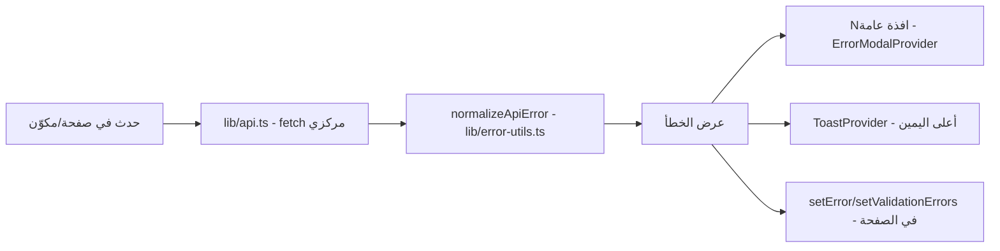

# تقرير اكتشاف الحالة الحالية للترجمة والأخطاء والتحقق واتجاه الواجهة في ATsofterp

**تاريخ التقرير**: 2026-07-31
**نوع التقرير**: تدقيق اكتشاف للقراءة فقط (Read-Only Discovery Audit) — دون أي تعديل على التطبيق
**الفرع**: `main` — **الالتزام (Commit)**: `23f9c65`
**الحالة**: **COMPLETED** (اكتمل التدقيق — لم يُنفَّذ أي إصلاح)

---

## القسم 1 — Executive Summary

### 1.1 نضج الترجمة (i18n) الحالي

نظام الترجمة **مُفعَّل بالكامل** (IMPLEMENTED) في الواجهة الأمامية: مزوّد سياق `I18nProvider` في
`apps/web/src/lib/i18n/i18n-provider.tsx`، ومفاتيح مسطّحة مبنية من 14 ملف Namespace لكل لغة
+ برميل `en.ts`/`ar.ts`، وسطح أنواع `TranslationNamespace` مكوَّن من 52 Namespace
(`apps/web/src/lib/i18n/types.ts:3-53`). فحص المزامنة `scripts/check-i18n.mjs` يؤكد
**3406 مفتاح إنجليزي و3406 مفتاح عربي متزامنين بالكامل** (يتم مسح 12 من أصل 14 ملف Namespace؛
المستبعدان: `error-dialog.ts` و`workspace.ts`).

**نقطة الضعف الأساسية**: دالة `t()` تُعيد **المفتاح الخام كما هو** عند عدم وجود الترجمة
(`i18n-provider.tsx:48,53,56`)، ولا يوجد تسجيل (Logging) للمفاتيح المفقودة، ولا دعم
Interpolation، ولا Pluralization. كل مواضع `t(...) || fallback` هي كود ميت لأن `t()` لا تُعيد قيمة
falsy إطلاقاً.

### 1.2 نضج معالجة الأخطاء الحالي

طبقات معالجة الأخطاء **موجودة ومتّصلة فعلياً**: عميل API مركزي (`lib/api.ts`) يستخرج
`status/code/messageKey/details`، ومطبِّع `normalizeApiError` في `lib/error-utils.ts:19-56`
(يقرأ `messageKey` أولاً ثم رسالة الخادم ثم حالة HTTP ثم خطأ الشبكة)، وخطاف `useApiErrorHandler`
و`ErrorModalProvider` (نافذة خطأ عامة موحدة في `components/admin/error-modal.tsx`)،
و`ToastProvider` (أعلى اليمين، إخفاء تلقائي بعد 4 ثوانٍ).

**الثغرات**: رسائل Validation من الخادم لا تُربط بالحقول أبداً (مصفوفة `errors` في استجابة 400
لا يقرأها أي كود أمامي؛ `lib/api.ts:54-56` يُبقي `message[0]` فقط ويرمي الباقي)؛ النافذة العامة
لا تحتوي على `role="dialog"`/`aria-modal`/Escape/Focus trap؛ أخطاء `non-HttpException` في
الخادم تمرّ كرسالة إنجليزية خام بدون مفتاح؛ بعض الصفحات تعرض `err?.message` الخام مباشرة
(مثال: `permissions/page.tsx:51`).

### 1.3 تغطية النافذة العامة

المزوّد `ErrorModalProvider` مُثبَّت في `RootLayout` (متاح على كل الصفحات)، لكن **48 ملفاً فقط**
يستدعيه فعلياً عبر `handleApiError(err)`؛ بقية الصفحات تستخدم Toast أو `setError(err?.message)`
بخطأ صفحة مركزي، أو لا تُظهر شيئاً.

### 1.4 نضج التحقق من النماذج (Form Validation)

الواجهة الأمامية **بدون أي مكتبة تحقق** (لا react-hook-form ولا zod ولا yup ولا formik —
غير مثبّتة أصلاً). 61 ملفاً تستخدم `useState<Record<string,string>>` مع `validate()` يدوية،
و18 ملفاً تستخدم دالة `validate()` صريحة. ملف `lib/form-validation.ts` **فارغ (0 بايت)**.
نموذج `locks/new` **بدون أي تحقق** (HTML `required` فقط). رسائل التحقق اليدوي مترجمة عبر
`t('complexForms.requiredField')` ومواضع أخرى.

### 1.5 نضج عقد خطأ الخادم (Backend Error Contract)

هناك **عقد واحد فعلي**: `AllExceptionsFilter` في `apps/api/src/common/filters/http-exception.filter.ts`
يُعيد `{ success:false, statusCode, message: string[], timestamp, messageKey?, errors? }` مع
تحديد اللغة عبر `getRequestLanguage` (`x-locale` ← `Accept-Language` ← `ar` افتراضياً).
89 مفتاح رسالة في `api-messages.ts`. **المشاكل**: أخطاء غير `HttpException` (بما فيها Prisma)
تعرض رسالة `exception.message` الإنجليزية الخام بدون مفتاح؛ رسائل class-validator تبقى إنجليزية
افتراضية؛ لا يوجد requestId؛ لا يُرسل `x-locale` من الواجهة أبداً (لا يظهر في `lib/api.ts`)،
لذا لغة الخادم قد تختلف عن لغة الواجهة.

### 1.6 نضج RTL/LTR الحالي

الاتجاه يُدار في وقت التشغيل عبر `document.documentElement.dir/lang` (`i18n-provider.tsx:35-42`)
ويُمرَّر عبر سياق `dir` إلى ~60 مكوّناً/صفحة. **لكن**: HTML الأولي مُرمَّز `lang="en" dir="ltr"`
مع عربي افتراضي (`layout.tsx:15`) → وميض LTR للمستخدم العربي. الاستخدام **18 خاصية منطقية مقابل
307 استخدامات فيزيائية** (`text-left` 179، `text-right` 61، `left-*` 14، `ml-*` 15، ...).
الهيكل الأساسي (Sidebar، Grid، Drawer) معالَج جيداً؛ تكسرات مؤكدة في حقول البحث داخل
المودالات، وخطوط Timeline الصيانة، وموضع Toasts فوق الـ Sidebar في RTL.

### 1.7 مستوى كشف المفاتيح الخام

- **مفاتيح ترجمة خام**: مخاطرة منهجية (آلية `t()` تُعيد المفتاح) مع مفتاحين فعليين قيد التشغيل:
  `status.URGENT` و`status.ONCE`.
- **مفاتيح صلاحيات خام**: **مؤكدة مرئية** في 3 صفحات إدارة الصلاحيات (`permissions`،
  `permissions/matrix`، `roles/[id]/permissions`).
- **حالات خام**: 5 مكوّنات/مواضع تُظهر القيم الخام مباشرة (`EntityStatusBadge`,
  `NotificationPriorityBadge`, `CmmsPriorityBadge`, badge مضمّن في physical-counts،
  خريطة locks).

### 1.8 التعارضات الرئيسية

- `translatePriority` موجود في `literals.ts` لكن `CmmsPriorityBadge` يتجاهله ويبني مفتاحاً ديناميكياً.
- `ui/toast.tsx` المستقل مقابل `toast-provider.tsx` (مكرّر، يبدو أحدهما غير مستخدم، و`animate-slide-in` بلا keyframes فعلية).
- 4 مكوّنات نماذج فارغة (`advanced-form.tsx`, `form-drawer.tsx`, `form-wizard.tsx`, `details-drawer.tsx`) + `form-validation.ts` فارغ.
- تباين عدّاد المفاتيح: تقرير سابق زعم 3407 مقابل 3406 الحالية (اختلاف منهجية العدّ).

### 1.9 مناطق لم تُحسم

سلوك Toast المستقل فعلياً؛ ما إذا كانت أي صفحة تقرأ `errors` من الخادم بصيغة غير متوقعة؛
سلوك `SecuritySettings` وقت التشغيل؛ التغطية الكاملة غير المؤكدة لكل الصفحات الـ261 سطراً سطراً
(التدقيق الكامل لسطر-بسطر طُبّق على العينات).

---

## القسم 2 — Audit Metadata

| العنصر | القيمة |
|---|---|
| مسار المستودع | `C:\Users\attef\PycharmProjects\Trae\ATsofterp` |
| الفرع الحالي | `main` |
| الالتزام الكامل | `23f9c65` (كامل: `23f9c655b4eb63d9b61b007e8dd940837817d467`) |
| حالة Git قبل التدقيق | نفس حالة Git بعد التدقيق (لم يُنفَّذ أي عملية كتابة Git) |
| حالة Git بعد التدقيق | موثقة في القسم 23 |
| صفحات الواجهة النشطة | **261** صفحة `page.tsx` تحت `apps/web/src/app` |
| عدّاد المفاتيح العربية | **3406** (نتيجة `node scripts/check-i18n.mjs`) |
| عدّاد المفاتيح الإنجليزية | **3406** |
| عدد Namespaces | **52** في نوع `TranslationNamespace` (types.ts) |
| ملفات الاختبار ذات الصلة | 22 ملف `*.spec.ts` في `apps/api/src` (4 قابلة للتشغيل بإعداد jest الحالي)؛ 0 ملفات اختبار ويب |
| الأوامر المستخدمة | قراءة ملفات (Read)، بحث نصي (Grep/Glob)، `node scripts/check-i18n.mjs` (قراءة فقط)، `Get-ChildItem` لتعداد المسارات |
| القيود المطبقة | لا تعديل على أي ملف تطبيق؛ لا عمليات Git للكتابة؛ لا install/update؛ لا prisma migrate/push/seed/generate؛ لا تشغيل أوامر تُولّد ملفات |
| الملفات المستثناة | `node_modules`، `.next`، `dist`، سجلات، ملفات البيئة، تقارير QA السابقة كمصدر أساسي |
| الملف المعتمد الوحيد | `docs/proofs/atsofterp-current-i18n-errors-validation-rtl-discovery-report.md` |
| التغييرات السابقة الموجودة | مذكورة في القسم 23 (لا تُنسب لهذه المهمة) |

---

## القسم 3 — Current i18n Architecture

| Component/File | Purpose | Active Usage | Fallback Behavior | Missing-Key Behavior | Status |
|---|---|---|---|---|---|
| `apps/web/src/lib/i18n/i18n-provider.tsx` | مزوّد سياق الترجمة والاتجاه | كل التطبيق عبر `RootLayout` | عند غياب locale البيانات أو الـ ns أو المفتاح → **إرجاع المفتاح الخام** (L48,53,56) | يُعرض المفتاح الخام؛ **لا تسجيل** | IMPLEMENTED (مع UNSAFE_FALLBACK) |
| `use-translation.ts` | خطاف `useTranslation()` | كل الصفحات | نفس سلوك `t()` | مفتاح خام | IMPLEMENTED |
| `types.ts` | أنواع `TranslationNamespace` (52) و`I18nContextValue` (يشمل `dir`) | وقت الترجمة فقط | — | — | IMPLEMENTED |
| `locales/en/*.ts` (14 ملف) + `en.ts` | قاموس إنجليزي | تحميل كامل عند import | — | — | IMPLEMENTED |
| `locales/ar/*.ts` (14 ملف) + `ar.ts` | قاموس عربي | تحميل كامل عند import | — | — | IMPLEMENTED |
| `literals.ts` | مساعدات القيم/الحالات (`translateStatus`...) | ~30+ موقعاً عبر `LocalizedValue` والشارات | `humanize(value)` (L48-51) — لا يُعيد المفتاح الخام أبداً | يُهيأ النص إنجليزياً | IMPLEMENTED (safe) |
| `format-locale.ts` | إعادة تصدير `literals.ts` فقط | نفس مواقع literals | — | — | LEGACY/DUPLICATED (إعادة تصدير مجردة) |
| `check-i18n.mjs` | فحص مزامنة EN/AR | يُشغَّل يدوياً في CI المحلي | — | يكشف المفاتيح غير المتزامنة فقط بين ملفي القاموس | PARTIAL (لا يفحص استخدام الكود، ويفحص 12/14 ملف) |
| `getRequestLanguage` (خادم) | تحديد لغة الاستجابة | كل طلبات API عبر الفلتر | `x-locale` → `Accept-Language` → `'ar'` | — | IMPLEMENTED |
| `api-messages.ts` (خادم) | كتالوج 89 مفتاح رسالة | فلتر الاستثناءات | — | يُعيد رسالة غير مترجمة | IMPLEMENTED |

### إجابات الأسئلة المطلوبة (i18n)

1. **ماذا يحدث عند عدم إيجاد `t(key)`؟** يُعاد المفتاح الخام (`i18n-provider.tsx:48,53,56`).
2. **هل يمكن أن يظهر المفتاح الخام للمستخدم؟** **نعم** — مؤكد في `status.URGENT` و`status.ONCE` ومواضع ديناميكية أخرى (القسم 4).
3. **هل يُسجَّل المفتاح المفقود؟** **لا** — لا يوجد console.warn/logger في المزوّد.
4. **هل المفتاح المفقود قابل للاكتشاف بالاختبارات؟** جزئياً: `check-i18n.mjs` يكتشف عدم التزامن بين القاموسين فقط؛ **لا** يكتشف المفاتيح المرجعية من كود الصفحات.
5. **هل العربية والإنجليزية متزامنتان حالياً؟** **نعم** — 3406/3406 مؤكد بتشغيل الفاحص.
6. **هل تُحمَّل Namespaces عالمياً أم انتقائياً؟** **عالمياً** — كلا القاموسين مستوردان بالكامل في `en.ts`/`ar.ts` وتُسطَّح مفتاحاتهما (لا تحميل كسول، لا fallback لكل Namespace).
7. **هل يمكن ترجمة قيم Interpolation؟** **لا** — `t()` لا تدعم أي Interpolation أو Pluralization (لا صيغة معاملات في التوقيع `t(key, ns?)`).
8. **هل تُترجم الحالات مركزياً أم محلياً؟** **مركزياً غالباً** عبر `literals.ts`، مع 5 استثناءات محلية (القسم 6).
9. **هل تُترجم تسميات الصلاحيات؟** **لا** — تُعرض مفاتيح `module:action` خاماً في صفحات إدارة الصلاحيات (القسم 5).
10. **ماذا يُعيد الخادم: عربي/إنجليزي/مفاتيح/مختلط؟** **مختلط**: رسائل `HttpException` مترجمة عبر `messageKey` (89 مفتاحاً، افتراضي عربي)، رسائل class-validator إنجليزية افتراضية، وأخطاء غير HttpException رسالة إنجليزية خام.
11. **هل ترسل الواجهة اللغة النشطة للـ API؟** **لا** — `lib/api.ts` يرسل فقط `Authorization` ورؤوس السياق التشغيلي؛ لا `x-locale` ولا `Accept-Language` مخصص.
12. **هل يمكن أن تختلف لغة الـ API عن لغة الواجهة؟** **نعم** — لأن الواجهة لا ترسل لغتها؛ الخادم يعتمد على `Accept-Language` الافتراضي للمتصفح أو `'ar'`.
13. **هل تتبع الطباعة والتصدير اللغة المختارة؟** جزئياً — صفحة `requests/[id]/print` تستخدم `t()` لكن تحتوي 17× `text-left` فيزيائية ولا يوجد تحقق من اتجاه الطباعة؛ لا يوجد تصدير CSV/Excel مدرج في التدقيق.
14. **هل التواريخ والأرقام واعية باللغة؟** التواريخ نعم عبر `formatDate`/`formatDateTime` في `literals.ts:94-120` (`ar-SA` مقابل `en-US`)؛ **الأرقام لا** — لا يوجد أي تنسيق أرقام محلي.
15. **هل توجد صفحات مقيّدة بالعربية أو الإنجليزية؟** نعم — كتلة المخزون (locks، operational-receipts، transfers، stock-adjustments، physical-counts) إنجليزية خام، وعمود `تم الإصلاح` عربي خام في repair-orders.

---

## القسم 4 — Raw Translation Keys

### 4.1 الآلية

`t()` تُعيد المفتاح الخام عند غياب أي جزء من المسار، وكل `t(...) || fallback` كود ميت.
`error-utils.ts:32-39` هو **الموقع الوحيد المحمي صحيحاً** (يقارن النتيجة بالمفتاح ويسقط للبديل).

### 4.2 المفاتيح الديناميكية المؤكدة/المحتملة الرؤية

| Route | File | Line | Visible Value/Pattern | Arabic | English | User Impact | Evidence Level |
|---|---|---|---|---|---|---|---|
| طلبات الصيانة (قوائم + لوحات) | `components/maintenance/CmmsPriorityBadge.tsx` | 14 | `t('status.' + p)` | `status.URGENT` خام | `status.URGENT` خام | أولوية URGENT تظهر كمفتاح خام في قوائم الطلبات و3 لوحات | CONFIRMED_VISIBLE |
| طلبات الصيانة (قائمة) | `app/admin/maintenance/requests/page.tsx` | 185 | `` t(`status.${r.type}`) `` | مفتاح خام لأي نوع غير مسجّل | مفتاح خام | أنواع جديدة تظهر خاماً | LIKELY_VISIBLE |
| جداول الوقاية (6 صفحات) | `schedules/page.tsx:156-157`, `schedules/[id]/page.tsx:99-100`, `schedules/[id]/execute/page.tsx:73-74`, `preventive/upcoming/page.tsx:38`, `preventive/overdue/page.tsx:45`, `preventive/calendar/page.tsx:114` | — | `` t(`status.${frequency}`) `` | `status.ONCE` خام | `status.ONCE` خام | التكرار ONCE (متاح في schedules/new) يظهر خاماً | CONFIRMED_VISIBLE |
| تكلفة طلب صيانة | `requests/[id]/cost/page.tsx` | 116 | `` t(`maintenanceWorkflow.cost${...}`) `` بدون fallback | مفتاح خام | مفتاح خام | أي مفتاح مركّب مفقود يظهر خاماً | LIKELY_VISIBLE |
| حركات المخزون (11 موقعاً) | `movements/page.tsx:159,165,298`, `movements/new/page.tsx:182`, `movements/[id]/page.tsx:88-89,124`, `movements/[id]/lines/page.tsx:215`, `movements/[id]/edit/page.tsx:92,101-102`, `adjustments/[id]/page.tsx:94` | — | `` t(`status.${x}`) `` | مفتاح خام | مفتاح خام | أنواع/اتجاهات/حالات غير مسجلة تظهر خاماً | LIKELY_VISIBLE |
| دور (تفاصيل) | `app/admin/access/roles/[id]/page.tsx` | 56 | `` t(`status.${role.status}`) `` | مفتاح خام | مفتاح خام | حالة غير موجودة تظهر خاماً | LIKELY_VISIBLE |
| إعدادات الترقيم | `settings/numbering/page.tsx` | 194,195,207,213,221,330-333 | `` t(`settings.numbering.operationNameMap.${code}`) `` (7 مواقع) | مفتاح خام | مفتاح خام | أكواد غير مسجلة تظهر خاماً | LIKELY_VISIBLE |
| قواعد الإشعارات | `settings/notification-rules/page.tsx` | 143,148,169,214,222 | مفاتيح eventTypes/severity/channels ديناميكية | مفتاح خام | مفتاح خام | أحداث/قنوات مفقودة تظهر خاماً | LIKELY_VISIBLE |
| إعدادات الأمان | `settings/security/page.tsx` | 57 | `` t(`settings.security.${key}`) `` | مفتاح خام | مفتاح خام | أي مفتاح بلا ترجمة | LIKELY_VISIBLE |
| فحوصات الباركود | `barcodes/scans/page.tsx` | 72 | `` t(`barcodes.scan.${PURPOSE_KEY_MAP[p]}`) `` | مفتاح خام | مفتاح خام | غرض غير مسجل | LIKELY_VISIBLE |
| جرد فعلي (تأكيد) | `inventory/physical-counts/[id]/page.tsx` | 270 | `` t(`physicalCount.${pendingAction}Confirm`,'physicalCount') `` | مفتاح خام (fallback الإنجليزي ميت) | مفتاح خام | أزرار تأكيد قد تعرض مفتاحاً خاماً | LIKELY_VISIBLE |
| بحث موحد | `app/admin/search/page.tsx` | 114,133 | `t(ENTITY_LABEL_KEYS[type] as any)` | — | — | **TypeError عند نوع غير معروف** (توقف صفحة) | CONFIRMED_VISIBLE (crash) |
| نتائج البحث | `app/admin/search/results/page.tsx` | 84 | `t(ENTITY_LABELS[type] as any)` | — | — | نفس الانهيار | LIKELY_VISIBLE (crash) |
| شريط التنقل | `components/admin/shell/*` (`admin-shell.tsx:126,129`, `sidebar.tsx`, `mobile-menu.tsx`) | — | `t(action.labelKey)` | مفتاح خام عند خطأ إملائي | مفتاح خام | مفاتيح التنقل كبيانات | LIKELY_VISIBLE |
| دفتر المخزون (خلل منطقي) | `app/admin/inventory/ledger/page.tsx` | 38 | `` t('inventoryLedger.movementType') `` | نص الترويسة المترجم يظهر كقيمة كل صف | نفسه | خطأ بيانات وليس مفتاحاً خاماً | CONFIRMED_VISIBLE (bug) |

**المفاتيح المرجعية المفقودة المؤكدة في كتلة `status`** (`locales/en/common.ts:246-345`):
`URGENT` و`ONCE` غائبان — كلاهما قيم قابلة للاختيار تصل لتدفقات الإنتاج.

**الإجماليات**:
- مخاطر مفاتيح خام مؤكدة الرؤية: **4** (CmmsPriorityBadge/URGENT، جداول الوقاية/ONCE، انهيار البحث، خلل ledger)
- مخاطر محتملة الرؤية: **11 مجموعة مواقع** تغطي ~35 سطراً في ~20 صفحة
- صفحات متأثرة: ~25 صفحة + 3 مكوّنات مشتركة (CmmsPriorityBadge، shell nav، LocalizedValue-safe)
- مفاتيح معرّفة وغير مستخدمة: غير محسوبة بدقة (لا يوجد فاحص استخدام) — يُترك UNCERTAIN
- مفاتيح مفقودة في العربية: **0** (مزامنة 3406/3406)
- مفاتيح مفقودة في الإنجليزية: **0**

---

## القسم 5 — Raw Permission Keys

| Route/Component | Permission Key | Internal Only | Visible to User | Localized Label Available | Status |
|---|---|---|---|---|---|
| `/admin/access/permissions` (قائمة) | `key` (`module:action`) | لا | **نعم** — أعمدة `key/module/action` تُعرض مباشرة من الخادم (`page.tsx:60-63`) | لا — لا يوجد بحث عن تسمية محلية | CONFIRMED_VISIBLE |
| `/admin/access/permissions/matrix` | `key` | لا | **نعم** — خلية `perm.key` بخط mono بارز (`page.tsx:87-89`) | لا | CONFIRMED_VISIBLE |
| `/admin/access/roles/[id]/permissions` | `key` و`action` | لا | **نعم** — كل صلاحية تعرض `perm.key` و`perm.action` (`page.tsx:143-144`) | لا | CONFIRMED_VISIBLE |
| Guard/صفحات التشغيل (قوائم، أزرار، Sidebar) | جميع المفاتيح الأخرى | **نعم** — للتحقق فقط | لا يوجد دليل على عرضها خارج صفحات الإدارة | — | INTERNAL_ONLY |
| رسائل 403 من الخادم | مفاتيح أخطاء (`errors.*`) | — | عبر `messageKey` مترجم | نعم (89 مفتاحاً) | INTERNAL_ONLY (لا تُعرض المفاتيح الخام في رسائل الأذونات) |
| `/admin/access/roles` / `users/[id]/roles` | — | نعم | لا — أسماء الأدوار من بيانات العمل | — | INTERNAL_ONLY |

**الخلاصة**: مفاتيح الصلاحيات **مرئية للمستخدم في 3 صفحات إدارة** (تعرض `module:action` خاماً بدون
ترجمة)؛ وباقي النظام يستخدمها داخلياً للأذونات فقط. لا يوجد أي "معرّف صلاحية" مترجم في أي مكان
(لا `permissions.*` label map للعرض).

---

## القسم 6 — Raw Status Codes

| Domain | Entity | Route | Status Field | Rendering Method | AR Result | EN Result | Raw Risk | Status |
|---|---|---|---|---|---|---|---|---|
| عام | حالة عامة | قوائم/تفاصيل كثيرة | `status` | `StatusBadge` → `translateStatus` | مترجم أو humanize | مترجم أو humanize | لا | IMPLEMENTED (shared) |
| CMMS | حالة طلب/مهمة | صفحات maintenance | `status` | `CmmsStatusBadge` → `translateStatus` | مترجم | مترجم | لا | IMPLEMENTED (shared) |
| CMMS | الأولوية | قوائم الطلبات + 3 لوحات | `priority` | `CmmsPriorityBadge` → **`t('status.'+p)` محلي** | `status.URGENT` خام | `status.URGENT` خام | **نعم** | CONFLICTING (يتجاهل `translatePriority`) |
| جرد | حالة جرد/حركة | inventory-counting | `status` | `InventoryStatusBadge` → `translateStatus` | مترجم | مترجم | لا | IMPLEMENTED (shared) |
| جرد | نوع الحركة | inventory-counting | `movementType` | `InventoryMovementTypeBadge` → `translateMovementType` | مترجم | مترجم | لا | IMPLEMENTED (shared) |
| تقارير | 9 أنواع قيمة | ~30 صفحة تقرير | متنوع | `LocalizedValue` (dispatcher) | مترجم | مترجم | لا | IMPLEMENTED (shared) |
| كيانات | حالة كيان (DRAFT/PENDING/...) | `users/page.tsx:256`, `warehouses/page.tsx:217,249` | `status` | `EntityStatusBadge` → **يُعرض خاماً** (`entity-status-badge.tsx:24-36`) | خام | خام | **نعم** | RISK |
| إشعارات | الأولوية | قوائم الإشعارات | `priority` | `NotificationPriorityBadge` → **`{priority}` خام** (`notification-priority-badge.tsx:11-19`) | خام | خام | **نعم** | RISK |
| جرد | جرد فعلي | `physical-counts/[id]/page.tsx:124-134` | `status` | badge مضمّن + `{status}` خام | خام | خام | **نعم** | RISK |
| مخزون | نوع القفل | `locks/[id]/page.tsx:9-14,112` | `lockType` | `LOCK_TYPES_MAP` إنجليزي مقيّد | إنجليزي في واجهة عربية | إنجليزي | **نعم** | RISK |
| CMMS | نوع الطلب/الأولوية | `requests/new/page.tsx:12-24` (+edit) | — | خيارات إنجليزية مقيّدة | إنجليزي في واجهة عربية | إنجليزي | **نعم** | RISK |
| CMMS | نوع المكوّن/الحرجية | `machine-components/page.tsx:14-34` (+edit) | — | خيارات إنجليزية مقيّدة | إنجليزي في واجهة عربية | إنجليزي | **نعم** | RISK |
| CMMS | نوع/تكرار الجدول | `schedules/new/page.tsx:11-24` | — | قيم Enum خام كتسميات | خام | خام | **نعم** | RISK |
| باركود | نوع الكيان | `barcodes/generate/page.tsx:16-25` (+designers) | — | Enum خام | خام | خام | **نعم** | RISK |
| مخزون | اتجاه حركة | `MovementLinesPanel.tsx:30-31` | — | `'IN'`/`'OUT'` خام في Select | خام | خام | طفيف | RISK |

**نتائج إضافية**:
- **خرائط حالة مكرّرة/متضاربة**: لا يوجد تضارب نصي في ترجمة الحالة الواحدة (المصدر موحّد في كتلة
  `status`)، لكن الـ 5 مكوّنات المحلية تتجاوزها بتسميات مختلفة.
- **حالات نطاقية تستخدم ترجمة عامة**: `translatePriority` يعيد التوجيه إلى `translateStatus` — لا
  تسميات أولوية مميزة.
- **حالات خام في مخرجات CSV/PDF/print**: لا يوجد تصدير CSV/Excel مدعوم في التدقيق؛ صفحة
  `requests/[id]/print` تستخدم `t()` لكن التنسيق فيزيائي `text-left` (17 موضعاً).

---

## القسم 7 — Hardcoded User-Facing Text

### 7.1 نص عربي مقيّد (القائمة الكاملة خارج ملفات الترجمة — 4 مواضع)

| File | Line | Text | Language | User-Facing | Translation Available | Status |
|---|---|---|---|---|---|---|
| `app/login/page.tsx` | 104 | `'العربية'` (تبديل اللغة) | AR | نعم | لا (نمط مقصود لتسمية اللغة الأم) | PARTIAL |
| `components/admin/language-switcher.tsx` | 11 | `'العربية'` (نفس النمط) | AR | نعم | لا — مكرر بدل مساعد مشترك | PARTIAL |
| `app/admin/settings/language/page.tsx` | 60 | `'العربية'`/`'English'` عبر مقارنة `t(...) === 'Left to Right'` | AR/EN | نعم | لا — **حيلة اكتشاف لغة هشة** | UNSAFE_FALLBACK |
| `app/admin/maintenance/repair-orders/page.tsx` | 62 | `'تم الإصلاح'` (ترويسة عمود) | AR | نعم | لا — **خلل فعلي**: عربي في واجهة إنجليزية | DEFECT |

### 7.2 نص إنجليزي مقيّد (أمثلة مؤكدة)

| File | Line | Text | Language | User-Facing | Translation Available | Status |
|---|---|---|---|---|---|---|
| `inventory/locks/[id]/page.tsx` | 60-132 | `'Lock updated'`, `'Update failed'`, `'Loading...'`, `'Not found'`, `'Back'`, `'Edit'`, `'Deactivate'`, `'Code:'`, `'Status:'`... الصفحة كاملة + مودال التعديل + `{lock.status}` خام | EN | نعم | لا (الصفحة بلا `useTranslation`) | DEFECT |
| `inventory/locks/page.tsx` | 80,93,103 | `'Lock deleted'`, `'Lock activated'`, `'Lock deactivated'` | EN | نعم (Toasts) | لا | DEFECT |
| `inventory/locks/new/page.tsx` | 45,63 | `'Lock created successfully'`, placeholder `'LOCK-001'` | EN | نعم | لا | DEFECT |
| `inventory/operational-receipts/[id]/page.tsx` | 83-196 | `'Action completed'`, `'Back to List'`, `'Document Details'`, `'Warehouse & Supplier'`, `'No lines'`, `'Confirm'`... | EN | نعم (الصفحة كاملة) | لا | DEFECT |
| `inventory/operational-receipts/page.tsx` | 136,139,161 | `'Updated successfully'`, `'Created successfully'`, `'Action completed'` | EN | نعم (Toasts) | لا | DEFECT |
| `inventory/transfers/page.tsx` | 142,145,167 | نفس الثلاثية | EN | نعم (Toasts) | لا | DEFECT |
| `inventory/stock-adjustments/page.tsx` | 129,132,154 | نفس الثلاثية | EN | نعم (Toasts) | لا | DEFECT |
| `inventory/physical-counts/[id]/page.tsx` | 109,114,122 | `` `Physical count ${pendingAction}ed` `` (صيغة مكسورة: "submited")، `'Action failed'` | EN | نعم (Toasts) | لا | DEFECT |
| `inventory/physical-counts/new/page.tsx` | 54 | `'Physical count created'` | EN | نعم (Toast) | لا | DEFECT |
| `barcodes/page.tsx` | 57 | `'No data'` | EN | نعم (empty state) | لا | DEFECT |
| `search/page.tsx` | 63 | `'Search failed'` | EN | نعم (خطأ صفحة) | لا | DEFECT |
| `access/roles/new/page.tsx` | 59-60 | placeholders `'e.g. MANAGER'`, `'e.g. Manager'` | EN | نعم | لا | PARTIAL |
| `barcodes/generate/page.tsx` | 179 | placeholder `'e.g., entity id'` | EN | نعم | لا | PARTIAL |
| `documents/attachments/upload/page.tsx` | 63 | placeholder `'e.g. machine, product'` | EN | نعم | لا | PARTIAL |
| `maintenance/requests/new/page.tsx` + `[id]/edit` | 12-24 | `'Corrective'/'Preventive'/'Predictive'/'Emergency'`, `'Low'/'Medium'/'High'/'Urgent'` | EN | نعم (خيارات تُعرض في واجهة عربية) | لا | DEFECT |
| `maintenance/machine-components/page.tsx` + `[id]/edit` | 14-34 / 13-36 | `'Mechanical'...` `'Critical'` | EN | نعم | لا | DEFECT |
| `maintenance/schedules/new/page.tsx` | 11-24 | `'PREVENTIVE'`, `'DAILY'`, `'ONCE'` خام | EN | نعم | لا | DEFECT |
| `entity/entity-detail-drawer.tsx` | 37,154 | `'Close panel'`, `'No content'` | EN | نعم (افتراضيات) | لا (قابلة للتجاوز) | PARTIAL |
| `entity/entity-toolbar.tsx` | 93 | `aria-label="More"` | EN | نعم (قارئ شاشة) | لا | PARTIAL |
| `admin/notifications/notification-item.tsx` | 37,44 | `title="Mark read"`, `title="Delete"` | EN | نعم (tooltips) | لا | PARTIAL |
| `admin/ui/confirm-dialog.tsx` | 26 | `confirmLabel \|\| 'Confirm'` | EN | نعم (افتراضي) | لا | PARTIAL |

**المستثنى (وفق المهمة)**: السجلات التقنية، التعليقات، نصوص الاختبارات، أسماء بيانات العمل
(أكواد وأدوار)، أسماء المسارات، مفاتيح الصلاحيات الداخلية.

### 7.3 تقدير نطاق الهجرة حسب النطاق

| النطاق | الحجم التقريبي للنص المقيّد | المواقع الرئيسية |
|---|---|---|
| المخزون (Locks/Receipts/Transfers/Stock-Adjustments/Physical-Counts) | ~5 صفحات كاملة + ~19 Toast + placeholder | أكبر نطاق |
| CMMS (طلبات/مكوّنات/جداول) | ~4 خرائط خيارات | متوسط |
| الباركود | 3 placeholders + empty state | صغير |
| البحث | 1 خطأ صفحة | صغير |
| المشتركة (drawer/toolbar/notification/confirm) | 5 افتراضيات | صغير |
| اللغة (تسميات تبديل) | 2 نمط مكرر + حيلة هشة | صغير |

---

## القسم 8 — Current Frontend Error Architecture

### 8.1 مخطط التدفق الفعلي



### 8.2 جدول آليات الخطأ

| Error Mechanism | Files | Used By | Error Types | Localized | Global | Field-Aware | Status |
|---|---|---|---|---|---|---|---|
| `handleResponse` (عميل API) | `lib/api.ts:41-71` | كل الطلبات | HTTP، شبكة، JSON | جزئياً (يُبقي `message[0]` فقط) | — | لا | IMPLEMENTED |
| `normalizeApiError` | `lib/error-utils.ts:19-56` | `error-handler.tsx` | كل ما يرميه العميل | نعم (messageKey أولاً) | — | لا | IMPLEMENTED (الموقع الوحيد الآمن للمفاتيح الديناميكية) |
| `useApiErrorHandler` | `components/admin/error-handler.tsx:9-22` | **48 ملفاً** | API | نعم | نعم | لا | IMPLEMENTED |
| `ErrorModalProvider` + `Modal` | `error-modal.tsx:27-71` | عبر الـ hook | عام | نعم (عنوان `errors.generalError`) | نعم | لا | IMPLEMENTED (بلا ARIA — راجع القسم 16) |
| `ToastProvider` | `toast-provider.tsx` (أعلى يمين، 4s) | ~20+ صفحة | نجاح/خطأ | نعم جزئياً (بعض المواضع إنجليزية خام) | لا | لا | IMPLEMENTED (PARTIAL) |
| `setError(err?.message)` صفحة مركزية | `permissions/page.tsx:51`, `permissions/matrix/page.tsx:25`, `search/page.tsx:63` وغيرها | ~20+ صفحة قوائم | API | لا — يعرض `err.message` الخام (رسالة خادم مترجمة أو إنجليزية) | لا | لا | IMPLEMENTED (RISK خام) |
| `setValidationErrors({form})` | 4 صفحات Core عبر `useCrudList` | companies/branches/departments/administrations | API 400 | نعم (رسالة أولى) | لا | مستوى النموذج فقط | IMPLEMENTED |
| حقول أخطاء يدوية | 61 ملفاً | انظر القسم 12 | محلي | نعم (`t('complexForms.requiredField')`) | لا | نعم | IMPLEMENTED |
| `window.alert`/`window.confirm` | **غير موجود** | 0 | — | — | — | — | NOT_IMPLEMENTED (لا يُستخدم) |

### 8.3 إجابات الأسئلة المطلوبة

1. **هل يوجد نظام نافذة خطأ عام واحد بالضبط؟** نعم — `ErrorModalProvider` واحد.
2. **هل يمكن تفعيله من أي صفحة نشطة؟** نعم (مزوّد عام في `RootLayout`)، لكن 48 ملفاً فقط يستدعيه.
3. **هل متاح في صفحات الدخول والإدارة؟** نعم من الناحية التقنية (المزوّد يلف الجميع)؛ صفحة login لا تستدعيه (خطأ inline).
4. **هل له زر إغلاق؟** نعم — `t('common.close')` (`error-modal.tsx:57-59`) وزر X في `Modal`.
5. **هل يغلقه Escape؟** **لا** — لا يوجد معالج مفتاح في `Modal` (`ui/modal.tsx`).
6. **هل يستعيد التركيز؟** **لا** — لا Focus trap ولا استعادة.
7. **هل يدعم العربية والإنجليزية؟** نعم — عبر `t('errors.generalError')`/`t('common.close')`.
8. **هل يستخدم الاتجاه الصحيح RTL/LTR؟** المودال محايد الاتجاه (متمركز) ويرث `dir` من الصفحة — نعم ضمنياً.
9. **هل يمكنه عرض رسالة خادم خام؟** نعم — `config.message` يعرض ما وصل من `err.message`.
10. **هل يمكنه عرض مفاتيح ترجمة خام؟** نعم — إذا كانت الرسالة مفتاحاً خاماً (من `t()` المفقودة أو `err.message` المفتاحي).
11. **هل يمكن أن تتراكم نوافذ متعددة؟** لا — حالة `config` واحدة (استبدال وليس تكديساً).
12. **هل تُعرض أخطاء خطيرة كـ Toast فقط؟** نعم — كتلة المخزون تعرض `'Update failed'`/`'Action failed'` كـ Toast.
13. **هل تُعرض أخطاء في منتصف الصفحة فقط؟** نعم — نمط `setError` + `<p className="text-center">` في قوائم كثيرة.
14. **هل تُبتلع الأخطاء بصمت؟** لم يُعثر على catch فارغ في المسارات المفحوصة؛ هناك صفحات بلا أي معالجة مرئية (راجع القسم 9).
15. **هل تستخدم أي صفحة `alert()`؟** لا.
16. **هل توجد مودالات محلية متعارضة؟** المودال المشترك واحد؛ توجد مودالات تشغيلية محلية مبنية على `Modal` نفسه (ليست متعارضة).

---

## القسم 9 — Global Error Dialog Coverage

| Route/Component | Uses Global Dialog | Uses Toast | Uses Inline Error | Uses Browser Alert | Raw Error Risk | Notes |
|---|---|---|---|---|---|---|
| 48 ملفاً (قوائم/تفاصيل/أشكال) | نعم (`handleApiError`) | — | — | — | منخفض (عبر normalize) | مثال: `core/departments/page.tsx:191-192`, `access/users/page.tsx:121-122,149-150,166-167`, `warehouses/new/page.tsx:48-49`, `messaging/page.tsx:72,81`, `downtime-logs/page.tsx:90-135` |
| كتلة المخزون (locks/operational-receipts/transfers/stock-adjustments/physical-counts) | لا | نعم (رسائل إنجليزية خام) | لا | لا | **عالي** (رسائل مقيّدة) | Toast بدل النافذة |
| 4 صفحات Core (companies/branches/departments/administrations) | لا | نعم (`showToast(err?.message...)`) | نعم (حقول + بانر form) | لا | متوسط | `companies/[id]/page.tsx:141,156` |
| صفحات قوائم (permissions, matrix, search...) | لا | لا | نعم (`setError(err?.message)`) | لا | **عالي** (عرض `err.message`) | ~20 صفحة |
| `permissions/matrix` | لا | لا | نعم | لا | متوسط | خطأ صفحة + Retry |
| `login` | لا | لا | نعم (خطأ inline) | لا | منخفض | يدوي |
| `roles/[id]/permissions` | لا | نعم | لا | لا | متوسط (`err?.message`) | Toast للتحميل والحفظ |
| صفحات بدون معالجة مرئية واضحة | لا | لا | لا | لا | — | صفحات Print/Preview/QR/تصاميم باركود (حالات تحميل فقط) |

### 9.1 الإحصاءات

- **صفحات تستخدم النافذة العامة فعلياً: 48 ملفاً** (عبر `handleApiError`).
- صفحات تستخدم خطأ inline فقط: ~20+ صفحة قوائم/تفاصيل (`setError` مركزي).
- صفحات تستخدم Toast فقط للأخطاء: ~10 صفحات (كتلة المخزون + صفحات Core + أخرى).
- صفحات تستخدم Browser Alert: **0**.
- صفحات تعرض `error.message`: ~25+ صفحة (نمط `err?.message || ...`).
- صفحات تعرض رسالة الخادم مباشرة: نفس المجموعة (رسائل `message[0]` المترجمة أو الخام).
- صفحات بلا معالجة مرئية: صفحات الطباعة/المعاينة/QR/التصاميم (~15 صفحة — تحميل فقط).
- صفحات بآليات متعددة متعارضة: 4 صفحات Core (Toast + بانر + حقول).

**بالفصل**: القوائم: مزيج نافذة/خطأ مركزي؛ صفحات التفاصيل: نافذة أو Toast؛ أشكال الإنشاء:
يدوي + Toast؛ أشكال التعديل: يدوي + Toast؛ صفحات الطباعة: لا معالجة أخطاء (تحميل فقط)؛
التقارير: `LocalizedValue` + نافذة/Toast؛ الإعدادات: Toast.

---

## القسم 10 — Backend Error Contract

| Source | HTTP Status | Response Shape | message | messageKey | code | fieldErrors | requestId | Raw Technical Risk |
|---|---|---|---|---|---|---|---|---|
| `HttpException` عادي (BadRequest/NotFound/Conflict/...) | كما يرميه السيرفيس | `{success:false, statusCode, message:[string], timestamp, messageKey?}` | أول عنصر من مصفوفة أو رسالة الكائن | نعم إن وُجد في كائن الخطأ | لا (لا `code`) | لا | لا | منخفض (مترجم عبر 89 مفتاحاً) |
| `ValidationPipe` (class-validator) | 400 | نفس الشكل + `errors` إن كان الكائن يحمل `errors` | **رسائل class-validator الإنجليزية** | لا | لا | **نعم إن وُجد** (`body.errors`) | لا | **عالي** (إنجليزية) |
| أخطاء غير `HttpException` (Prisma/SQL) | 500 | نفس الشكل بدون messageKey | `exception.message` **الخام** | لا | لا | لا | لا | **عالي** (تفاصيل تقنية/أسماء قيود) |
| خطأ 404 مسار غير موجود | 404 | NestJS الافتراضي (`{"statusCode":404,"message":"Cannot GET ..."}`) — **خارج الفلتر** | إنجليزي | لا | لا | لا | لا | متوسط |
| استجابة غير JSON | متغير | نص خام | — | — | — | — | — | — |
| شبكة (فشل الاتصال) | — | بدون استجابة | — | — | — | — | — | يُعالج في `normalizeApiError` كخطأ شبكة |

**إجابات الأسئلة المطلوبة**:
1. عقد واحد أساسي — نعم (الفلتر العالمي الوحيد، `main.ts:16`).
2. أشكال متعددة — نعم: الشكل الموحّد + 404 الافتراضي من NestJS + نص غير JSON.
3. تترجم الأخطاء في الخادم؟ — نعم لرسائل HttpException المفتاحية (89 مفتاحاً)، افتراضياً عربي.
4. أخطاء كمفاتيح ترجمة؟ — تُعاد `messageKey` كحقل منفصل وتترجمها الواجهة عبر `normalizeApiError` (المسار الوحيد الآمن).
5. رسائل class-validator الإنجليزية؟ — نعم تُعاد إنجليزية افتراضية.
6. مسارات الحقول محفوظة؟ — **لا** تصل للواجهة (الواجهة لا تقرأ `errors`)؛ والفلتر يمرر `errors` فقط إن كانت في كائن الخطأ.
7. حقول متداخلة؟ — عبر class-validator `message[0]` فقط إن أُرسلت.
8. أخطاء أسطر مصفوفات؟ — `@ValidateNested({each:true})` موجود في DTOs لكن مسارات الأسطر لا تُمرَّر.
9. requestId؟ — **لا** يوجد.
10. أكواد Prisma مكشوفة؟ — نعم في رسالة `exception.message` الخام لحالات غير HttpException (500).
11. أسماء قيود قاعدة البيانات؟ — نعم ضمن نفس الرسالة الخام.
12. Stack traces للواجهة؟ — **لا** (لا يُرسل stack في جسم الاستجابة).
13. حقول غير معروفة؟ — `forbidNonWhitelisted:true` يجعلها خطأ 400 عاماً برسالة class-validator (وليس حقل-بـ-حقل على الواجهة).
14. هل تعمل الواجهة على تطبيع كل شكل حالي؟ — جزئياً: الشكل الموحّد نعم؛ `errors` مهملة؛ 404 نصي يعرض `HTTP 404: ...`.

---

## القسم 11 — DTO and Validation Behavior

### 11.1 ValidationPipe العالمي

```ts
// apps/api/src/main.ts:18-24
new ValidationPipe({ whitelist: true, forbidNonWhitelisted: true, transform: true })
```

- `exceptionFactory`: **غير معرّف** (افتراضي NestJS — رسائل إنجليزية، مصفوفة message).
- `forbidUnknownValues`: غير مضبوط (افتراضي).
- أنابيب إضافية: `new ValidationPipe({ transform: true })` فقط على 5 نقاط في `search.controller.ts` (41,64,83,104,122).

### 11.2 إحصاءات DTO

| المقياس | القيمة |
|---|---|
| ملفات `.dto.ts` | **382** |
| تستورد class-validator | **122 (31.9%)** |
| بلا class-validator | 260 — منها 36 أغلفة `PartialType/PickType/OmitType/IntersectionType`، و239 أصغر من 200 بايت |
| Validators مخصصة (`ValidatorConstraint`/`registerDecorator`/`@Validate(`) | **0** |
| `@Matches`/`@IsUUID`/`@IsDecimal`/`@IsObject`/`@IsDate` | **0** |
| التكرارات | `@IsString` 878، `@IsOptional` 862، `@Min` 95، `@IsNumber` 91، `@IsBoolean` 38، `@IsIn` 36 (23 ملفاً)، `@IsInt` 27، `@IsDateString` 15، `@IsArray` 14، `@ValidateNested` 8، `@MinLength` 7، `@IsNotEmpty` 6، `@MaxLength` 1، `@IsEnum` 2 (search فقط)، `@IsEmail` 2، `@IsPositive` 2 |

### 11.3 جدول تمثيلي

| Domain | DTO | Fields | Validation Present | Custom Messages | Field Paths Preserved | Status |
|---|---|---|---|---|---|---|
| Admin | `create-administration.dto.ts` | 22 | `@IsString`/`@IsOptional` | لا | لا (لا يصل للواجهة) | PARTIAL |
| CMMS | `create-maintenance-request.dto.ts:1-100` | ~20 | غني: `@IsIn(['LOW','MEDIUM','HIGH','URGENT'])`, `@ValidateNested`, `@Min(0.01)`, `@IsArray` | لا | لا | IMPLEMENTED (DTO) |
| باركود | `create-barcode-label.dto.ts` | ~8 | `@IsIn(ENTITY_TYPES)`, `@IsIn(SYMBOLOGIES)` | لا | لا | IMPLEMENTED |
| قفل مخزون | `create-lock.dto.ts` | 4 | `@IsIn([...])` نصي | لا | لا | PARTIAL |
| شركاء | `create-partner.dto.ts` | ~6 | `@IsIn(['CUSTOMER','SUPPLIER','BOTH'])` | لا | لا | PARTIAL |
| مكوّن آلة | `create-machine-component.dto.ts:25-103` | ~20 | مكدس `@IsString() @IsOptional() @IsIn(...)` | لا | لا | IMPLEMENTED |
| تعديل مخزون | `create-stock-adjustment.dto.ts` | ~4 | `@IsIn(['ADJUSTMENT_IN','ADJUSTMENT_OUT'])` | لا | لا | PARTIAL |
| بحث | `search-query.dto.ts:100,144` | ~15 | `@IsEnum(EntityType, {each:true})` (الوحيد) | لا | لا | PARTIAL |

**خلاصة الرسائل**: كلها **رسائل class-validator إنجليزية افتراضية** — لا عربية مقيّدة، ولا مفاتيح ترجمة،
ولا أكواد مستقرة في DTO نفسها. وجود المزخرفات لا يعني أن الواجهة تُظهر الحقل الصحيح (القسم 14).

---

## القسم 12 — Form Validation Matrix

التصنيفات: FULL_FIELD_VALIDATION، PARTIAL_FIELD_VALIDATION، HTML_REQUIRED_ONLY،
GENERAL_ERROR_ONLY، NO_VISIBLE_VALIDATION، CUSTOM_LOCAL_IMPLEMENTATION،
SHARED_IMPLEMENTATION، UNCERTAIN.

| Route | Form Component | Fields | Required Fields | Client Validation | Server Field Mapping | Inline Errors | General Dialog | AR/EN | RTL/LTR | Status |
|---|---|---|---|---|---|---|---|---|---|---|
| `/login` | native `<form>` (login/page.tsx:43) | 2 | 2 | يدوي `if(!email||!password)` | لا | نعم (setError) | لا | OK (باستثناء تسمية اللغة) | OK (dir صريح :35) | PARTIAL_FIELD_VALIDATION |
| `/admin/profile/password` | تغيير كلمة المرور | 3 | 3 | يدوي | لا | نعم | Toast | OK | OK | PARTIAL_FIELD_VALIDATION |
| `/admin/core/companies` (+[id]) | مودال/تفاصيل | ~10 | 2 | يدوي (`errors.code/name` :128-145) + بانر `validationErrors.form` (useCrudList) | **لا** (بانر form برسالة أولى) | نعم | Toast + بانر | OK | OK | CUSTOM_LOCAL_IMPLEMENTATION |
| `/admin/core/branches` | مودال (useCrudList) | ~6 | 2 | يدوي + بانر | لا | نعم | Toast | OK | OK | CUSTOM_LOCAL_IMPLEMENTATION |
| `/admin/core/departments` | مودال (useCrudList) | ~6 | 2 | يدوي + بانر + F9 (company/branch/administration/parent) | لا | نعم | Toast | OK | OK | CUSTOM_LOCAL_IMPLEMENTATION |
| `/admin/core/administrations` | مودال (useCrudList) | ~5 | 2 | يدوي + بانر + F9 | لا | نعم | Toast | OK | OK | CUSTOM_LOCAL_IMPLEMENTATION |
| `/admin/access/users` | مودال مستخدم | ~10 | 3 | يدوي (users/page.tsx:40,109-134) + F9 (company/branch/department/role) | لا | نعم | نعم (handleApiError) | OK | OK | PARTIAL_FIELD_VALIDATION |
| `/admin/access/roles` (+new) | مودال/صفحة | ~6 | 2 | يدوي (roles/page.tsx:30,94-109) | لا | نعم | Toast | P (placeholders مقيّدة في new) | OK | PARTIAL_FIELD_VALIDATION |
| `/admin/inventory/warehouses/new` (+edit) | صفحة نموذج | ~8 | 2 | يدوي (`validate()` :29-35) + F9 (company/branch) | لا | نعم (error props) | نعم | OK | OK | PARTIAL_FIELD_VALIDATION |
| `/admin/inventory/locations/new` (+edit) | صفحة نموذج | ~6 | 2 | يدوي | لا | نعم | Toast | OK | OK | PARTIAL_FIELD_VALIDATION |
| `/admin/inventory/products/new` (+edit) | صفحة نموذج | ~12 | 2 | يدوي | لا | نعم | Toast | OK | OK | PARTIAL_FIELD_VALIDATION |
| `/admin/inventory/product-categories/new` (+edit) | صفحة نموذج | ~5 | 2 | يدوي | لا | نعم | Toast | OK | OK | PARTIAL_FIELD_VALIDATION |
| `/admin/inventory/movements/new` (+[id]/edit) | صفحة نموذج + أسطر | ~8 | 3 | يدوي (movements/new:182) | لا | نعم | Toast | OK | OK (خطوط RTL داخلية) | PARTIAL_FIELD_VALIDATION |
| `/admin/inventory/movements/[id]/lines` | محرر أسطر | خطوط | 2 | يدوي + F9 (product/location) | لا | نعم | Toast | OK | OK | PARTIAL_FIELD_VALIDATION |
| `/admin/inventory/adjustments/new` (+[id]/edit, [id]/lines) | صفحة نموذج + أسطر | ~7 | 2 | يدوي (adjustments/new:103-121) + F9 | لا | نعم | Toast | OK | OK | PARTIAL_FIELD_VALIDATION |
| `/admin/inventory/transfers` | مودال أسطر | ~8 | 3 | يدوي + F9 (مصدر/وجهة) | لا | نعم | Toast | P (Toasts إنجليزية) | OK | PARTIAL_FIELD_VALIDATION |
| `/admin/inventory/stock-adjustments` | مودال أسطر | ~5 | 2 | يدوي | لا | نعم | Toast | P (Toasts إنجليزية) | OK | PARTIAL_FIELD_VALIDATION |
| `/admin/inventory/operational-receipts/[id]` | مودال أسطر | ~8 | 3 | يدوي + F9 | لا | نعم | Toast | **P→EN خام** (الصفحة إنجليزية) | OK | PARTIAL_FIELD_VALIDATION |
| `/admin/inventory/counts/new` | صفحة نموذج | ~6 | 3 | يدوي (counts/page.tsx:38,123-124) + F9 (company/branch/warehouse) | لا | نعم | Toast | OK | OK | PARTIAL_FIELD_VALIDATION |
| `/admin/inventory/counts/[id]/execute` | نموذج أسطر | خطوط | 2 | يدوي + F9 (product) | لا | نعم | Toast | OK | OK | PARTIAL_FIELD_VALIDATION |
| `/admin/inventory/locks/new` | native `<form>` | 4 | 2 | **صفر** — HTML `required` فقط (locks/new:22-52) | لا | **لا** (رسائل المتصفح فقط) | Toast إنجليزي | **EN خام** | OK | HTML_REQUIRED_ONLY |
| `/admin/inventory/physical-counts/new` (+[id]) | صفحة نموذج + أزرار حالة | ~6 | 2 | يدوي | لا | نعم | Toast | **P→EN خام** | OK | PARTIAL_FIELD_VALIDATION |
| `/admin/maintenance/machines/new` (+[id]/edit) | صفحة نموذج | ~20 | 3 | يدوي + F9 | لا | نعم | نعم | OK | OK | PARTIAL_FIELD_VALIDATION |
| `/admin/maintenance/machine-components/new` (+edit) | صفحة نموذج | ~10 | 2 | يدوي (machine-components/new:121) + F9 (parentComponent) | لا | نعم | نعم | P (خيارات إنجليزية) | OK | PARTIAL_FIELD_VALIDATION |
| `/admin/maintenance/machine-categories/new` (+edit) | صفحة نموذج | ~5 | 2 | يدوي | لا | نعم | Toast | OK | OK | PARTIAL_FIELD_VALIDATION |
| `/admin/maintenance/machine-documents/new` (+edit) | صفحة نموذج | ~6 | 2 | يدوي | لا | نعم | Toast | OK | OK | PARTIAL_FIELD_VALIDATION |
| `/admin/maintenance/machine-parts/new` (+edit) | صفحة نموذج | ~8 | 2 | يدوي (machine-parts/new:105-106) + F9 | لا | نعم | Toast | OK | OK | PARTIAL_FIELD_VALIDATION |
| `/admin/maintenance/requests/new` (+[id]/edit) | صفحة نموذج | ~15 | 4 | يدوي + F9 (machine...) | لا | نعم | نعم | P (خيارات إنجليزية) | OK | PARTIAL_FIELD_VALIDATION |
| `/admin/maintenance/tasks/new` (+[id]/edit, assign, complete) | صفحة نموذج | ~8 | 3 | يدوي (tasks/new:74-75) + F9 (request/user) | لا | نعم | نعم | OK | OK | PARTIAL_FIELD_VALIDATION |
| `/admin/maintenance/downtime-logs/new` (+[id]/edit) | صفحة نموذج | ~8 | 3 | يدوي | لا | نعم | نعم | OK | OK | PARTIAL_FIELD_VALIDATION |
| `/admin/maintenance/schedules/new` | صفحة نموذج | ~10 | 3 | يدوي | لا | نعم | Toast | P (Enums خام) | OK | PARTIAL_FIELD_VALIDATION |
| `/admin/maintenance/checklist-items` | مودال عناصر | ~4 | 2 | يدوي | لا | نعم | Toast | OK | OK | PARTIAL_FIELD_VALIDATION |
| `/admin/maintenance/cost-centers` | مودال | ~5 | 2 | يدوي | لا | نعم | Toast | OK | OK | PARTIAL_FIELD_VALIDATION |
| `/admin/maintenance/operation-types` | مودال | ~4 | 2 | يدوي | لا | نعم | Toast | OK | OK | PARTIAL_FIELD_VALIDATION |
| `/admin/maintenance/production-lines` | مودال | ~5 | 2 | يدوي | لا | نعم | Toast | OK | OK | PARTIAL_FIELD_VALIDATION |
| `/admin/maintenance/sla` | مودال قواعد | ~6 | 2 | يدوي | لا | نعم | Toast | OK | OK | PARTIAL_FIELD_VALIDATION |
| `/admin/maintenance/bom` | مودال أسطر | ~7 | 2 | يدوي | لا | نعم | Toast | OK | OK | PARTIAL_FIELD_VALIDATION |
| `/admin/maintenance/spare-part-plans` | مودال | ~6 | 2 | يدوي | لا | نعم | Toast | OK | OK | PARTIAL_FIELD_VALIDATION |
| `/admin/maintenance/machine-responsibilities` | مودال | ~4 | 2 | يدوي | لا | نعم | Toast | OK | OK | PARTIAL_FIELD_VALIDATION |
| `/admin/maintenance/personnel` | مودال تعيين | ~4 | 2 | يدوي + F9 (user) | لا | نعم | Toast | OK | R (زر مسح `right-2`) | PARTIAL_FIELD_VALIDATION |
| `/admin/maintenance/accountability` | مودال | ~4 | 2 | يدوي | لا | نعم | Toast | OK | OK | PARTIAL_FIELD_VALIDATION |
| `/admin/messaging` | نموذج رسالة | ~4 | 2 | يدوي | لا | نعم | نعم | OK | OK | PARTIAL_FIELD_VALIDATION |
| `/admin/settings/company` | نموذج إعدادات | ~10 | 2 | يدوي | لا | نعم | Toast | OK | OK | PARTIAL_FIELD_VALIDATION |
| `/admin/settings/numbering` | نموذج إعدادات | ~8 | 0 | يدوي | لا | نعم | Toast | **R** (مفاتيح ديناميكية) | OK | PARTIAL_FIELD_VALIDATION |
| `/admin/settings/notification-rules` | نموذج إعدادات | ~8 | 1 | يدوي | لا | نعم | Toast | **R** (مفاتيح ديناميكية) | OK | PARTIAL_FIELD_VALIDATION |
| `/admin/settings/security` | نموذج إعدادات | ~5 | 0 | يدوي | لا | نعم | Toast | **R** (مفاتيح ديناميكية) | OK | PARTIAL_FIELD_VALIDATION |
| `/admin/settings/appearance` | نموذج إعدادات | ~5 | 0 | يدوي | لا | نعم | Toast | OK | OK | PARTIAL_FIELD_VALIDATION |
| `/admin/settings/language` | نموذج إعدادات | ~2 | 0 | — | لا | — | — | **R** (حيلة "Left to Right") | OK | CUSTOM_LOCAL_IMPLEMENTATION |
| `/admin/barcodes/generate` | نموذج توليد | ~7 | 3 | يدوي (generate/page.tsx:53-83) + F9 | لا | نعم | Toast | P (placeholder مقيّد) | OK | PARTIAL_FIELD_VALIDATION |
| `/admin/barcodes/templates/new` (+[id]/edit) | نموذج قالب | ~10 | 3 | يدوي | لا | نعم | Toast | OK | OK | PARTIAL_FIELD_VALIDATION |
| `/admin/barcodes/machine-cards/designer` + `product-labels/designer` | مصمم | ~8 | 2 | يدوي | لا | نعم | Toast | P (Enums خام) | OK | PARTIAL_FIELD_VALIDATION |
| `/admin/documents/attachments/upload` | نموذج رفع | 4 | 3 | يدوي | لا | نعم | Toast | P (placeholder مقيّد) | OK | PARTIAL_FIELD_VALIDATION |
| `/admin/alerts` + `/admin/notifications` | فلاتر | ~4 | 0 | يدوي | لا | نعم | Toast | OK (labelKey) | OK | PARTIAL_FIELD_VALIDATION |

### 12.1 الإحصاءات المطلوبة

- إجمالي النماذج النشطة: **~72 نموذجاً** (طرق إنشاء/تعديل/إجراء/فلاتر؛ العدّ مؤهل بناءً على المسارات والأنماط المفحوصة — 61 ملفاً بنمط سجل أخطاء + 18 ملفاً بدالة validate()).
- نماذج تُظهر أخطاء أسفل الحقول: ~60 (النمط اليدوي المشترك عبر `error` props).
- نماذج بـ HTML `required` فقط: **1** (`locks/new`) + 2 نماذج native `<form>` جزئياً.
- نماذج بخطأ عام فقط: 4 صفحات Core (بانر form) + ~20 صفحة قوائم (خطأ مركزي).
- نماذج بلا تحقق مرئي: `locks/new` عملياً (رسائل المتصفح فقط) + صفحات طباعة/معاينة (لا نموذج).
- حفظ القيم بعد الفشل: نعم — كل النماذج المفحوصة تحافظ على state (لا مسح).
- مسح الحقول بعد الفشل: لا يوجد.
- تركيز أول حقل خاطئ: **لا يوجد** في أي نموذج مفحوص.
- دعم أخطاء الأسطر/المتداخلة: لا (أخطاء الأسطر تظهر كـ Toast/نافذة عامة).
- نماذج مع F9/تحقق بحث: **70 ملفاً** يستخدم `F9Lookup` (33 محوّلاً).
- تكرار الإرسال: أزرار معطّلة أثناء الحفظ في معظم النماذج (`disabled={saving}`)؛ لا يوجد Idempotency-Key على مستوى العميل.

---

## القسم 13 — Field Components

| Component | Shared/Local | Error Prop | Required Prop | ARIA | RTL/LTR | Active Usage Count | Status |
|---|---|---|---|---|---|---|---|
| `ui/input.tsx` | Shared | نعم (`error?: string` + `text-red-600` + حدود حمراء) :7,19,22 | لا (مُمرَّر يدوياً عبر label أو HTML) | **لا** `aria-invalid`/`aria-describedby` | يرث dir | ~60+ صفحة | IMPLEMENTED (ناقص ARIA) |
| `ui/select.tsx` | Shared | نعم :7,21,29 | لا | لا | يرث dir | ~40 صفحة | IMPLEMENTED (ناقص ARIA) |
| `ui/textarea.tsx` | Shared | نعم :7,19,23 | لا | لا | يرث dir | ~15 صفحة | IMPLEMENTED (ناقص ARIA) |
| `f9/F9Lookup.tsx` | Shared | نعم :18,161,170 (حد أحمر + نص) | لا | لا | يرث dir | **70 ملفاً** | IMPLEMENTED (الأكثر استخداماً) |
| حقول inline يدوية | Local | نعم (`{validationErrors.code && <p...>}`) | — | لا | يرث dir | `companies/[id]/page.tsx:407,415` وغيرها | CUSTOM_LOCAL |
| خطوط الأسطر (Line panels) | Shared | نعم (عبر الأزرار) | — | لا | **R** (`text-left`/`text-right` فيزيائية) | `MovementLinesPanel.tsx:97-112`, `AdjustmentLinesPanel.tsx:89-108` | IMPLEMENTED (RISK RTL) |
| `StatusBadge`/`CmmsStatusBadge`/`InventoryStatusBadge` | Shared | — | — | لا | محايد | ~100+ موقعاً | IMPLEMENTED |
| `LocalizedValue` | Shared | — | — | — | محايد | ~30 تقريراً | IMPLEMENTED |
| `Modal` (أساس) | Shared | — | — | **لا** role/aria-modal/escape/focus | محايد (متمركز) | كل المودالات | IMPLEMENTED (ناقص ARIA) |

**المكوّنات المكررة/غير المتوافقة**: لا توجد مكوّنات حقول متعارضة موازية؛ الاختلاف الوحيد هو نمط
الخطأ اليدوي (inline `<p>`) مقابل نمط shared — نفس المظهر تقريباً. `advanced-form.tsx`/`form-drawer.tsx`/
`form-wizard.tsx`/`details-drawer.tsx` **فارغة 0 بايت** (لا تستخدم).

---

## القسم 14 — Backend-to-Field Mapping

| Flow | Backend Field Errors | Frontend Mapping | Inline Message | General Dialog | Values Preserved | Result |
|---|---|---|---|---|---|---|
| Login | 401 بمفتاح رسالة (مترجم) | خطأ inline عبر `setError` | نعم | لا | نعم | **لا ربط بالحقول** — رسالة عامة |
| تغيير كلمة المرور | 400/401 مفتاح | Toast عبر `err?.message` | لا | لا | نعم | لا ربط |
| Company إنشاء/تعديل | 400 مع `errors` (مهمل) | بانر `validationErrors.form` (رسالة أولى) + حقول يدوية | نعم (code/name يدوياً) | لا | نعم | **جزئي**: حقول التحقق اليدوي فقط؛ أخطاء الخادم غير مربوطة |
| Branch إنشاء/تعديل | 400 مع `errors` | نفس نمط useCrudList | نعم | لا | نعم | جزئي |
| Department إنشاء/تعديل | 400 مع `errors` | نفس النمط + F9 errors | نعم | لا | نعم | جزئي |
| Machine إنشاء/تعديل | 400 مع `errors` | `handleApiError`/Toast + حقول يدوية | نعم | نعم/Toast | نعم | جزئي |
| Maintenance request | 400 مع `errors` (DTO غني) | `handleApiError`/Toast + حقول يدوية | نعم | نعم/Toast | نعم | جزئي |
| Inventory count | 400 مع `errors` | Toast + حقول يدوية (`errs`) | نعم | لا | نعم | جزئي |
| Inventory adjustment | 400 مع `errors` | Toast + حقول يدوية | نعم | لا | نعم | جزئي |
| Installed parts | 400 مع `errors` | `handleApiError` (حسب النمط المشترك — PARTIAL_EVIDENCE) | نعم | نعم | نعم | جزئي |
| Attachment upload | 400/413 مع `errors` | Toast + يدوي | نعم | لا | نعم | جزئي |
| Settings | 400 مع `errors` | Toast | نعم | لا | نعم | جزئي |

**النتيجة العامة**: لا يوجد أي شكل من أشكال الربط `errors.fieldName → إدخال` في الواجهة الأمامية؛
مصفوفة `errors` من الخادم **لا تُقرأ إطلاقاً**. أخطاء الخادم تظهر إما في النافذة العامة، أو Toast،
أو بانر نموذج برسالة أولى فقط. التحقق الحقيقي بالحقل هو اليدوي المحلي فقط.

---

## القسم 15 — RTL/LTR

| Component/Page Type | Arabic Direction | English Direction | Alignment | Portal Behavior | Risk | Status |
|---|---|---|---|---|---|---|
| `layout.tsx:15` (html أولي) | RTL بعد التأثير فقط — **وميض LTR** | LTR فوري | — | — | **وميض عربي** | RISK |
| `i18n-provider` (documentElement) | rtl | ltr | — | — | لا | IMPLEMENTED |
| ~60 صفحة/مكوّن `dir={dir}` | صحيح | صحيح | — | — | لا | IMPLEMENTED |
| Admin Shell/Sidebar | يمين (`globals.css:296-302`) | يسار | منطقي | — | لا | IMPLEMENTED |
| DataGrid (admin-data-grid + header/body/actions) | صحيح (أعمدة الإجراءات أولاً، textAlign معكوس) | صحيح | منطقي | — | لا | IMPLEMENTED |
| Drawer (entity-detail-drawer) | يسار/ترتيب معكوس | يمين | منطقي | — | لا | IMPLEMENTED |
| Search input + أيقونة (F9/UnifiedSearchModal) | **يسار خام** (`UnifiedSearchModal.tsx:160,169`) | صحيح | فيزيائي | مودال | **BREAKS** | RISK |
| Grid toolbars (datagrid/toolbar.tsx:45,47; ui/toolbar.tsx:30,32) | **يسار خام** | صحيح | فيزيائي | — | **BREAKS** | RISK |
| صفحات إعدادات/باركود (pl-9) | يسار خام (`settings/page.tsx:150`, `settings/audit/page.tsx:152`, 7 صفحات باركود) | صحيح | فيزيائي | — | **BREAKS** | RISK |
| Timelines (requests activity/workflow, machines activity) | **يسار خام** (`left-4`, `pl-10`) | صحيح | فيزيائي | — | **BREAKS** | RISK |
| Toast container | **أعلى يمين** (`toast-provider.tsx:45`) يغطي Sidebar الأيمن في RTL | صحيح | فيزيائي | نعم (fixed) | **BREAKS** | RISK |
| Permission matrix (sticky left-0) | يسار خام (matrix/page.tsx:74,87) | صحيح | فيزيائي | — | RISK | RISK |
| جداول الجرد/الأسطر (text-left/text-right) | لا ينعكس | صحيح | فيزيائي | — | RISK | RISK |
| Print (requests/[id]/print) | 17× `text-left` | صحيح | فيزيائي | — | RISK | RISK |
| Mobile menu | لوحة صحيحة + داخل فيزيائي (`mr-2`, `text-left`, `ml-7`) | صحيح | فيزيائي | — | RISK | RISK |
| Modal/Nav/Context-selector/F9 modals | محايد (متمركز) | محايد | — | نعم | لا | SAFE |
| الأيقونات | Chevron Sidebar معكوس عبر CSS؛ chevron Mobile **غير معكوس** | صحيح | — | — | طفيف | PARTIAL |
| Global CSS (globals.css) | 9 قواعد `[dir]` صحيحة (sidebar/chevron/active/drawer/حدود الجدول) | — | منطقي غالباً | — | لا | IMPLEMENTED |
| خطوط عربية | لا يوجد خط عربي (`globals.css:182` Apple/Segoe/Roboto) | — | — | — | RISK (قراءة عربية) | RISK |

**الإحصاء**: 18 استخداماً منطقياً مقابل **307 استخدامات فيزيائية** (`text-left` 179، `text-right` 61،
`left-*` 14، `right-*` 9، `ml-*` 15، `mr-*` 8، `pl-*` 15، `pr-*` 3). لا يوجد `direction`/`unicode-bidi`
ولا مكوّن RTL في tailwind.config.ts (plugins: []).

---

## القسم 16 — Accessibility

| Feature | Implemented | Shared | Pages Covered | Evidence | Status |
|---|---|---|---|---|---|
| Dialog role / `aria-modal` | **لا** | Modal عام | 0 | `ui/modal.tsx:17-29` بلا role/aria | NOT_IMPLEMENTED |
| Dialog title association (`aria-labelledby`) | لا | — | 0 | — | NOT_IMPLEMENTED |
| Dialog description association | لا | — | 0 | — | NOT_IMPLEMENTED |
| Close-button accessible name | **جزئياً** — زر X في `Modal` بلا aria-label (أيقونة SVG فقط)؛ زر إغلاق نافذة الخطأ له نص `t('common.close')` | نعم (للنص فقط) | — | `modal.tsx:22-26` | PARTIAL |
| Escape closes dialog | لا | — | 0 | لا معالج keydown | NOT_IMPLEMENTED |
| Focus trap | لا | — | 0 | — | NOT_IMPLEMENTED |
| Focus restoration | لا | — | 0 | — | NOT_IMPLEMENTED |
| `aria-invalid` | لا — كل مكوّنات الحقول | — | 0 | `input.tsx`/`select.tsx`/`textarea.tsx`/`F9Lookup` | NOT_IMPLEMENTED |
| `aria-describedby` | لا | — | 0 | — | NOT_IMPLEMENTED |
| Required announcement | لا (لا `required` prop على المكوّنات المشتركة) | — | 0 | — | NOT_IMPLEMENTED |
| Error summary | لا | — | 0 | لا يوجd أي ملخص أخطاء | NOT_IMPLEMENTED |
| First-error focus | لا | — | 0 | — | NOT_IMPLEMENTED |
| Keyboard operation | جزئياً — F9 (مفتاح F9/Ctrl+Space/Enter :130-139) والتنقل عبر Tab الافتراضي | F9 | 70 ملفاً | `F9Lookup.tsx` | PARTIAL |
| Color-independent error indication | جزئياً — نص خطأ أحمر + حدود حمراء فقط (لا أيقونة/سماكي نصي إضافي) | نعم | النماذج المشتركة | `input.tsx:19,22` | PARTIAL |
| Screen-reader text | لا | — | 0 | — | NOT_IMPLEMENTED |
| Language/direction attributes | نعم — `documentElement.lang/dir` + `dir` على ~60 مكوّناً | نعم | واسعة | `i18n-provider.tsx:35-42` | IMPLEMENTED |

---

## القسم 17 — Duplicate and Legacy Systems

| Concept | Implementation A | Implementation B | Active Consumers | Difference | Status |
|---|---|---|---|---|---|
| Toast | `toast-provider.tsx` (نشط) | `ui/toast.tsx` (يبدو غير مستخدم؛ نفس الموضع) | ~30 صفحة | مكرر؛ `animate-slide-in` بلا keyframes | DUPLICATED (أحدهما UNUSED) |
| ترجمة القيم/الحالات | `literals.ts` (مركزي) | `CmmsPriorityBadge`/`EntityStatusBadge`/`NotificationPriorityBadge` (محلية) | مختلط | تجاوز مركزي بمفاتيح/قيم خام | CONFLICTING |
| تسمية لغة | `language-switcher.tsx` | `login/page.tsx` | — | نمط مكرر + حيلة "Left to Right" في settings/language | DUPLICATED / UNSAFE_FALLBACK |
| مصمّمات النماذج | الأنماط اليدوية (61 ملفاً) | `advanced-form.tsx`/`form-wizard.tsx`/`form-drawer.tsx` (فارغة 0 بايت) | لا شيء | فارغة | UNUSED |
| مساعد التحقق | الأنماط اليدوية | `lib/form-validation.ts` (فارغ 0 بايت) | لا شيء | فارغ | UNUSED |
| تنسيق التواريخ | `literals.ts:94-120` (فعال) | `format-locale.ts` (إعادة تصدير فقط) | نفس المصدر | مجرد re-export | LEGACY |
| عميل API | `lib/api.ts` (فعال) | لا يوجد منافس | الكل | — | CANONICAL |
| النافذة العامة | `error-modal.tsx` | لا يوجد منافس | 48 ملفاً | — | CANONICAL |
| مودال أساس | `ui/modal.tsx` | لا يوجد منافس | الكل | — | CANONICAL |
| فحص i18n | `check-i18n.mjs` | لا يوجد منافس | CI اليدوي | — | CANONICAL (PARTIAL التغطية) |
| خرائط الحالة | كتلة `status` المركزية | 5 خرائط محلية (locks/machine-components/requests/schedules/barcodes) | مختلط | تسميات إنجليزية مقيّدة | CONFLICTING |

**لا توصيات حذف في هذا التدقيق** — التوثيق فقط.

---

## القسم 18 — Tests

| Test File | Non-Empty | Test Type | Actual Assertions | Scope | Status |
|---|---|---|---|---|---|
| `scripts/check-i18n.mjs` | نعم | فاحص مزامنة | 3406 EN / 3406 AR متزامنين (قيد التشغيل) | ترجمة (12/14 ملف) | PASS (قيد التشغيل) — لا يفحص استخدام الكود |
| `apps/api/src/modules/factory/inventory/inventory-routes.spec.ts` | نعم | وحدة مسارات | 7 اختبارات: معالج واحد لكل مسار (express router.stack) | خلفي | موجود (تشغيل سابق موثق في تقارير سابقة) |
| `apps/api/src/modules/factory/maintenance/maintenance-permissions-consistency.spec.ts` | نعم | وحدة اتساق | 5 اختبارات: كل مفتاح مفروض مسجَّل، لا أسماء مكررة | خلفي/صلاحيات | موجود |
| `apps/api/src/modules/auth/permission-synchronization.spec.ts` | نعم | وحدة مزامنة | اتساق مفاتيح الصلاحيات | خلفي | موجود |
| `apps/api/src/modules/auth/guards/permissions.guard.spec.ts` | نعم | وحدة Guard | سلوك Guard | خلفي | موجود |
| 18 ملف spec أخرى في `apps/api/src` | نعم (موجودة مسبقاً) | متنوع | غير مفصلة في هذا التدقيق | خلفي | موجودة؛ **4 قابلة للتشغيل** بإعداد jest الحالي |
| اختبارات ويب | **لا توجد ملفات** | — | — | أمامي | NOT_IMPLEMENTED |

**الفجوات حسب مجال الاهتمام**:
- مزامنة الترجمة: فاحص فقط (لا اختبار JUnit) — لا يغطي raw keys.
- Raw-key prevention: **لا اختبارات**.
- Error normalization: لا اختبارات أمامية.
- Error modal/Toast: لا اختبارات.
- Field validation: لا اختبارات.
- Backend validation contract: لا اختبارات على شكل رسائل class-validator.
- RTL/LTR: لا اختبارات (لا Playwright في المستودع).
- Required fields/focus/accessibility: لا اختبارات.
- ترجمة رفض الأذونات/الحالات: لا اختبارات أمامية (الخلفية تغطي اتساق المفاتيح فقط).

---

## القسم 19 — Page-by-Page Summary

**المفتاح**: i18n: `T`=عبر t()، `TH`=t()+نص مقيّد، `H`=إنجليزي خام. RawKey: `N`=لا مخاطرة مؤكدة،
`DYN`=مفتاح ديناميكي، `RAW`=خام مرئي مؤكد، `CRASH`=انهيار محتمل. RawStatus: `S`=شارة مشتركة،
`R`=عرض خام. ErrDialog: `Y`=نافذة عامة (handleApiError)، `T`=Toast، `I`=inline. Fields: `Y`=أخطاء
حقول يدوية، `N`=لا/HTML فقط، `NA`=لا نموذج. AR/EN/RTL/LTR/Overall: `OK`/`P`(جزئي)/`R`(خطر)/`B`(تكسر).
الصفحات غير المفحوصة سطراً-بسطر قُيّمت وفق المكوّنات المشتركة التي تستهلكها (PARTIAL_EVIDENCE).

### 19.1 الجذر والتحقق

| Route | i18n | RawKey | RawStatus | ErrDialog | Fields | AR | EN | RTL | LTR | Overall |
|---|---|---|---|---|---|---|---|---|---|---|
| `/` | T | N | — | — | NA | OK | OK | OK | OK | OK |
| `/login` | TH | N | — | I | Y | P | OK | OK | OK | OK |
| `/admin/access/permissions` | T | RAW (أعمدة مفاتيح صلاحيات) | S | I | NA | OK | OK | OK | OK | RISK |
| `/admin/access/permissions/matrix` | T | RAW (مفاتيح صلاحيات) | — | I | NA | OK | OK | R (sticky left-0) | OK | RISK |
| `/admin/access/roles` | T | N | S | T | Y | OK | OK | OK | OK | OK |
| `/admin/access/roles/new` | TH | N | — | T | Y | P | P | OK | OK | RISK |
| `/admin/access/roles/[id]` | T | DYN (`status.${role.status}`) | S | T | Y | OK | OK | OK | OK | RISK |
| `/admin/access/roles/[id]/edit` | T | N | — | T | Y | OK | OK | OK | OK | OK |
| `/admin/access/roles/[id]/permissions` | T | RAW (perm.key/action) | — | T | N | OK | OK | OK | OK | RISK |
| `/admin/access/users` | T | N | S | Y | Y | OK | OK | OK | OK | OK |
| `/admin/access/users/[id]` | T | N | S | Y | Y | OK | OK | OK | OK | OK |
| `/admin/access/users/[id]/activity` | T | N | S | Y | NA | OK | OK | OK | OK | OK |
| `/admin/access/users/[id]/login-history` | T | N | S | Y | NA | OK | OK | OK | OK | OK |
| `/admin/access/users/[id]/roles` | T | N | S | Y | Y | OK | OK | OK | OK | OK |
| `/admin/profile` | T | N | — | T | NA | OK | OK | OK | OK | OK |
| `/admin/profile/password` | T | N | — | T | Y | OK | OK | OK | OK | OK |

### 19.2 النطاق الأساسي (Core)

| Route | i18n | RawKey | RawStatus | ErrDialog | Fields | AR | EN | RTL | LTR | Overall |
|---|---|---|---|---|---|---|---|---|---|---|
| `/admin/core/companies` | T | N | S | T | Y | OK | OK | OK | OK | OK |
| `/admin/core/companies/[id]` | T | N | S | T | Y | OK | OK | OK | OK | OK |
| `/admin/core/branches` | T | N | S | T | Y | OK | OK | OK | OK | OK |
| `/admin/core/branches/[id]` | T | N | S | T | Y | OK | OK | OK | OK | OK |
| `/admin/core/departments` | T | N | S | T | Y | OK | OK | OK | OK | OK |
| `/admin/core/departments/[id]` | T | N | S | T | Y | OK | OK | OK | OK | OK |
| `/admin/core/administrations` | T | N | S | T | Y | OK | OK | OK | OK | OK |
| `/admin/core/administrations/[id]` | T | N | S | T | Y | OK | OK | OK | OK | OK |

### 19.3 المخزون

| Route | i18n | RawKey | RawStatus | ErrDialog | Fields | AR | EN | RTL | LTR | Overall |
|---|---|---|---|---|---|---|---|---|---|---|
| `/admin/inventory/products` | T | N | S | Y | Y | OK | OK | OK | OK | OK |
| `/admin/inventory/products/new` | T | N | — | T | Y | OK | OK | OK | OK | OK |
| `/admin/inventory/products/[id]` | T | N | S | Y | NA | OK | OK | OK | OK | OK |
| `/admin/inventory/products/[id]/edit` | T | N | — | T | Y | OK | OK | OK | OK | OK |
| `/admin/inventory/products/[id]/balances` | T | N | S | Y | NA | OK | OK | OK | OK | OK |
| `/admin/inventory/products/[id]/label` | T | N | — | — | NA | OK | OK | OK | OK | OK |
| `/admin/inventory/products/[id]/qr` | T | N | — | — | NA | OK | OK | OK | OK | OK |
| `/admin/inventory/product-categories` | T | N | S | T | Y | OK | OK | OK | OK | OK |
| `/admin/inventory/product-categories/new` | T | N | — | T | Y | OK | OK | OK | OK | OK |
| `/admin/inventory/product-categories/[id]` | T | N | S | T | NA | OK | OK | OK | OK | OK |
| `/admin/inventory/product-categories/[id]/edit` | T | N | — | T | Y | OK | OK | OK | OK | OK |
| `/admin/inventory/warehouses` | T | N | S | Y | Y | OK | OK | OK | OK | OK |
| `/admin/inventory/warehouses/new` | T | N | — | Y | Y | OK | OK | OK | OK | OK |
| `/admin/inventory/warehouses/[id]` | T | N | S | Y | NA | OK | OK | OK | OK | OK |
| `/admin/inventory/warehouses/[id]/edit` | T | N | — | Y | Y | OK | OK | OK | OK | OK |
| `/admin/inventory/locations` | T | N | S | Y | Y | OK | OK | OK | OK | OK |
| `/admin/inventory/locations/new` | T | N | — | T | Y | OK | OK | OK | OK | OK |
| `/admin/inventory/locations/[id]` | T | N | S | Y | NA | OK | OK | OK | OK | OK |
| `/admin/inventory/locations/[id]/edit` | T | N | — | T | Y | OK | OK | OK | OK | OK |
| `/admin/inventory/movements` | T | DYN (11 موقعاً) | S | Y | Y | OK | OK | OK | OK | RISK |
| `/admin/inventory/movements/new` | T | DYN | — | T | Y | OK | OK | OK | OK | RISK |
| `/admin/inventory/movements/[id]` | T | DYN | S | Y | NA | OK | OK | OK | OK | RISK |
| `/admin/inventory/movements/[id]/edit` | T | DYN | — | T | Y | OK | OK | OK | OK | RISK |
| `/admin/inventory/movements/[id]/lines` | T | DYN | S | Y | Y | OK | OK | OK | OK | RISK |
| `/admin/inventory/balances` | T | N | S | Y | NA | OK | OK | OK | OK | OK |
| `/admin/inventory/balances/[id]` | T | N | S | Y | NA | OK | OK | OK | OK | OK |
| `/admin/inventory/opening-balances` | T | N | S | Y | Y | OK | OK | OK | OK | OK |
| `/admin/inventory/ledger` | T | RAW (خلل ترويسة/قيمة) | S | Y | NA | OK | OK | OK | OK | DEFECT |
| `/admin/inventory/adjustments` | T | N | S | Y | Y | OK | OK | OK | OK | OK |
| `/admin/inventory/adjustments/new` | T | N | — | T | Y | OK | OK | OK | OK | OK |
| `/admin/inventory/adjustments/[id]` | T | DYN (`status.${x}` :94) | S | Y | NA | OK | OK | OK | OK | RISK |
| `/admin/inventory/adjustments/[id]/edit` | T | N | — | T | Y | OK | OK | OK | OK | OK |
| `/admin/inventory/adjustments/[id]/lines` | T | N | S | T | Y | OK | OK | OK | OK | OK |
| `/admin/inventory/counts` | T | N | S | T | Y | OK | OK | OK | OK | OK |
| `/admin/inventory/counts/history` | T | N | S | T | NA | OK | OK | OK | OK | OK |
| `/admin/inventory/counts/new` | T | N | — | T | Y | OK | OK | OK | OK | OK |
| `/admin/inventory/counts/[id]` | T | N | S | T | NA | OK | OK | OK | OK | OK |
| `/admin/inventory/counts/[id]/adjust` | T | N | S | T | Y | OK | OK | OK | OK | OK |
| `/admin/inventory/counts/[id]/approve` | T | N | S | T | Y | OK | OK | OK | OK | OK |
| `/admin/inventory/counts/[id]/edit` | T | N | — | T | Y | OK | OK | OK | OK | OK |
| `/admin/inventory/counts/[id]/execute` | T | N | S | T | Y | OK | OK | OK | OK | OK |
| `/admin/inventory/counts/[id]/history` | T | N | S | T | NA | OK | OK | OK | OK | OK |
| `/admin/inventory/counts/[id]/results` | T | N | S | T | NA | OK | OK | OK | OK | OK |
| `/admin/inventory/counts/[id]/review` | T | N | S | T | Y | OK | OK | OK | OK | OK |
| `/admin/inventory/counts/[id]/start` | T | N | S | T | Y | OK | OK | OK | OK | OK |
| `/admin/inventory/transfers` | TH | N | S | T | Y | P | P | OK | OK | RISK |
| `/admin/inventory/transfers/[id]` | TH | N | S | T | NA | P | P | OK | OK | RISK |
| `/admin/inventory/stock-adjustments` | TH | N | S | T | Y | P | P | OK | OK | RISK |
| `/admin/inventory/operational-receipts` | TH | N | S | T | Y | P | P | OK | OK | RISK |
| `/admin/inventory/operational-receipts/[id]` | H | N | S (شارة فقط) | T | Y | **P→EN** | OK | OK | OK | DEFECT |
| `/admin/inventory/locks` | H | N | R (LOCK_TYPES) | T | N | **P→EN** | OK | OK | OK | DEFECT |
| `/admin/inventory/locks/new` | H | N | — | T | **N** (HTML فقط) | **P→EN** | OK | OK | OK | DEFECT |
| `/admin/inventory/locks/[id]` | H | N | R (`{lock.status}` خام) | T | Y | **P→EN** | OK | OK | OK | DEFECT |
| `/admin/inventory/physical-counts` | T | N | S | T | Y | OK | OK | OK | OK | OK |
| `/admin/inventory/physical-counts/new` | TH | N | — | T | Y | P | P | OK | OK | RISK |
| `/admin/inventory/physical-counts/[id]` | TH | DYN (`physicalCount.${...}Confirm`) | R (inline badge) | T | Y | P | P | OK | OK | DEFECT |
| `/admin/inventory/reconciliation` | T | N | S | Y | NA | OK | OK | OK | OK | OK |
| `/admin/inventory/reports` | T | N | S | Y | NA | OK | OK | OK | OK | OK |
| `/admin/inventory/reports/exceptions` | T | N | S | Y | NA | OK | OK | OK | OK | OK |
| `/admin/inventory/reports/stock-card` | T | N | S | Y | NA | OK | OK | OK | OK | OK |
| `/admin/inventory/reports/traceability` | T | N | S | Y | NA | OK | OK | OK | OK | OK |
| `/admin/inventory/governance-audit` | T | N | S | Y | NA | OK | OK | OK | OK | OK |

### 19.4 الصيانة (CMMS)

| Route | i18n | RawKey | RawStatus | ErrDialog | Fields | AR | EN | RTL | LTR | Overall |
|---|---|---|---|---|---|---|---|---|---|---|
| `/admin/maintenance/machines` | T | N | S | Y | Y | OK | OK | OK | OK | OK |
| `/admin/maintenance/machines/new` | T | N | — | Y | Y | OK | OK | OK | OK | OK |
| `/admin/maintenance/machines/[id]` | T | N | S | Y | NA | OK | OK | OK | OK | OK |
| `/admin/maintenance/machines/[id]/edit` | T | N | — | Y | Y | OK | OK | OK | OK | OK |
| `/admin/maintenance/machines/[id]/activity` | T | N | S | Y | NA | OK | OK | **B** (timeline يسار) | OK | RISK |
| `/admin/maintenance/machines/[id]/attachments` | T | N | S | Y | Y | OK | OK | OK | OK | OK |
| `/admin/maintenance/machines/[id]/barcode-records` | T | N | S | Y | NA | OK | OK | OK | OK | OK |
| `/admin/maintenance/machines/[id]/card` | T | N | S | Y | NA | OK | OK | OK | OK | OK |
| `/admin/maintenance/machines/[id]/documents` | T | N | S | Y | NA | OK | OK | OK | OK | OK |
| `/admin/maintenance/machines/[id]/downtime` | T | N | S | Y | NA | OK | OK | OK | OK | OK |
| `/admin/maintenance/machines/[id]/image` | T | N | — | Y | Y | OK | OK | OK | OK | OK |
| `/admin/maintenance/machines/[id]/location` | T | N | — | Y | Y | OK | OK | OK | OK | OK |
| `/admin/maintenance/machines/[id]/maintenance-log` | T | N | S | Y | NA | OK | OK | OK | OK | OK |
| `/admin/maintenance/machines/[id]/manufacturer` | T | N | — | Y | Y | OK | OK | OK | OK | OK |
| `/admin/maintenance/machines/[id]/operational-status` | T | N | S | Y | Y | OK | OK | OK | OK | OK |
| `/admin/maintenance/machines/[id]/parts` | T | N | S | Y | NA | OK | OK | OK | OK | OK |
| `/admin/maintenance/machines/[id]/qr` | T | N | — | — | NA | OK | OK | OK | OK | OK |
| `/admin/maintenance/machines/[id]/warranty` | T | N | — | Y | Y | OK | OK | OK | OK | OK |
| `/admin/maintenance/machine-categories` | T | N | S | T | Y | OK | OK | OK | OK | OK |
| `/admin/maintenance/machine-categories/new` | T | N | — | T | Y | OK | OK | OK | OK | OK |
| `/admin/maintenance/machine-categories/[id]` | T | N | S | T | NA | OK | OK | OK | OK | OK |
| `/admin/maintenance/machine-categories/[id]/edit` | T | N | — | T | Y | OK | OK | OK | OK | OK |
| `/admin/maintenance/machine-components` | TH | N | S | Y | Y | P | P | OK | OK | RISK |
| `/admin/maintenance/machine-components/new` | TH | N | — | Y | Y | P | P | OK | OK | RISK |
| `/admin/maintenance/machine-components/[id]` | T | N | S | Y | NA | OK | OK | OK | OK | OK |
| `/admin/maintenance/machine-components/[id]/edit` | TH | N | — | Y | Y | P | P | OK | OK | RISK |
| `/admin/maintenance/machine-documents` | T | N | S | Y | Y | OK | OK | OK | OK | OK |
| `/admin/maintenance/machine-documents/history` | T | N | S | Y | NA | OK | OK | OK | OK | OK |
| `/admin/maintenance/machine-documents/new` | T | N | — | Y | Y | OK | OK | OK | OK | OK |
| `/admin/maintenance/machine-documents/[id]` | T | N | S | Y | NA | OK | OK | OK | OK | OK |
| `/admin/maintenance/machine-documents/[id]/edit` | T | N | — | Y | Y | OK | OK | OK | OK | OK |
| `/admin/maintenance/machine-documents/[id]/view` | T | N | S | Y | NA | OK | OK | OK | OK | OK |
| `/admin/maintenance/machine-parts` | T | N | S | Y | Y | OK | OK | OK | OK | OK |
| `/admin/maintenance/machine-parts/new` | T | N | — | T | Y | OK | OK | OK | OK | OK |
| `/admin/maintenance/machine-parts/[id]` | T | N | S | Y | NA | OK | OK | OK | OK | OK |
| `/admin/maintenance/machine-parts/[id]/edit` | T | N | — | T | Y | OK | OK | OK | OK | OK |
| `/admin/maintenance/machine-parts/[id]/machines` | T | N | S | Y | Y | OK | OK | OK | OK | OK |
| `/admin/maintenance/machine-responsibilities` | T | N | S | T | Y | OK | OK | OK | OK | OK |
| `/admin/maintenance/requests` | T | DYN (`status.${type}` :185) | S (CmmsPriority RISK) | Y | Y | OK | OK | OK | OK | RISK |
| `/admin/maintenance/requests/new` | TH | N | — | Y | Y | P | P | OK | OK | RISK |
| `/admin/maintenance/requests/[id]` | T | N | S | Y | NA | OK | OK | OK | OK | OK |
| `/admin/maintenance/requests/[id]/activity` | T | N | S | Y | NA | OK | OK | **B** (timeline يسار) | OK | RISK |
| `/admin/maintenance/requests/[id]/assign` | T | N | S | Y | Y | OK | OK | OK | OK | OK |
| `/admin/maintenance/requests/[id]/attachments` | T | N | S | Y | Y | OK | OK | OK | OK | OK |
| `/admin/maintenance/requests/[id]/checklist` | T | N | S | Y | Y | OK | OK | OK | OK | OK |
| `/admin/maintenance/requests/[id]/cost` | T | DYN (`maintenanceWorkflow.cost${...}`) | S | Y | Y | OK | OK | OK | OK | RISK |
| `/admin/maintenance/requests/[id]/edit` | TH | N | — | Y | Y | P | P | OK | OK | RISK |
| `/admin/maintenance/requests/[id]/parts` | T | N | S | Y | Y | OK | OK | OK | OK | OK |
| `/admin/maintenance/requests/[id]/print` | T | N | S | — | NA | OK | OK | **R** (17× text-left) | OK | RISK |
| `/admin/maintenance/requests/[id]/workflow` | T | N | S | Y | Y | OK | OK | **B** (timeline يسار) | OK | RISK |
| `/admin/maintenance/tasks` | T | N | S | Y | Y | OK | OK | OK | OK | OK |
| `/admin/maintenance/tasks/my-tasks` | T | N | S | Y | NA | OK | OK | OK | OK | OK |
| `/admin/maintenance/tasks/new` | T | N | — | Y | Y | OK | OK | OK | OK | OK |
| `/admin/maintenance/tasks/[id]` | T | N | S | Y | NA | OK | OK | OK | OK | OK |
| `/admin/maintenance/tasks/[id]/assign` | T | N | — | Y | Y | OK | OK | OK | OK | OK |
| `/admin/maintenance/tasks/[id]/complete` | T | N | — | Y | Y | OK | OK | OK | OK | OK |
| `/admin/maintenance/tasks/[id]/edit` | T | N | — | Y | Y | OK | OK | OK | OK | OK |
| `/admin/maintenance/schedules` | T | DYN (`status.${frequency}`) | S | Y | Y | OK | OK | OK | OK | RISK |
| `/admin/maintenance/schedules/new` | TH | N | — | T | Y | P | P | OK | OK | RISK |
| `/admin/maintenance/schedules/[id]` | T | DYN | S | Y | NA | OK | OK | OK | OK | RISK |
| `/admin/maintenance/schedules/[id]/checklist` | T | N | S | Y | Y | OK | OK | OK | OK | OK |
| `/admin/maintenance/schedules/[id]/execute` | T | DYN | S | Y | Y | OK | OK | OK | OK | RISK |
| `/admin/maintenance/schedules/[id]/history` | T | N | S | Y | NA | OK | OK | OK | OK | OK |
| `/admin/maintenance/downtime-logs` | T | N | S | Y | Y | OK | OK | OK | OK | OK |
| `/admin/maintenance/downtime-logs/analysis` | T | N | S | Y | NA | OK | OK | OK | OK | OK |
| `/admin/maintenance/downtime-logs/by-machine/[machineId]` | T | N | S | Y | NA | OK | OK | OK | OK | OK |
| `/admin/maintenance/downtime-logs/current` | T | N | S | Y | NA | OK | OK | OK | OK | OK |
| `/admin/maintenance/downtime-logs/new` | T | N | — | Y | Y | OK | OK | OK | OK | OK |
| `/admin/maintenance/downtime-logs/[id]` | T | N | S | Y | NA | OK | OK | OK | OK | OK |
| `/admin/maintenance/downtime-logs/[id]/edit` | T | N | — | Y | Y | OK | OK | OK | OK | OK |
| `/admin/maintenance/checklist-items` | T | N | S | T | Y | OK | OK | OK | OK | OK |
| `/admin/maintenance/cost-centers` | T | N | S | T | Y | OK | OK | OK | OK | OK |
| `/admin/maintenance/operation-types` | T | N | S | T | Y | OK | OK | OK | OK | OK |
| `/admin/maintenance/production-lines` | T | N | S | T | Y | OK | OK | OK | OK | OK |
| `/admin/maintenance/sla` | T | N | S | T | Y | OK | OK | OK | OK | OK |
| `/admin/maintenance/bom` | T | N | S | T | Y | OK | OK | OK | OK | OK |
| `/admin/maintenance/spare-part-plans` | T | N | S | T | Y | OK | OK | OK | OK | OK |
| `/admin/maintenance/personnel` | T | N | S | T | Y | OK | OK | R (زر مسح يمين) | OK | RISK |
| `/admin/maintenance/accountability` | T | N | S | T | Y | OK | OK | OK | OK | OK |
| `/admin/maintenance/workload` | T | N | S | Y | NA | OK | OK | OK | OK | OK |
| `/admin/maintenance/calendar` | T | N | S | Y | NA | OK | OK | OK | OK | OK |
| `/admin/maintenance/repair-orders` | TH | N | S | T | NA | **P** (ترويسة عربية خام) | OK | OK | OK | DEFECT |
| `/admin/maintenance/spare-parts` | T | N | S | Y | Y | OK | OK | OK | OK | OK |
| `/admin/maintenance/spare-parts/[id]` | T | N | S | Y | NA | OK | OK | OK | OK | OK |
| `/admin/maintenance/spare-parts/[id]/edit` | T | N | — | Y | Y | OK | OK | OK | OK | OK |
| `/admin/maintenance/preventive/calendar` | T | DYN | S | Y | NA | OK | OK | OK | OK | RISK |
| `/admin/maintenance/preventive/execution-history` | T | N | S | Y | NA | OK | OK | OK | OK | OK |
| `/admin/maintenance/preventive/overdue` | T | DYN | S | Y | NA | OK | OK | OK | OK | RISK |
| `/admin/maintenance/preventive/upcoming` | T | DYN | S | Y | NA | OK | OK | OK | OK | RISK |
| `/admin/maintenance/planning/overdue` | T | N | S | Y | NA | OK | OK | OK | OK | OK |
| `/admin/maintenance/planning/sla-due` | T | N | S | Y | NA | OK | OK | OK | OK | OK |
| `/admin/maintenance/planning/unassigned` | T | N | S | Y | NA | OK | OK | OK | OK | OK |
| `/admin/maintenance/reliability/mttr` | T | N | S | Y | NA | OK | OK | OK | OK | OK |
| `/admin/maintenance/dashboard` | T | N | S | Y | NA | OK | OK | OK | OK | OK |
| `/admin/maintenance/dashboard/cost-kpis` | T | N | S | Y | NA | OK | OK | OK | OK | OK |
| `/admin/maintenance/dashboard/critical` | T | N | R (CmmsPriorityBadge) | Y | NA | OK | OK | OK | OK | RISK |
| `/admin/maintenance/dashboard/current-downtime` | T | N | S | Y | NA | OK | OK | OK | OK | OK |
| `/admin/maintenance/dashboard/machines-under-maintenance` | T | N | S | Y | NA | OK | OK | OK | OK | OK |
| `/admin/maintenance/dashboard/open-requests` | T | N | R (CmmsPriorityBadge) | Y | NA | OK | OK | OK | OK | RISK |
| `/admin/maintenance/dashboard/overdue` | T | N | S | Y | NA | OK | OK | OK | OK | OK |
| `/admin/maintenance/dashboard/sla-escalated` | T | N | S | Y | NA | OK | OK | OK | OK | OK |
| `/admin/maintenance/dashboard/sla-overdue` | T | N | S | Y | NA | OK | OK | OK | OK | OK |
| `/admin/maintenance/dashboard/upcoming-preventive` | T | N | S | Y | NA | OK | OK | OK | OK | OK |

### 19.5 الباركود

| Route | i18n | RawKey | RawStatus | ErrDialog | Fields | AR | EN | RTL | LTR | Overall |
|---|---|---|---|---|---|---|---|---|---|---|
| `/admin/barcodes` | TH | N | S | T | NA | OK | P (empty state خام) | OK | OK | RISK |
| `/admin/barcodes/generate` | TH | N | R (ENTITY_TYPES خام) | T | Y | P | P | OK | OK | RISK |
| `/admin/barcodes/machine-cards` | T | N | S | Y | NA | OK | OK | OK | OK | OK |
| `/admin/barcodes/machine-cards/designer` | TH | N | R (Enums خام) | T | Y | P | P | OK | OK | RISK |
| `/admin/barcodes/machine-cards/preview` | T | N | S | — | NA | OK | OK | OK | OK | OK |
| `/admin/barcodes/machine-cards/print` | T | N | S | — | NA | OK | OK | R (pl-9) | OK | RISK |
| `/admin/barcodes/preview` | T | N | S | — | NA | OK | OK | OK | OK | OK |
| `/admin/barcodes/print` | T | N | S | — | NA | OK | OK | R (pl-9) | OK | RISK |
| `/admin/barcodes/print-jobs` | T | N | S (LocalizedValue) | Y | NA | OK | OK | OK | OK | OK |
| `/admin/barcodes/print-jobs/[id]` | T | N | S (LocalizedValue) | Y | NA | OK | OK | OK | OK | OK |
| `/admin/barcodes/product-labels` | T | N | S | Y | NA | OK | OK | OK | OK | OK |
| `/admin/barcodes/product-labels/designer` | TH | N | R (Enums خام) | T | Y | P | P | OK | OK | RISK |
| `/admin/barcodes/product-labels/preview` | T | N | S | — | NA | OK | OK | OK | OK | OK |
| `/admin/barcodes/product-labels/print` | T | N | S | — | NA | OK | OK | R (pl-9) | OK | RISK |
| `/admin/barcodes/records` | T | N | S | Y | NA | OK | OK | OK | OK | OK |
| `/admin/barcodes/records/[id]` | T | N | S | Y | NA | OK | OK | OK | OK | OK |
| `/admin/barcodes/scan` | T | N | S | Y | Y | OK | OK | OK | OK | OK |
| `/admin/barcodes/scans` | T | DYN (`barcodes.scan.${...}`) | S | Y | NA | OK | OK | OK | OK | RISK |
| `/admin/barcodes/scans/[id]` | T | N | S | Y | NA | OK | OK | OK | OK | OK |
| `/admin/barcodes/templates` | T | N | S | T | Y | OK | OK | OK | OK | OK |
| `/admin/barcodes/templates/new` | T | N | — | T | Y | OK | OK | OK | OK | OK |
| `/admin/barcodes/templates/[id]` | T | N | S | T | NA | OK | OK | OK | OK | OK |
| `/admin/barcodes/templates/[id]/edit` | T | N | — | T | Y | OK | OK | OK | OK | OK |
| `/admin/barcodes/templates/[id]/preview` | T | N | S | — | NA | OK | OK | OK | OK | OK |

### 19.6 التقارير ولوحات المعلومات

| Route | i18n | RawKey | RawStatus | ErrDialog | Fields | AR | EN | RTL | LTR | Overall |
|---|---|---|---|---|---|---|---|---|---|---|
| `/admin/dashboard` | T | N | S | Y | NA | OK | OK | OK | OK | OK |
| `/admin/reports` | T | N | S | Y | NA | OK | OK | OK | OK | OK |
| `/admin/reports/inventory` | T | N | S | Y | Y (فلاتر F9) | OK | OK | OK | OK | OK |
| `/admin/reports/inventory/movements` | T | N | S | Y | Y | OK | OK | OK | OK | OK |
| `/admin/reports/inventory/balances` | T | N | S | Y | Y | OK | OK | OK | OK | OK |
| `/admin/reports/inventory/adjustments` | T | N | S | Y | Y | OK | OK | OK | OK | OK |
| `/admin/reports/inventory/count-variance` | T | N | S | Y | Y | OK | OK | OK | OK | OK |
| `/admin/reports/low-stock` | T | N | S | Y | NA | OK | OK | OK | OK | OK |
| `/admin/reports/maintenance` | T | N | S | Y | Y | OK | OK | OK | OK | OK |
| `/admin/reports/maintenance/requests` | T | N | S | Y | Y | OK | OK | OK | OK | OK |
| `/admin/reports/maintenance/costs` | T | N | S | Y | Y | OK | OK | OK | OK | OK |
| `/admin/reports/maintenance/downtime` | T | N | S | Y | Y | OK | OK | OK | OK | OK |
| `/admin/reports/maintenance/kpis` | T | N | S | Y | Y | OK | OK | OK | OK | OK |
| `/admin/reports/maintenance/schedules` | T | N | S | Y | Y | OK | OK | OK | OK | OK |
| `/admin/reports/upcoming-preventive` | T | N | S | Y | NA | OK | OK | OK | OK | OK |
| `/admin/reports/overdue-preventive` | T | N | S | Y | NA | OK | OK | OK | OK | OK |
| `/admin/reports/parts` | T | N | S | Y | Y | OK | OK | OK | OK | OK |
| `/admin/reports/parts-usage` | T | N | S | Y | Y | OK | OK | OK | OK | OK |
| `/admin/reports/machine-log` | T | N | S | Y | Y | OK | OK | OK | OK | OK |
| `/admin/reports/audit` | T | N | S | Y | Y | OK | OK | R (pl-9) | OK | RISK |
| `/admin/reports/attachments` | T | N | S | Y | NA | OK | OK | OK | OK | OK |
| `/admin/reports/notifications` | T | N | S | Y | NA | OK | OK | OK | OK | OK |
| `/admin/reports/partners` | T | N | S | Y | NA | OK | OK | OK | OK | OK |
| `/admin/reports/user-activity` | T | N | S | Y | Y | OK | OK | OK | OK | OK |
| `/admin/reports/barcodes/scans` | T | N | S | Y | NA | OK | OK | OK | OK | OK |
| `/admin/reports/assets` | T | N | S | Y | NA | OK | OK | OK | OK | OK |

### 19.7 البحث والإشعارات والرسائل والملفات

| Route | i18n | RawKey | RawStatus | ErrDialog | Fields | AR | EN | RTL | LTR | Overall |
|---|---|---|---|---|---|---|---|---|---|---|
| `/admin/search` | TH | CRASH (`t(ENTITY_LABEL_KEYS[type])`) | S | I | Y | OK | P | OK (isRtl :88-103) | OK | RISK |
| `/admin/search/results` | T | CRASH | S | I | NA | OK | OK | OK | OK | RISK |
| `/admin/search/recent` | T | N | S | I | NA | OK | OK | OK (dir :59,62) | OK | OK |
| `/admin/search/entities` | T | N | S | I | NA | OK | OK | OK (dir :58,64) | OK | OK |
| `/admin/notifications` | T | N | R (NotificationPriorityBadge) | T | Y | OK | OK | OK | OK | RISK |
| `/admin/alerts` | T | N | S | T | Y | OK | OK | OK | OK | OK |
| `/admin/messaging` | T | N | S | Y | Y | OK | OK | OK | OK | OK |
| `/admin/messaging/[id]` | T | N | S | Y | NA | OK | OK | OK | OK | OK |
| `/admin/documents/attachments` | T | N | S | Y | NA | OK | OK | OK | OK | OK |
| `/admin/documents/attachments/upload` | TH | N | — | T | Y | P | P | OK | OK | RISK |
| `/admin/installed-parts` | T | N | S | Y | Y | OK | OK | OK | OK | OK |
| `/admin/spare-part-conditions` | T | N | S | Y | NA | OK | OK | OK | OK | OK |

### 19.8 الإعدادات

| Route | i18n | RawKey | RawStatus | ErrDialog | Fields | AR | EN | RTL | LTR | Overall |
|---|---|---|---|---|---|---|---|---|---|---|
| `/admin/settings` | T | N | — | T | NA | OK | OK | R (pl-9) | OK | RISK |
| `/admin/settings/company` | T | N | — | T | Y | OK | OK | OK | OK | OK |
| `/admin/settings/language` | TH | N | — | — | Y | P | P | OK | OK | RISK |
| `/admin/settings/appearance` | T | N | — | T | Y | OK | OK | OK | OK | OK |
| `/admin/settings/security` | T | DYN (`settings.security.${key}`) | — | T | Y | OK | OK | OK | OK | RISK |
| `/admin/settings/numbering` | T | DYN (7 مواقع) | — | T | Y | OK | OK | OK | OK | RISK |
| `/admin/settings/notification-rules` | T | DYN (5 مواقع) | — | T | Y | OK | OK | OK | OK | RISK |
| `/admin/settings/audit` | T | N | S | Y | Y | OK | OK | R (pl-9) | OK | RISK |
| `/admin/settings/audit/user-activity` | T | N | S | Y | Y | OK | OK | OK | OK | OK |
| `/admin/settings/audit/login-history` | T | N | S | Y | Y | OK | OK | OK | OK | OK |

---

## القسم 20 — Quantitative Summary

| المقياس | القيمة |
|---|---|
| المسارات النشطة المدرجة في التدقيق | **261** |
| النماذج المدرجة في التدقيق | **~72** (مؤهلة حسب نمط المسارات) |
| نماذج بأخطاء على مستوى الحقول | **~61 ملفاً** (نمط errors-record) + 18 بدالة validate() — الفعال ~60 نموذجاً |
| نماذج بخطأ عام فقط | 4 صفحات Core (بانر) + ~20 صفحة قوائم (خطأ مركزي) |
| نماذج بلا تحقق مرئي | **1** (`locks/new`) + صفحات طباعة/معاينة (لا نموذج) |
| صفحات تستخدم النافذة العامة | **48 ملفاً** (استدعاء `handleApiError`) — النافذة متاحة للجميع |
| صفحات تستخدم Toast للأخطاء | **~30 صفحة** (منها ~19 Toast إنجليزية خام في كتلة المخزون) |
| صفحات تعرض `error.message` الخام | **~25+ صفحة** (نمط `setError(err?.message ...)`) |
| مخاطر مفاتيح ترجمة خام مؤكدة | **4** (URGENT، ONCE، انهيار البحث، خلل ledger) |
| مخاطر مفاتيح ترجمة محتملة | **11 مجموعة مواقع** (~20 صفحة) |
| مخاطر مفاتيح صلاحيات خام مؤكدة | **3 صفحات** (permissions، matrix، roles/[id]/permissions) |
| مخاطر حالات خام مؤكدة | **5 مكوّنات/مواضع** (EntityStatusBadge، NotificationPriorityBadge، CmmsPriorityBadge، badge physical-counts، خريطة locks) + 5 خرائط خيارات إنجليزية |
| رسائل عربية مقيّدة | **4** (1 خلل فعلي) |
| رسائل إنجليزية مقيّدة | **~21 موقعاً مؤكداً** (+ صفحات كاملة في كتلة المخزون) |
| مفاتيح EN مفقودة | **0** (مزامنة 3406/3406) |
| مفاتيح AR مفقودة | **0** |
| مخاطر RTL | **8 تكسرات مؤكدة** (بحث F9، toolbars، إعدادات/باركود، 3 timelines، Toast، matrix) + 307 استخدامات فيزيائية |
| مخاطر LTR | منخفضة — 0 تكسر مؤكد (الفيزيائية الأصلية LTR)؛ التكسرات في RTL |
| اختبارات ذات صلة غير فارغة | **4 قابلة للتشغيل** (routes، permissions-consistency، permission-synchronization، guard) + فاحص i18n قيد التشغيل |
| اختبارات فارغة ذات صلة | لا توجد ملفات اختبار ويب أصلاً (0) |

---

## القسم 21 — Unresolved Facts

| النقطة | ما تم البحث عنه | أين | لماذا بقيت غير محسومة | الدليل المطلوب لاحقاً |
|---|---|---|---|---|
| عدّاد المفاتيح 3406 مقابل 3407 | عدّاد check-i18n مقابل زعم التقرير السابق | `scripts/check-i18n.mjs` (12 ملفاً) | منهجيات عدّ مختلفة؛ الفاحص يستبعد `error-dialog.ts` و`workspace.ts` | إعادة عدّ شاملة لكل ملفات الـ 14 + en.ts/ar.ts |
| استخدام `ui/toast.tsx` المستقل | استدعاءات الاستيراد | `components/admin/ui/toast.tsx` | لا يظهر مستهلك واضح لكن لم يُثبت عدم الاستخدام | بحث استيراد شامل + فحص تشغيل |
| قراءة `errors` من الخادم | أنماط `data.errors`/`.errors` | كامل `apps/web/src` | grep صفر نتائج لكن احتمالية نمط غير معتاد | فحص AST شامل لكل `.catch` |
| التغطية الكاملة سطر-بسطر | كل صفحة من 261 | `apps/web/src/app` | التدقيق السطر-بسطر طُبّق على العينات (10 صفحات + النطاقات الحرجة) | فحص سطر-بسطر لكل صفحة متبقية |
| سلوك `SecuritySettings` وقت التشغيل | ربطها بتدفق المصادقة | `apps/api` | لا يوجد ربط مكتشف في الكود الحالي | تشغيل تدفق المصادقة وفحصه |
| مفاتيح معرّفة وغير مستخدمة | عدّ المفاتيح بدون استخدام | القاموسان | لا يوجد فاحص استخدام للمفاتيح | فاحص مفاتيح-غير-مستخدمة |
| سلوك الصفحة الافتراضية `/` عند عدم المصادقة | إعادة التوجيه | `app/page.tsx` | لم يُفحص التدفق الكامل | فحص تشغيل المتصفح |
| رسائل class-validator الفعلية في 400 | أمثلة تشغيلية | DTOs | بدون تشغيل خادم لا تتوفر أمثلة فعلية (قراءة-فقط) | تشغيل خادم محلي وإرسال طلب 400 |

---

## القسم 22 — Evidence Index

| Finding | Files | Classes/Functions | Routes | Confidence |
|---|---|---|---|---|
| t() تُعيد المفتاح الخام بدون تسجيل | `i18n-provider.tsx:44-59` | `t`, `getNestedValue` | الكل | CONFIRMED |
| URGENT/ONCE غائبان عن كتلة status | `locales/en/common.ts:246-345` | — | requests/schedules/preventive | CONFIRMED |
| CmmsPriorityBadge مفتاح ديناميكي | `CmmsPriorityBadge.tsx:4-15` | — | requests lists + 3 dashboards | CONFIRMED_VISIBLE |
| انهيار t(undefined) | `search/page.tsx:114,133`, `search/results/page.tsx:84` | `ENTITY_LABEL_KEYS`, `ENTITY_LABELS` | /admin/search* | CONFIRMED |
| خلل ledger | `inventory/ledger/page.tsx:38` | — | /admin/inventory/ledger | CONFIRMED |
| مفاتيح صلاحيات خام مرئية | `permissions/page.tsx:60-63`, `permissions/matrix/page.tsx:87-89`, `roles/[id]/permissions/page.tsx:143-144` | — | 3 صفحات | CONFIRMED_VISIBLE |
| حالات خام: EntityStatusBadge/NotificationPriorityBadge | `entity-status-badge.tsx:24-36`, `notification-priority-badge.tsx:11-19` | — | users/warehouses/notifications | CONFIRMED_VISIBLE |
| عربي مقيّد في repair-orders | `repair-orders/page.tsx:62` | — | /admin/maintenance/repair-orders | CONFIRMED |
| كتلة المخزون إنجليزية خام | 5 صفحات locks/receipts/transfers/stock-adjustments/physical-counts | — | 8 صفحات | CONFIRMED |
| معمارية الخطأ العامة | `api.ts`, `error-utils.ts`, `error-handler.tsx`, `error-modal.tsx`, `toast-provider.tsx`, `layout.tsx` | `handleResponse`, `normalizeApiError`, `useApiErrorHandler`, `ErrorModalProvider` | الكل (48 مستهلكاً نشطاً) | CONFIRMED |
| عقد خطأ الخادم | `http-exception.filter.ts:6-47`, `main.ts:16-24`, `api-messages.ts` | `AllExceptionsFilter`, `getRequestLanguage` | كل API | CONFIRMED |
| لا x-locale من الواجهة | `api.ts:20-39` | `getApiRequestHeaders` | كل API | CONFIRMED |
| لا مكتبة تحقق أمامية | `apps/web/package.json:11-18` | — | الكل | CONFIRMED |
| locks/new بلا تحقق | `locks/new/page.tsx:22-52` | — | /admin/inventory/locks/new | CONFIRMED |
| errors غير مربوطة | `api.ts:54-56` + grep صفر | `handleResponse` | كل النماذج | CONFIRMED |
| RTL: 18 منطقية/307 فيزيائية | 4 ملفات منطقية + قواعد `globals.css` | — | واسع | CONFIRMED |
| تكسرات RTL مؤكدة | `UnifiedSearchModal.tsx:160,169`, `datagrid/toolbar.tsx:45,47`, `ui/toolbar.tsx:30,32`, `toast-provider.tsx:45`, 3 صفحات timelines, `matrix/page.tsx:74,87` | — | ~15 صفحة | CONFIRMED |
| Modal بلا ARIA | `ui/modal.tsx:17-29` | `Modal` | كل المودالات | CONFIRMED |
| مكوّنات فارغة 0 بايت | `advanced-form.tsx`, `form-drawer.tsx`, `form-wizard.tsx`, `details-drawer.tsx`, `form-validation.ts` | — | لا أحد | CONFIRMED (UNUSED) |
| المزامنة 3406/3406 | `check-i18n.mjs` (تشغيل) | — | — | CONFIRMED (تشغيل فعلي) |

---

## القسم 23 — Final Git Integrity Statement

**Final Git Status**

```
M  .gitignore                                 (سابق — ليس من هذه المهمة)
M  AGENTS.md                                  (سابق)
M  apps/api/package.json                      (سابق)
M  apps/api/prisma/seed/seed-cmms-permissions.ts (سابق)
M  apps/api/src/modules/auth/guards/permissions.guard.spec.ts (سابق)
M  apps/api/src/modules/factory/inventory-adjustments/inventory-adjustments.controller.ts (سابق)
M  apps/api/src/modules/factory/inventory-adjustments/inventory-adjustments.module.ts (سابق)
D  apps/api/src/modules/factory/inventory/dto/create-stock-adjustment.dto.ts (سابق)
M  apps/api/src/modules/factory/inventory/inventory.controller.ts (سابق)
M  apps/api/src/modules/factory/inventory/inventory.service.ts (سابق)
M  apps/web/src/app/admin/inventory/counts/[id]/page.tsx (سابق)
M  apps/web/src/lib/i18n/locales/ar/common.ts (سابق)
M  apps/web/src/lib/i18n/locales/en/common.ts (سابق)
M  package-lock.json                          (سابق)
?? apps/api/jest.config.js                    (سابق)
?? apps/api/prisma/seed/permission-state-report.ts (سابق)
?? apps/api/prisma/seed/permission-sync.ts    (سابق)
?? apps/api/prisma/seed/seed-cmms-permission-keys.ts (سابق)
?? apps/api/scripts/                          (سابق)
?? apps/api/src/modules/auth/permission-synchronization.spec.ts (سابق)
?? apps/api/src/modules/factory/inventory/inventory-routes.spec.ts (سابق)
?? apps/api/src/modules/factory/maintenance/maintenance-permissions-consistency.spec.ts (سابق)
?? docs/agent-rules/                          (سابق)
?? docs/proofs/atsofterp-critical-permissions-routes-tests-report.md (سابق)
?? docs/proofs/atsofterp-current-architecture-discovery-report.md (سابق)
?? docs/proofs/atsofterp-permanent-agent-rules-installation-report.md (سابق)
?? docs/proofs/atsofterp-permission-database-sync-runtime-proof-report.md (سابق)
?? docs/proofs/evidence/                      (سابق)
?? opencode.json                              (سابق)
?? proof-token.txt                            (سابق)
?? scripts/verify-permission-ui.mjs           (سابق)
```

- **Modified application files: 0** (من هذه المهمة)
- **Modified backend files: 0**
- **Modified frontend files: 0**
- **Modified translation files: 0**
- **Modified test files: 0**
- **Modified package or lock files: 0**
- **Approved report file:**
  `docs/proofs/atsofterp-current-i18n-errors-validation-rtl-discovery-report.md`
- **Any other task-created changes:** None
- **Pre-existing changes:** القائمة أعلاه (غير مُسنَدة لهذه المهمة — محفوظة دون لمس)
- **Commit:** `23f9c65` (baseline، لم يتغير)

---

## Facts Requiring a Later Decision

(قائمة قرارات مطلوبة لاحقاً فقط — دون اختيار أو تنفيذ أي حل)

1. سلوك `t()` عند غياب المفتاح: قرار بين إرجاع المفتاح الخام (الحالي)، أو رسالة موحّدة، أو تسجيل المفقودات.
2. مصير مفاتيح `status.URGENT` و`status.ONCE` (إضافة ترجمة أو تغيير المصدر).
3. معالجة مفاتيح الصلاحيات الخام في صفحات الإدارة الثلاث (ترجمة أم إبقاء تقني).
4. ربط أخطاء الخادم بالحقول (`errors` من الفلتر) — قرار واجهة أمامية.
5. مصير المكوّنات الفارغة (`advanced-form`, `form-wizard`, `form-drawer`, `details-drawer`, `form-validation`).
6. توحيد الـ Toast (`toast-provider` مقابل `ui/toast`).
7. إرسال `x-locale` من الواجهة أو اعتماد آلية أخرى لتطابق لغة الـ API.
8. استبدال الاستخدامات الفيزيائية بـ `dir`/منطقية في النقاط الثماني المكسورة في RTL.
9. تسمية الحقول `required`/ARIA في المكوّنات المشتركة.
10. منهجية عدّاد مفاتيح موحدة (3406 مقابل 3407).
